Análise de Expressão Diferencial de RNA-Seq com DESeq2
================
25/09/2021

DESeq2, é um método para análise diferencial de dados de contagem,
usando estimativa de redução da dispersões e alterações de log fold
chang para melhorar a estabilidade e interpretabilidade das estimativas
de dispersão dos dados (Love, M.I.., 2014).

Neste notebook, descrevo uma análise RNA-seq, com o intuito de detectar 
genes diferencialmente expressos. A matriz com os dados de contagem dos
fragmentos sequênciados, foi obtida pelo programa featureCounts, do qual
realizou a contagem dos fragmentos alinhados pelo Hisat2.

Os dados brutos foram retirados de um artigo publicado na cellpress.  
Título: “Defining lncRNAs Correlated with CHO Cell Growth and IgG
Productivity by RNA-Seq”  
Autor Davide Vito. [Link]('https://www.sciencedirect.com/science/article/pii/S2589004219305309')

## Importando as bibliotecas

``` r
# Análise de expressão diferencial
library('DESeq2')

# Anotação gênica
library("AnnotationDbi")
library("org.Mm.eg.db")  #db de camundongo

# Manipulação e visualização de dados
library("dplyr")
library('writexl')
library('ggplot2')
library("pheatmap")
library("RColorBrewer")
library("ggrepel")

# Padronizando tamanho de imagens
options(repr.plot.width = 16, repr.plot.height = 12)
```

# Carregando e pré-processando os dados a serem analizados:

Como dados de entrada para o DESeq2, são necessários uma matriz de
contagem (countData, proveniente do featureCounts) e uma tabela com
informações sobre as amostras (coldata, com as colunas sample\_id e as
condições do experimento).

O pacote DESeq2 espera que os dados das “counts reads” não estejam
normalizado, ou seja, “raw counts”. Por exemplo, a matriz de valores
inteiros obtida a partir de RNA-seq ou de outro experimento de
sequenciamento.

Os valores na matriz devem ser contagens não normalizadas ou contagens
estimadas de leituras de sequenciamento (for single-end RNA-seq) ou
fragmentos (for paired-end RNA-seq).

Esses valores de contagem permitem avaliar a precisão da medição
corretamente. O modelo DESeq2 corrige internamente o tamanho da
biblioteca, portanto valores transformados ou normalizados, não devem
ser usados como dados de entrada.

## Carregando a tabela com as counts por gene

``` r
countData <- read.table("featureCounts.txt", header=TRUE, row.names=1)
```

## Excluindo as colunas (chr, start, end, strand, length)

``` r
countData <- countData[,6:ncol(countData)]
head(countData)
```

    ##                    SRR10493810.bam SRR10493811.sorted.bam SRR10493818.bam
    ## ENSCGRG00015000045               5                      0               0
    ## ENSCGRG00015000091               0                      0               0
    ## ENSCGRG00015000179             856                    750             733
    ## ENSCGRG00015000181               4                      6               1
    ## ENSCGRG00015000198             399                    343             971
    ## ENSCGRG00015000295            1412                   2387            1958
    ##                    SRR10493819.sorted.bam
    ## ENSCGRG00015000045                      0
    ## ENSCGRG00015000091                      0
    ## ENSCGRG00015000179                    650
    ## ENSCGRG00015000181                      4
    ## ENSCGRG00015000198                    941
    ## ENSCGRG00015000295                   2159

## Renomeando as colunas:

``` r
colnames(countData) <- c('SRR10493810', 'SRR10493811', 'SRR10493818', 'SRR10493819')
head(countData)
```

    ##                    SRR10493810 SRR10493811 SRR10493818 SRR10493819
    ## ENSCGRG00015000045           5           0           0           0
    ## ENSCGRG00015000091           0           0           0           0
    ## ENSCGRG00015000179         856         750         733         650
    ## ENSCGRG00015000181           4           6           1           4
    ## ENSCGRG00015000198         399         343         971         941
    ## ENSCGRG00015000295        1412        2387        1958        2159

## Convertendo o dataframe counsts em matriz

``` r
countData <- as.matrix(countData)
head(countData)
```

    ##                    SRR10493810 SRR10493811 SRR10493818 SRR10493819
    ## ENSCGRG00015000045           5           0           0           0
    ## ENSCGRG00015000091           0           0           0           0
    ## ENSCGRG00015000179         856         750         733         650
    ## ENSCGRG00015000181           4           6           1           4
    ## ENSCGRG00015000198         399         343         971         941
    ## ENSCGRG00015000295        1412        2387        1958        2159

## Carregando a tabela coldata

Esta tabela possui informações como: sample\_id e condições testadas
(day4 vs day7). Obs: Os nomes das colunas que representam as amostras em
countData devem corresponder as linhas sample\_id da tabela coldata.

``` r
coldata <- read.table("coldata.txt", header=TRUE, row.names=1, sep ='\t')

# Transformando a coluna "condition" em "factor" com dois levels (day4 e day7)
coldata$condition <- as.factor(coldata$condition)
head(coldata)
```

    ##             condition
    ## SRR10493810      day4
    ## SRR10493811      day4
    ## SRR10493818      day7
    ## SRR10493819      day7


# Análise dos dados com DESeq2

## Passando os dados de countData, coldata e design para a função DESeqDataSetFromMatrix()

countData &lt;- tabela com as contagens das reads (counts); coldata
&lt;- tabela com as condições para análise; design &lt;- \~ (indica
comparação) + coluna em coldata, que indique as condições(fatores) dos
quais se deseja avaliar.

Exemplo: \~condition (aqui são conparados os fatores, day7 vs day4, mas
poderia ser, tratado vs controle).

``` r
dds <- DESeqDataSetFromMatrix(countData=countData, colData=coldata, design= ~condition)
dds
```

    ## class: DESeqDataSet 
    ## dim: 28472 4 
    ## metadata(1): version
    ## assays(1): counts
    ## rownames(28472): ENSCGRG00015000045 ENSCGRG00015000091 ...
    ##   ENSCGRG00015005628 ENSCGRG00015005843
    ## rowData names(0):
    ## colnames(4): SRR10493810 SRR10493811 SRR10493818 SRR10493819
    ## colData names(1): condition

## Realizando um filtro para os genes que tenham a soma das readcounts &gt;= 10.

Antes da análise com o DESeq2, é recomendável remover genes que tenham
pouca ou nenhuma chance de serem detectados como diferencialmente
expressos, isso aumentará o poder de detecção de genes realmente
modificados.

``` r
# O slot counts contém os dados de contagem como uma matriz de valores de contagem inteiros não negativos, 
# uma linha para cada unidade observacional (gene ou similar) e uma coluna para cada amostra.

filtro <- rowSums(counts(dds)) >= 10
dds <- dds[filtro,]
```

Há duas razões que tornam o filtro útil: 1- Reduzimos o tamanho da
memória do objeto dds, ao remover as linhas com poucas reads. 2-
Aumentamos a velocidade das funções de transformação e teste do DESeq2.

## Observação sobre os níveis de fatores

Por padrão, R escolherá um nível de referência para os fatores com base
na ordem alfabética. Então, se não for informado à função DESeq() quais
os níveis que se deseja comparar (ou seja, qual nível representa o grupo
controle e qual representa o grupo tratado), as comparações serão
baseadas em ordem alfabética dos níveis. Sendo o último vs o primeiro.

Por isso antes de executar DESeq2, é essencial escolher os níveis de
referência apropriados para cada fator. Isso pode ser feito pela função
relevel() em R. O nível de referência de um fator forma a base de
comparações de um experimento.

Por exemplo no experimento selvagem vs mutante, “tipo selvagem” é o
nível de referência. Em tratados vs não tratados, o nível de referência
é o não tratado. O primeiro nível do fator é usado como denominador.

Caso a ordem dos seus fatores não representem a comparação desejada, os
fatores precisam ser redefinidos.

[link sobre level in
DESeq2](https://rstudio-pubs-static.s3.amazonaws.com/329027_593046fb6d7a427da6b2c538caf601e1.html)

### Solução 1 para o nível de referência: Definir explicitamente o nével de referência.

``` r
# Usando o relevel, para especificar o level de referência:
dds$condition <- relevel(dds$condition, ref = "day4")
```

## Análise da expressão diferenciada, correndo o deseq2

``` r
#ddsDE, será a variável onde o objeto criado pela função DESeq será armazenado.
ddsDE <- DESeq(dds)
```

    ## estimating size factors

    ## estimating dispersions

    ## gene-wise dispersion estimates

    ## mean-dispersion relationship

    ## final dispersion estimates

    ## fitting model and testing

``` r
ddsDE
```

    ## class: DESeqDataSet 
    ## dim: 15972 4 
    ## metadata(1): version
    ## assays(4): counts mu H cooks
    ## rownames(15972): ENSCGRG00015000179 ENSCGRG00015000181 ...
    ##   ENSCGRG00015004270 ENSCGRG00015004380
    ## rowData names(22): baseMean baseVar ... deviance maxCooks
    ## colnames(4): SRR10493810 SRR10493811 SRR10493818 SRR10493819
    ## colData names(2): condition sizeFactor

### Conferindo se a análise do DESeq foi realizada sobre as condições desejadas:

``` r
resultsNames(ddsDE)
```

    ## [1] "Intercept"              "condition_day7_vs_day4"

### Solução 2 para o nível de referência: Usar o parâmetro contraste para definir o nível de referência.

Se a fórmula de design for multifatorial ou, a variável na fórmula de
design tiver mais de 2 níveis. É preciso informar os níveis de
comparação ao parâmetro contraste, que leva um vetor de caracteres de
três elementos:

1 - nome do fator de interesse, 2 - o numerador (ou seja, comparador) e
3 - o denominador (ou seja, controle).

Exemplo: Extariondo resultados de log2 fold change em relação à tratado
/ Controle.

res &lt;- results(ddsDE, contrast=c(“condition”,“tratado”,“controle”))

``` r
res <- results(ddsDE, contrast=c("condition","day7","day4"))
```

# Resultados do DESeq2

As tabelas de resultados são geradas usando a função results(), que gera
uma tabela de resultados com “log2 fold changes”, “p-values” e “p-values
ajustados” etc.

Executando results()

``` r
res <- results(ddsDE)
```

## Resumo dos resultados

``` r
# Número total de genes
sum(!is.na(res$pvalue))
```

    ## [1] 15972

``` r
# Número de genes diferencialmente expressos
sum(res$pvalue < 0.05, na.rm=TRUE)
```

    ## [1] 9112

``` r
# Descrição resumida dos resultados
summary(res)
```

    ## 
    ## out of 15972 with nonzero total read count
    ## adjusted p-value < 0.1
    ## LFC > 0 (up)       : 4649, 29%
    ## LFC < 0 (down)     : 4631, 29%
    ## outliers [1]       : 0, 0%
    ## low counts [2]     : 0, 0%
    ## (mean count < 2)
    ## [1] see 'cooksCutoff' argument of ?results
    ## [2] see 'independentFiltering' argument of ?results

É obseravado acina um total de 9112 genes de um total de 15972, estão
diferencialmente expressos, quando levamos em consideração um “p-value”
de 0,05, valor padrão.

Sendo estes:

4649, 29% —&gt; Up regulados 4631, 29% —&gt; Down regulados

#### FDR (False Discovery Rate)

Suponhamos que a nossa hipótese nula seja verdadeira: Pela definição do
“p-value”, esperamos que até 5% dos genes analisados (15972) tenham um
“p-value” abaixo de 0,05, esse número seria igual a 789 genes.

Se considerarmos apenas a lista de genes com um “p-value” abaixo de
0,05, dos quais estariam diferencialmente expressos, esta lista deve
conter até (798/9112 = 0,0875), ou seja, 8,75% de falsos positivos.

Para contornar essa situação o deseq2 usa o método de Benjamini-Hochberg
para corrigir ‘p-valeu’ para um valor de ‘p-value ajustado’ levando em
consideração taxa de falsas descobertas (FDR)

## Número de genes diferencialmente expressos considerando o “p-value ajustado” &lt; 0.05

``` r
# Número total de genes
sum(!is.na(res$padj))
```

    ## [1] 15972

``` r
# Número de genes com um 'p-value' nemor que 0,05
sum(res$padj < 0.05, na.rm=TRUE)
```

    ## [1] 8489

É obseravado acina que, 8489 genes de um total de 15972 estão
diferencialmente expressos, quando levamos em consideração um “p-value
ajustado” de 0,05, do qual leva em consideração o FDR.

### Número possível falsos positivos

``` r
sum(res$pvalue < 0.05, na.rm=TRUE) - sum(res$padj < 0.05, na.rm=TRUE)
```

    ## [1] 623

É possível observar uma diferença de 623 genes que poderiam ser
considerados falso positivos. O método de BH ajusta o “p-value”
considerando a FDR.

## Método de Benjamini-Hochberg (BH)

Por padrão o DESeq2 usa o método de ajuste do “p-value” de
Benjamini-Hochberg (BH). Este método diminui a taxa de descoberta de
falsos (FDR). Este controle sobre a taxa de FDR é uma maneira de
identificar o máximo de dados significativos quanto possível, a uma
proporção relativamente baixa de falsos positivos.

Esses valores, chamados de “p-value ajustados” por BH, são fornecidos na
coluna padj do objeto res.

Obs: a função results() executa automaticamente a filtragem independente
com base na média de contagens NORMALIZADA para cada gene, otimizando o
número de genes que terão um “p-value” ajustado abaixo de um determinado
corte de FDR, alfa.

### Ajustando os parâmetros da função results() para “p-valeu ajustado” &lt; 0.05.

Por padrão, o argumento alpha é definido como 0.1. Se o corte do valor p
ajustado for um valor diferente de 0,1, alfa deve ser definido:

É possível também determinar um valor de corte para o log fold change
(lfcThreshold = 0.5)

Para mais Informações sobre os argumentos de results(), consule:
?results

``` r
res05 <- results(ddsDE, alpha = 0.05, contrast=c("condition","day7","day4"), pAdjustMethod = "BH")
```

## Resumo dos resultados ajustados

``` r
# Número total de genes
sum(!is.na(res05$padj))
```

    ## [1] 15972

``` r
# Número de genes com um 'p-value ajustado' nemor que 0,05
sum(res05$padj < 0.05, na.rm=TRUE)
```

    ## [1] 8489

``` r
summary(res05)
```

    ## 
    ## out of 15972 with nonzero total read count
    ## adjusted p-value < 0.05
    ## LFC > 0 (up)       : 4295, 27%
    ## LFC < 0 (down)     : 4194, 26%
    ## outliers [1]       : 0, 0%
    ## low counts [2]     : 0, 0%
    ## (mean count < 2)
    ## [1] see 'cooksCutoff' argument of ?results
    ## [2] see 'independentFiltering' argument of ?results

É obseravado acina um total de 8489 genes diferencialmente expressos,
quando considerado um “p-value ajustado” de 0,05.

Os resultados acima mostram que 4295 genes (27%) tiveram um log fold
change(LFC) positivo. Ou seja estão up-regulados. Enquanto 4194 genes
(26%) estão down-regulados.

Resumo:

4295, 27% —&gt; Up regulados 4194, 26% —&gt; Down regulados

### Informações sobre os resultados

Informações sobre quais variáveis e testes foram usados podem ser
encontradas, ao chamar a função mcols no objeto de resultados.

``` r
mcols(res05)$description
```

    ## [1] "mean of normalized counts for all samples"     
    ## [2] "log2 fold change (MLE): condition day7 vs day4"
    ## [3] "standard error: condition day7 vs day4"        
    ## [4] "Wald statistic: condition day7 vs day4"        
    ## [5] "Wald test p-value: condition day7 vs day4"     
    ## [6] "BH adjusted p-values"


# Visualização dos dados de Expressão Diferenciada com DESeq2

Para testar a expressão diferencial, usamos as contagens brutas. No
entanto, para outras análises downstream, como visualização ou
agrupamento de genes diferencialmente expressos, pode ser útil trabalhar
com versões transformadas dos dados.

## Dados de counts não normalizados

O Histograma abaixo mostra a distribuição das counts não normalizados.

``` r
hist(countData, xlab = 'ReadsCounts não Normalizada', main= 'Dados não transformados')
```

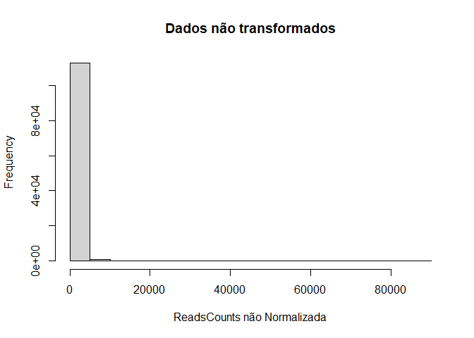<!-- -->

## rlogTransformation

Esta função transforma os dados de contagem para a escala log2, de uma
forma que minimiza as diferenças entre  
as amostras com contagens pequenas e as normaliza em relação ao tamanho
da biblioteca.

Quando blind = FALSO, o projeto experimental é usado apenas pelo VST e
rlog tranformation no cálculo da estimativa de dispersão gênica, a fim
de ajustar a linha de tendência através das dispersões sobre a média.

sendo assim, apenas a linha de tendência é usada pelas transformações, e
não as estimativas de dispersão gênicas.

Portanto, para visualização, agrupamento ou aplicações de aprendizado de
máquina, se tende a recomendar blind = FALSE.

``` r
# "Regularized log transformation" para os plots PCAs, clustering e heatmaps, 
rld <- rlog(ddsDE, blind = FALSE)

# As informações em um objeto SummarizedExperiment(ex: rld) podem ser acessadas com funçõe assay() que 
# retorma uma matriz com os dados reais, ou seja, as "read counts".
assay_rld <-assay(rld)

head(assay_rld)
```

    ##                    SRR10493810 SRR10493811 SRR10493818 SRR10493819
    ## ENSCGRG00015000179    9.808429    9.757480    9.335988    9.231177
    ## ENSCGRG00015000181    1.948129    2.014567    1.853738    1.931487
    ## ENSCGRG00015000198    8.783902    8.712414    9.677103    9.688469
    ## ENSCGRG00015000295   10.574003   11.423745   10.743714   10.933028
    ## ENSCGRG00015000322    1.869237    1.748084    1.613910    1.614818
    ## ENSCGRG00015000363    4.917549    4.939367    4.303312    4.387391

# O Histograma abaixo mostra a distribuição das “counts” normalizadas entre 5 e 15.

``` r
hist(assay_rld, xlab = 'ReadsCounts Normalizada', main= 'Dados transformados' )
```

<!-- -->

## Distribuição dos dados transformados

``` r
x <- assay_rld
corRainbow = rainbow(dim(x)[2])

plot(density(x[,1]), col = corRainbow[1], lwd=2,
     xlab="valores de Expressão", ylab="Densidade", main= "Distribuição dos dados transformados",
     ylim=c(0, max(density(x[,1])$y)+.02 ) )
  
for( i in 2:dim(x)[2] )
lines(density(x[,i]), col=corRainbow[i], lwd=2)
legend("topright", cex=1.1, colnames(x), lty=rep(1,dim(x)[2]), col=corRainbow)
```

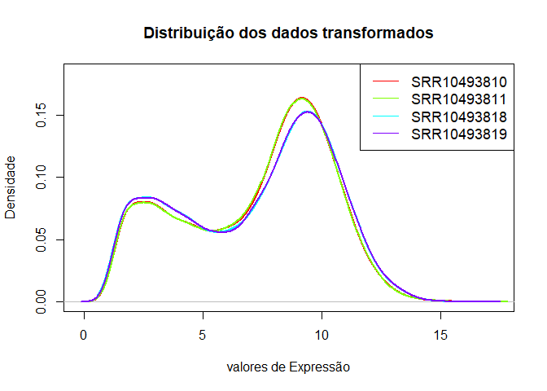<!-- -->

## Distribuição das read counts entre as replicatas.

``` r
par(mfrow=c(1,2))
plot(countData[,1:2], xlab='day4_rep1', ylab='day4_rep2', pch=16, cex=0.5)
plot(countData[,3:4], xlab='day7_rep1', ylab='day7_rep2', pch=16, cex=0.5)

mtext("Comparando as distribuição das replicatas", line = -1.5, cex = 1.5, outer = TRUE)
```

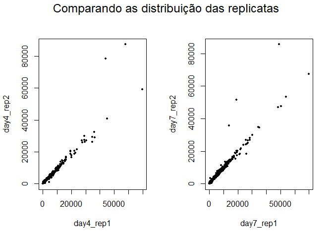<!-- -->

Os dados acima revelam uma distribuição homogênea das “read counts” das
amostras. Qualificando as replicatas.

## Estimativa da Dispersão

Para um gene ter sua expressão significativa, não depende apenas de seu
LFC, mas também de sua variabilidade dentro do grupo.

O DESeq2 quantifica esta dispersão que pode ser entendida como o
coeficiente de variação ao quadrado.

Por exemplo: um valor de dispersão de 0,01 significa que a expressão do
gene tende a diferir normalmente em 10% ($\\sqrt{0,01} = 10\\%$) entre
as amostras do mesmo grupo.

As estimativas de dispersão estão inversamente relacionadas à média e
diretamente relacionadas à variância.

Com base nessa relação, a dispersão de um gene é considerada alta quando
a média das ‘read counts’ são baixas e uma dispersão baixa quando a
média das ‘read counts’ são altas.

## Plot de dispersão

``` r
plotDispEsts(ddsDE, main="Estimativa de Dispersão")
```

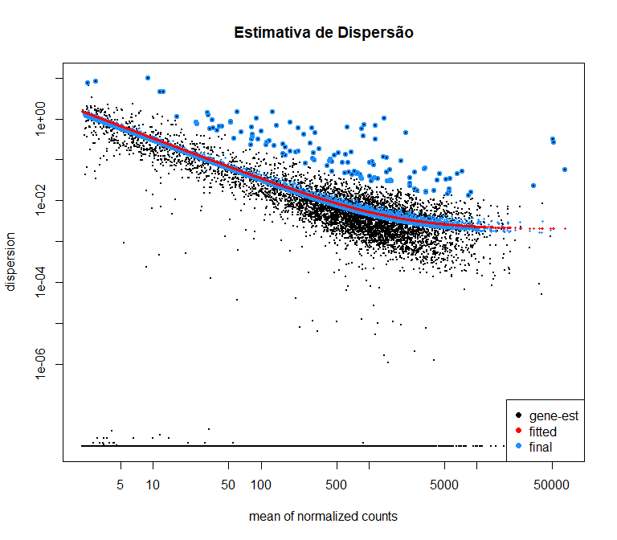<!-- -->

No gráfico de dispersão espera-se que a dispersão dos genes analisados
se encontre próximo a linha de dispersão esperada, linha vermelha.

-   A linha vermelha representa a estimativa do valor de dispersão
    esperado para cada genes, que mostra a dependência das dispersões em
    relação à média.

-   Os pontos pretos são as estimativas de dispersão para cada gene,
    obtidas considerando as informações de cada gene separadamente.
    (obs: A menos que se tenha muitas amostras, esses valores flutuam
    fortemente em torno de seus valores reais.)

-   Os pontos azuis representam as estimativas finais, que são então
    usadas no teste de hipótese.

-   Os círculos azuis acima da “nuvem” principal, são genes que possuem
    altas estimativas de dispersão (outliers da dispersão).

## PCA

Um gráfico de PCA mostra grupos de amostras com base em sua
similaridade. O PCA não descarta nenhuma amostra ou característica
(variáveis). Em vez disso, reduz o número esmagador de dimensões ao
construir os componentes principais (PCs).

``` r
pcaData <- plotPCA(rld, intgroup="condition", returnData=TRUE)

percentVar <- round(100 * attr(pcaData, "percentVar"))

ggplot(pcaData, aes(PC1, PC2, color=condition)) +
  geom_point(size=2) +
  ggtitle('Observação da variação entre as amostras do dia 4 e dia 7') + 
  theme(plot.title = element_text(hjust = 0.5)) +
  
  xlab(paste0("PC1: ",percentVar[1],"% variação")) +
  ylab(paste0("PC2: ",percentVar[2],"% variaçao")) + 
  coord_fixed()
```

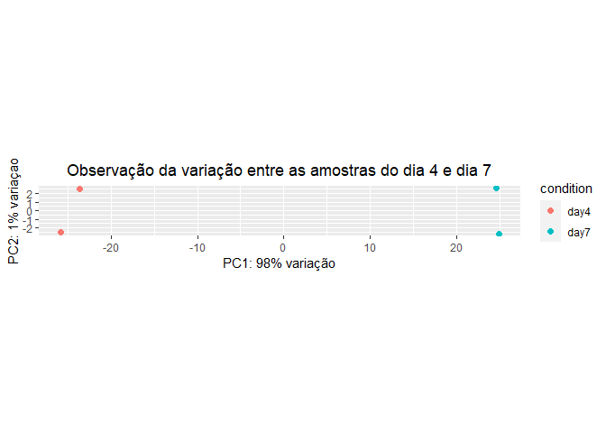<!-- -->

## PCA 2

``` r
plotPCA(rld, intgroup = "condition", ntop = 500) +
  theme_bw() + # remove o tema padrão do ggplot2
  geom_point(size = 3) +
  scale_y_continuous(limits = c(-5, 5)) + # Modifica os limites para corrigir as dimensões da figura
  ggtitle(label = "Principal Component Analysis (PCA)", 
          subtitle = "Variação dos genes em relação as 6 amostras")
```

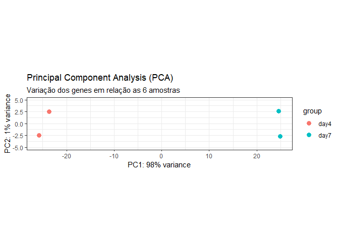<!-- -->

## Distância entre as amostras

Um heatmap da matriz de distância, nos dá uma visão geral sobre as
semelhanças e dissimilaridades entre as amostras.

Este clustering de amostra é realizado ao aplicarmos a função dist() à
transposta (t) da matriz de contagem transformada (rld) para obter
distâncias amostra a amostra.

``` r
sampleDists <- dist(t(assay_rld))

sampleDistMatrix <- as.matrix(sampleDists)
rownames(sampleDistMatrix) <- paste(colnames(assay_rld), " - ", rld$condition)
colnames(sampleDistMatrix) <- colnames(assay_rld)

corBlues <- colorRampPalette(rev(brewer.pal(9, "Blues")))(255)

pheatmap(sampleDistMatrix,
         clustering_distance_rows=sampleDists,
         clustering_distance_cols=sampleDists,
         col=corBlues)
```

<!-- -->

## Analisando os valores de p-value ajustado

``` r
hist(res05$padj, breaks=50, col="gray", main =('Histrograma'),
     xlab = 'p-value ajustado', 
     ylab = 'Frequência')
```

<!-- -->

O gráfico acima, revelam uma frequência alta para as amostras com um
valor de ‘p-value’ ajustado concentrado em valores ao redor de 0,05.
Contribuindo para a significancia dos resultados.

## MA-Plot de LFCs vs contagens normalizadas

“MA-plot” (“M” para menos, porque uma razão de log é igual a log menos
log, e “A” para média) é um gráfico de dispersão de LFC (log2 fold
change, no eixo y) versus a média de contagens normalizadas (no eixo x).

A função plotMA mostra o LFC atribuíveis a uma determinada variável
sobre a média das contagens normalizadas para todas as amostras no
DESeqDataSet.

``` r
plotMA(res05, ylim=c(-5,5), main='Expressão diferenciada (day4 vs day7)', 
       xlab='Média das counts Normalizada',
       )
```

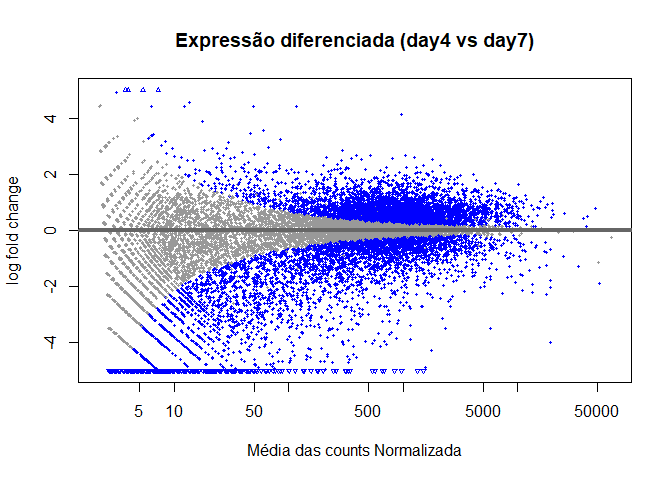<!-- -->
Cada ponto indica um gene, em azul temos os genes que estão
diferencialmente expressos. sendo os acima da linha central,
up-regulados e os abaixo down-regulados.

Obs: Os pontos que caem para fora da quadro são plotados como triângulos
abertos apontando para cima ou para baixo.

## Redução (shrink) os valores de log2 fold changes

Para gerar estimativas mais precisas de log2 foldchange, DESeq2 permite
a redução das estimativas de LFC para zero quando a informação para um
gene é baixa, como poucas readCounts ou altos valores de dispersão.

Esta redução ou normalização de LFC usa informações de todos os genes
para gerar estimativas mais precisas. Especificamente, a distribuição
das estimativas de LFC para todos os genes é usada para reduzir as
estimativas de LFC de genes com poucas informações ou alta dispersão
para estimativas de LFC mais prováveis (mais baixas).

Para gerar as estimativas de log2 fold change reduzidas, é preciso
executar uma etapa adicional em seu objeto de resultados com a função
lfcShrink ().

[Mais informações sobre
lfcshrink](https://www.bioconductor.org/packages/devel/bioc/vignettes/DESeq2/inst/doc/DESeq2.html)

### A função lfcShrink() requer alguns parâmetros

objeto DESeqDataSet - ddsDE

Objeto DESeqResults - res05

Tipo do métodos - “apeglm” e “normal” e “ashr”:

O método apeglm requer o uso de coef. Já o método “normal”, tanto coef
ou contrast podem ser especificado.

Obs: Apenas coef ou contrast pode ser especificado, não ambos.

coef = O nome( “condition\_day7\_vs\_day4”) ou o número(indíce do
resulteNames(), referente a condição a ser analizada, neste caso 2).

Consultando o resultsNames

``` r
resultsNames(ddsDE)
```

    ## [1] "Intercept"              "condition_day7_vs_day4"

Caso o design do experimento tenha mais de uma condição, está pode ser
acessada pelo seu indíce.

Para confirmar o número do coef:

``` r
resultsNames(ddsDE)[2]
```

    ## [1] "condition_day7_vs_day4"

## Executando o lfcShrink()

OBS: A redução do LFC não mudará o número total de genes que são
identificados como diferencialmente expressos.

A redução de LFC ajuda na avaliação posterior dos resultados, como na
subdivisão de genes significativos com base em LFC para uma avaliação
posterior.

Além disso, para ferramentas de análise funcional, como GSEA, que exigem
valores de LFC como entrada, é necessário fornecer valores reduzidos.

``` r
res05_shrink <- lfcShrink(ddsDE, coef=2, res=res05, type = "apeglm")
```

    ## using 'apeglm' for LFC shrinkage. If used in published research, please cite:
    ##     Zhu, A., Ibrahim, J.G., Love, M.I. (2018) Heavy-tailed prior distributions for
    ##     sequence count data: removing the noise and preserving large differences.
    ##     Bioinformatics. https://doi.org/10.1093/bioinformatics/bty895

## MA-Plot de LFCs dos lfc reduzidos

``` r
plotMA(res05_shrink,  ylim=c(-5,5))
```

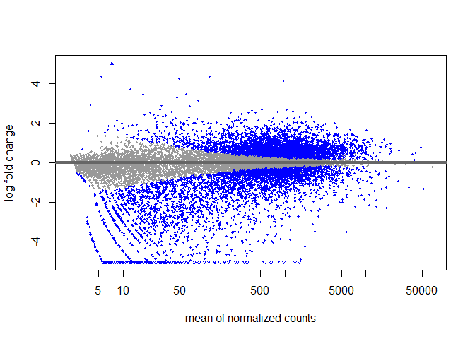<!-- -->

## Comparando os plotMA em relação a os valores de LFC-shrink com os valores de LFC normais.

``` r
par(mfrow=c(1,2), mar=c(4,4,4,1))
xlim <- c(1,1e5); ylim <- c(-3,3)

plotMA(res05, xlim=xlim, ylim=ylim, main="normal")
plotMA(res05_shrink, xlim=xlim, ylim=ylim, main="apeglm")
```

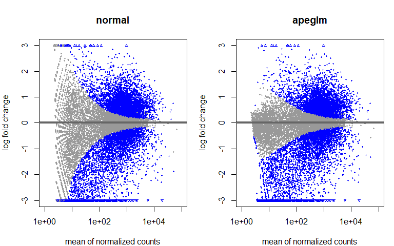<!-- -->

À esqueda dos plots é possível notar uma abundância dos genes com baixa
média dos valores de contagem das reads, sendo muitos destes com valores
altos logfoldchanges, o que aumenta dispersão destes genes.

Após a redução se observa um plot com estimativas mais reduzidas da
dispesão, favorecendo as análises downstream, como enriquecimento de
vias.

## Plot counts

Pode ser útil examinar as contagens das reads para um único gene entre
os grupos. Uma função simples para fazer esse gráfico é plotCounts, que
normaliza as counts pelos fatores de tamanho estimados (ou fatores de
normalização, se esses forem usados) e adiciona uma pseudocontagem de
1/2 para permitir a plotagem em escala logarítmica.

Aqui é representado os genes que t^m o menor “p-value”, menor LFC e
maior LFC da tabela de resultados(ddsDE). Obs: É possível selecionar o
gene por nome ou pelo índice numérico.

``` r
par(mfrow=c(1,3), mar=c(6,4,4,1))
gene_idx1 = which.min(res05$padj)
plotCounts(ddsDE, gene=gene_idx1, intgroup="condition")

gene_idx2 = which.min(res05$log2FoldChange)
plotCounts(ddsDE, gene=gene_idx2, intgroup="condition")

gene_idx3 = which.max(res05$padj)
plotCounts(ddsDE, gene=gene_idx3, intgroup="condition")
```

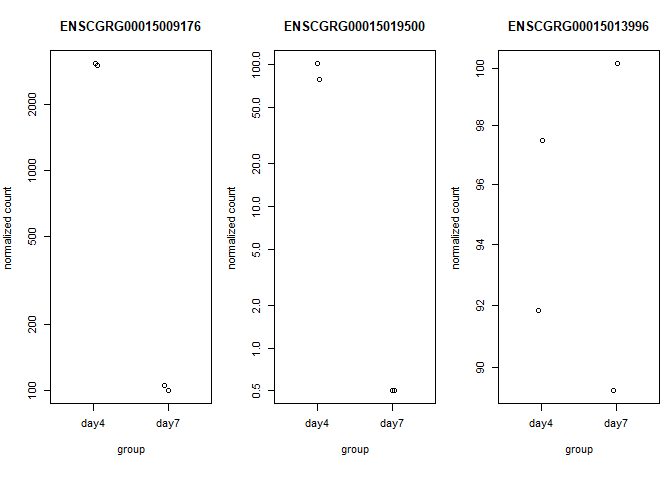<!-- -->


# Agrupamento de Genes e Visualização

## Agrupamento de Genes e Visualização

Nosso propósito é a detecção de genes diferencialmente expressos, e
estamos procurando em diferenças entre  
as amostras, da qual o tratamento experimental proporcionou mudanças no
padrão controle .

Com isso, o heatmap tem o propósito de destacar as diferenças entre as
amostras. Sendo sendo observada a  
variação da expressão de cada gene/linha em relação as amostras.

Sendo 0 a expressão média, enquanto, amarelo ou vermelho representam as
diferenças do desvios padrão abaixo  
e acima dessa média, respectivamente. Um número absoluto mais alto, está
relacionado a maior intensidade

### Z-score e o agrupamento das amostras

A padronização de scala por linha (scale=‘row’) centraliza os valores de
expresão de cada gene e os  
transforma em Z-scores, e o heatmap mostra o quanto cada gene se desvia
desta média.

Row Z-Score é um método de escalonamento para visualização em heatmaps
que ajuda a aprimorar os  
agrupamentos de genes com tendências semelhantes na expressão entre as
amostras.

O Z-Score é calculado por: (Valor da expressão do gene na amostra de
interesse) - (Expressão média em todas as amostras) / Desvio padrão

### Heatmap da matriz de contagem

Para explorar uma matriz de contagem, geralmente é instrutivo olhar para
ela com um heatmap.

O heatmap se torna mais interessante se não olharmos para a expressão
absoluta, mas sim para a quantidade que cada gene em uma amostra se
desvia (uma anormalidade) da média dos genes em todas as amostras.

Portanto, os valores de cada gene nas amostras são reunidos em uma média
e o heatmap mostra o quanto cada gene se desvia desta média.

### Agrupamento de genes pelo heatmap

``` r
topVarGenes <- head(order(-rowVars(assay_rld)),50) # - significa decresing

cores_heat<- colorRampPalette(brewer.pal(9, "YlOrRd"))(250)
       
mat <- assay_rld[ topVarGenes, ]
mat <- mat - rowMeans(mat)

pheatmap(mat, scale="row", cluster_rows=TRUE, show_rownames=TRUE, 
         cluster_cols=TRUE, annotation_col=coldata, col=cores_heat)
```

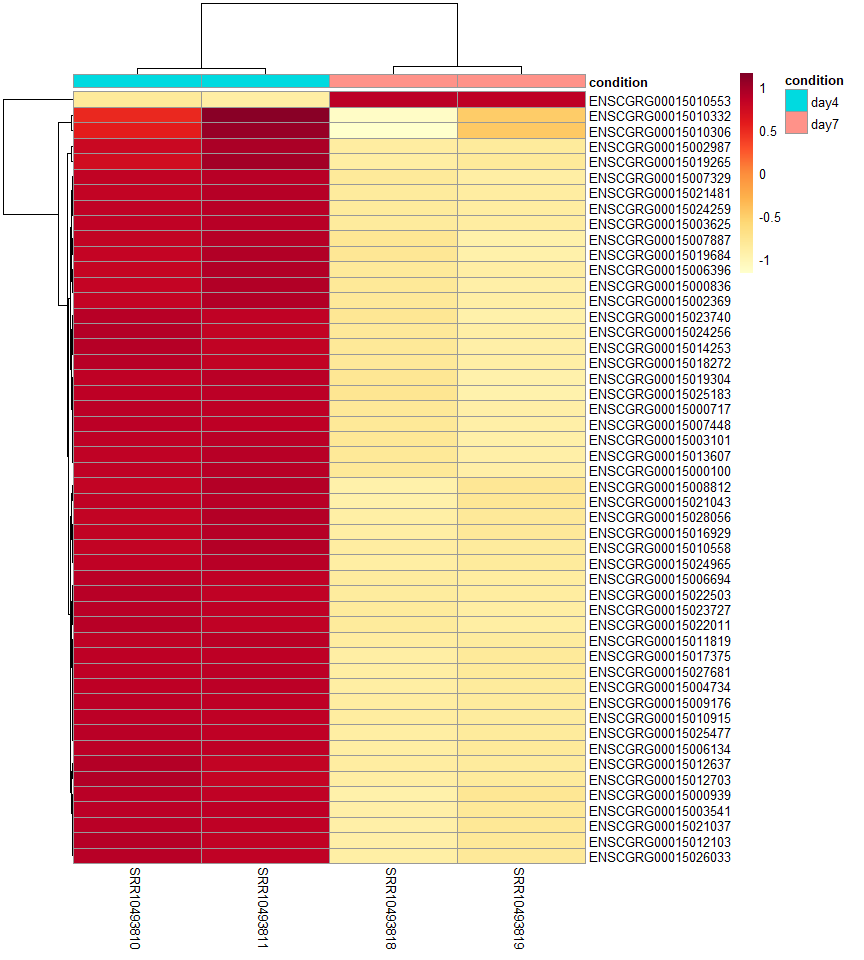<!-- -->

## Volcano plot

No volcano plot conseguimos visualizar genes diferencialmente expressos,
sendo em verde, genes que apresentam um “p-value ajustado” menor que
0.05, indicando genes significativamente diferentes em valores de
expressão em relação ao grupo controle.

``` r
#png("volcano-DE.png", 1000, 700, pointsize=20)

mylabel <- c('Significante', "Não-Significante")

plot(res05_shrink$log2FoldChange, -1*log10(res05_shrink$padj), col=ifelse(res05_shrink$padj<0.05, "green", "black"),
     xlab="log Counts", ylab="log Fold Change", pch=20, main='Volcano Plot de Expressão Diferencial')

legend('topright', mylabel, fill=c('green', 'black'))
```

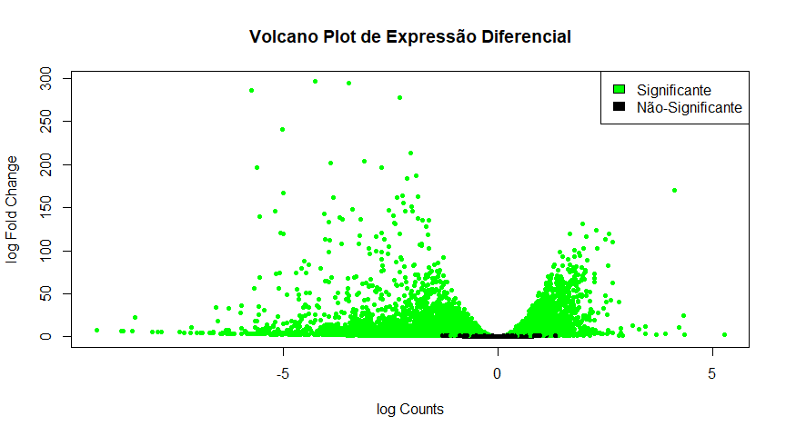<!-- -->


# Anotação Gênica

## Adicionando uma coluna de significância em res05\_shrink

Esta coluna receberá os valores de ‘True’ e ‘False’ se representarem
dados significativos. Serão considerados valores significativos: pajd
&lt; 0.05 e logfoldchande &gt; 0.5

OBS\*: Lembrando que o resultado é expresso em log de 2, logo, log2 de
0.5 é igual a um log fold chande de 1.

``` r
res05_shrink$significant <- ifelse(res05_shrink$padj< 0.05, "True", "False")
res05_shrink[which(abs(res05_shrink$log2FoldChange)< 0.5),'significant'] <- "False"
```

### Transformando a tabela res05 em df, para o merge com a tabela de dados homólogos de camundongos

``` r
df_res05_shrink <- as.data.frame(res05_shrink)

# Ordenando a tabela res05 pelo valor de p-value ajustado
df_res05_shrink <- df_res05_shrink[order(df_res05_shrink$padj), ]

df_res05_shrink$Gene.stable.ID <- row.names(df_res05_shrink)

head(df_res05_shrink)
```

    ##                     baseMean log2FoldChange      lfcSE        pvalue
    ## ENSCGRG00015009176  1570.408      -4.888540 0.12995571  0.000000e+00
    ## ENSCGRG00015021481  5834.333      -3.484899 0.08148921  0.000000e+00
    ## ENSCGRG00015012637 19362.170      -4.000937 0.07817660  0.000000e+00
    ## ENSCGRG00015003625  1754.204      -4.254339 0.11497824 1.137067e-300
    ## ENSCGRG00015006694  2341.466      -3.472970 0.09406640 1.864941e-299
    ## ENSCGRG00015027681  1519.005      -5.727278 0.15749296 4.143566e-290
    ##                             padj significant     Gene.stable.ID
    ## ENSCGRG00015009176  0.000000e+00        True ENSCGRG00015009176
    ## ENSCGRG00015021481  0.000000e+00        True ENSCGRG00015021481
    ## ENSCGRG00015012637  0.000000e+00        True ENSCGRG00015012637
    ## ENSCGRG00015003625 4.540310e-297        True ENSCGRG00015003625
    ## ENSCGRG00015006694 5.957367e-296        True ENSCGRG00015006694
    ## ENSCGRG00015027681 1.103017e-286        True ENSCGRG00015027681

## Dataset com informações de genes de camundongos homologos ás células CHO (chinnese hamister ovary cells)

``` r
homoBiomart <- as.data.frame(read.delim('mart_export.txt', header = T, sep = '\t'))

head(homoBiomart)
```

    ##       Gene.stable.ID Mouse.gene.stable.ID
    ## 1 ENSCGRG00015000002                     
    ## 2 ENSCGRG00015000003                     
    ## 3 ENSCGRG00015000004                     
    ## 4 ENSCGRG00015000005                     
    ## 5 ENSCGRG00015000006   ENSMUSG00000021835
    ## 6 ENSCGRG00015000007   ENSMUSG00000037628

## Unindo os datasets pela coluna em comun gene.stable.ID

``` r
results <- as.data.frame(merge(df_res05_shrink, homoBiomart, by='Gene.stable.ID'))

head(results)
```

    ##       Gene.stable.ID    baseMean log2FoldChange      lfcSE       pvalue
    ## 1 ENSCGRG00015000004    9.165919     -0.6499394 0.77732678 1.257846e-01
    ## 2 ENSCGRG00015000005  223.298389      0.1830109 0.19291129 3.253275e-01
    ## 3 ENSCGRG00015000007 2491.435800      1.6754375 0.08995252 3.485988e-78
    ## 4 ENSCGRG00015000008 1734.822673      0.9425629 0.09463847 9.655602e-24
    ## 5 ENSCGRG00015000009 1695.826396      0.6641348 0.09487205 1.596911e-12
    ## 6 ENSCGRG00015000010  803.132818      0.1371245 0.12002009 2.470813e-01
    ##           padj significant Mouse.gene.stable.ID
    ## 1 1.933249e-01       False                     
    ## 2 4.252501e-01       False                     
    ## 3 4.639851e-76        True   ENSMUSG00000037628
    ## 4 1.525413e-22        True   ENSMUSG00000015759
    ## 5 1.115254e-11        True   ENSMUSG00000062014
    ## 6 3.402905e-01       False   ENSMUSG00000055128

## Removendo dados duplicados

``` r
# Removendo dados duplicados da Mouse.gene.stable.ID
results <- distinct(results, Mouse.gene.stable.ID, .keep_all= TRUE)

head(results)
```

    ##       Gene.stable.ID    baseMean log2FoldChange      lfcSE       pvalue
    ## 1 ENSCGRG00015000004    9.165919    -0.64993936 0.77732678 1.257846e-01
    ## 2 ENSCGRG00015000007 2491.435800     1.67543750 0.08995252 3.485988e-78
    ## 3 ENSCGRG00015000008 1734.822673     0.94256287 0.09463847 9.655602e-24
    ## 4 ENSCGRG00015000009 1695.826396     0.66413476 0.09487205 1.596911e-12
    ## 5 ENSCGRG00015000010  803.132818     0.13712450 0.12002009 2.470813e-01
    ## 6 ENSCGRG00015000011  541.342367     0.02869991 0.14652521 8.425474e-01
    ##           padj significant Mouse.gene.stable.ID
    ## 1 1.933249e-01       False                     
    ## 2 4.639851e-76        True   ENSMUSG00000037628
    ## 3 1.525413e-22        True   ENSMUSG00000015759
    ## 4 1.115254e-11        True   ENSMUSG00000062014
    ## 5 3.402905e-01       False   ENSMUSG00000055128
    ## 6 8.869154e-01       False   ENSMUSG00000021838

## Informações sobre os dados de entrada para a query.

keys: É coluna da tabela results que possui a key correspondente no do
db que se deseja comparar e extrair os item.

column: Add colunas do db que se deseja adquirir as info. ex: c(“GO” ,
“SYMBOL”, “GENENAME” )

keytype: é o tipo de keys que estamos passando, nesse caso foi keytype =
“ENSEMBL”, pois o id dos meus genes possuim essa nomeclatura.

### Consultar as colunas do db

``` r
columns(org.Mm.eg.db)
```

    ##  [1] "ACCNUM"       "ALIAS"        "ENSEMBL"      "ENSEMBLPROT"  "ENSEMBLTRANS"
    ##  [6] "ENTREZID"     "ENZYME"       "EVIDENCE"     "EVIDENCEALL"  "GENENAME"    
    ## [11] "GENETYPE"     "GO"           "GOALL"        "IPI"          "MGI"         
    ## [16] "ONTOLOGY"     "ONTOLOGYALL"  "PATH"         "PFAM"         "PMID"        
    ## [21] "PROSITE"      "REFSEQ"       "SYMBOL"       "UNIPROT"

### Consultar as keys do db

``` r
keytypes(org.Mm.eg.db)
```

    ##  [1] "ACCNUM"       "ALIAS"        "ENSEMBL"      "ENSEMBLPROT"  "ENSEMBLTRANS"
    ##  [6] "ENTREZID"     "ENZYME"       "EVIDENCE"     "EVIDENCEALL"  "GENENAME"    
    ## [11] "GENETYPE"     "GO"           "GOALL"        "IPI"          "MGI"         
    ## [16] "ONTOLOGY"     "ONTOLOGYALL"  "PATH"         "PFAM"         "PMID"        
    ## [21] "PROSITE"      "REFSEQ"       "SYMBOL"       "UNIPROT"

## Adicionando as anotações à tabela de resultados

``` r
# Adicionando o símbolo do gene
results$GeneSymbol <- mapIds(x = org.Mm.eg.db,
                              keys = results$Mouse.gene.stable.ID,
                              column = "SYMBOL",
                              keytype = "ENSEMBL",
                              multiVals = "first")
```

    ## 'select()' returned 1:many mapping between keys and columns

``` r
# Adicionando a descrição do gene
results$GeneDescription <- mapIds(org.Mm.eg.db,
                              keys = results$Mouse.gene.stable.ID,
                              column = "GENENAME",
                              keytype = "ENSEMBL",
                              multiVals = "first")
```

    ## 'select()' returned 1:many mapping between keys and columns

``` r
# Adicionando o ENTREZID
results$ENTREZID <- mapIds(org.Mm.eg.db,
                              keys = results$Mouse.gene.stable.ID,
                              column = "ENTREZID",
                              keytype = "ENSEMBL",
                              multiVals = "first")
```

    ## 'select()' returned 1:many mapping between keys and columns

## Visualizando a tabela com os dados de anotação inseridos

``` r
head(results)
```

    ##       Gene.stable.ID    baseMean log2FoldChange      lfcSE       pvalue
    ## 1 ENSCGRG00015000004    9.165919    -0.64993936 0.77732678 1.257846e-01
    ## 2 ENSCGRG00015000007 2491.435800     1.67543750 0.08995252 3.485988e-78
    ## 3 ENSCGRG00015000008 1734.822673     0.94256287 0.09463847 9.655602e-24
    ## 4 ENSCGRG00015000009 1695.826396     0.66413476 0.09487205 1.596911e-12
    ## 5 ENSCGRG00015000010  803.132818     0.13712450 0.12002009 2.470813e-01
    ## 6 ENSCGRG00015000011  541.342367     0.02869991 0.14652521 8.425474e-01
    ##           padj significant Mouse.gene.stable.ID GeneSymbol
    ## 1 1.933249e-01       False                            NULL
    ## 2 4.639851e-76        True   ENSMUSG00000037628      Cdkn3
    ## 3 1.525413e-22        True   ENSMUSG00000015759      Cnih1
    ## 4 1.115254e-11        True   ENSMUSG00000062014       Gmfb
    ## 5 3.402905e-01       False   ENSMUSG00000055128     Cgrrf1
    ## 6 8.869154e-01       False   ENSMUSG00000021838      Samd4
    ##                                      GeneDescription ENTREZID
    ## 1                                               NULL     NULL
    ## 2                cyclin-dependent kinase inhibitor 3    72391
    ## 3 cornichon family AMPA receptor auxiliary protein 1    12793
    ## 4                       glia maturation factor, beta    63985
    ## 5    cell growth regulator with ring finger domain 1    68755
    ## 6            sterile alpha motif domain containing 4    74480

## Criando um subset dos genes com expressão significativa

``` r
res_sig = as.data.frame(subset(results, padj< 0.05))
res_sig <- na.omit(res_sig)
res_sig = res_sig[order(res_sig$log2FoldChange, decreasing=TRUE),]
head(res_sig)
```

    ##           Gene.stable.ID  baseMean log2FoldChange     lfcSE        pvalue
    ## 6361  ENSCGRG00015014056 117.02347       4.328667 0.4119615  1.777749e-26
    ## 10027 ENSCGRG00015021957  49.39002       4.223146 0.6284647  3.502474e-12
    ## 4838  ENSCGRG00015010553 975.31791       4.113391 0.1466091 5.729765e-174
    ## 4839  ENSCGRG00015010553 975.31791       4.113391 0.1466091 5.729765e-174
    ## 1606  ENSCGRG00015003447  60.58478       3.432653 0.4902614  3.162151e-13
    ## 9026  ENSCGRG00015019703  46.00532       3.272854 0.5467203  2.615811e-10
    ##                padj significant Mouse.gene.stable.ID GeneSymbol
    ## 6361   3.293992e-25        True   ENSMUSG00000109392     Gm5737
    ## 10027  2.367394e-11        True   ENSMUSG00000024810       Il33
    ## 4838  5.719738e-171        True   ENSMUSG00000058427      Cxcl2
    ## 4839  5.719738e-171        True   ENSMUSG00000029379      Cxcl3
    ## 1606   2.348019e-12        True   ENSMUSG00000056758      Hmga2
    ## 9026   1.484182e-09        True   ENSMUSG00000039103       Nexn
    ##                        GeneDescription ENTREZID
    ## 6361               predicted gene 5737   436008
    ## 10027                   interleukin 33    77125
    ## 4838  chemokine (C-X-C motif) ligand 2    20310
    ## 4839  chemokine (C-X-C motif) ligand 3   330122
    ## 1606     high mobility group AT-hook 2    15364
    ## 9026                           nexilin    68810


# Volcano Plot

Visualização dos gene com um p-value ajustado de &lt;1e-50 e
log2FoldChange absoluto &gt; 2.

``` r
volcano = ggplot(res_sig, aes(log2FoldChange, -log10(pvalue))) + geom_point(aes(col=significant)) +
  scale_color_manual(values=c("red", "green"))

volcano + geom_text(data=filter(res_sig, abs(log2FoldChange) > 2 & padj <1e-50), aes(label=GeneSymbol)) +
  coord_cartesian(clip = "off")
```

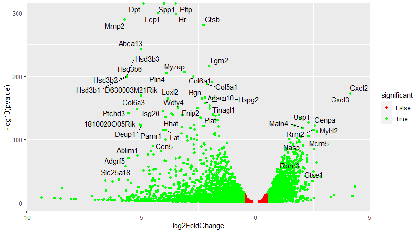<!-- -->

## Salvando o arquivo resultados mais anotação

As colunas GeneSymbol, GeneDescription e ENTREZID, apresentam volores no
formato lista. Durante a conversão para dataframe, para salvar como csv
ou xlsm, o o programa não sabe como lidar com esse formato, salvando o
arquivo sem estas iinformações.

Por isso é preciso converter as colunas para o tipo caracter, e aí sim
salvar como dataframe no formato desejado.

``` r
# Criando uma cópia do df
df <- res_sig
# Aplicando a função as.character as colunas GeneSymbol, GeneDescription e ENTREZID c(10:12)
alter_cols <- apply(df[ , c(9:11)], 2, as.character)  # retorna um df com as colunas modificadas

# Substituindo as colunas
df[ , colnames(df) %in% colnames(alter_cols)] <- alter_cols  

# Salvando os resultados do DESeq2
# write.csv(as.data.frame(df), 'results_DESeq2_shrink.csv')
# writexl::write_xlsx(as.data.frame(df), 'results_DESeq2_shrink.xlsx')
# 
# # Sanvando os resultados DE para e up regulados down regulados 
# res05_shrink_sig_up <- filter(df, significant == "True" & log2FoldChange > 0)
# writexl::write_xlsx(as.data.frame(res05_shrink_sig_up), 'results_DESeq2_shrink_genes_up.xlsx')
# 
# res05_shrink_sig_down <- filter(df, significant == "True" & log2FoldChange < 0)
# writexl::write_xlsx(as.data.frame(res05_shrink_sig_down), 'results_DESeq2_shrink_genes_down.xlsx')
```


# Opcional a critério do usuário

``` r
# Criando coluna de significância
res05$significant <- ifelse(res05$padj< 0.05, "True", "False")
res05[which(abs(res05$log2FoldChange)< 0.5),'significant'] <- "False"

# Transfornado o df_res05_shrink em dataframe
df_res05 <- as.data.frame(res05)

# Ordenando a tabela res05 pelo valor de p-value ajustado
df_res05 <- df_res05[order(df_res05$padj), ]

# Adicionando a coluna Gene.stable.ID como nome das linhas
df_res05$Gene.stable.ID <- row.names(df_res05)

# Realizando o merge do df_res05_shrink com genes id homólogos de camundongos
results2 <- as.data.frame(merge(df_res05, homoBiomart, by='Gene.stable.ID'))

# Removendo dados duplicados da Mouse.gene.stable.ID
results2 <- distinct(results2, Mouse.gene.stable.ID, .keep_all= TRUE)

### Adicionando as anotações à tabela de results2

# Adicionando o símbolo do gene
results2$GeneSymbol <- mapIds(x = org.Mm.eg.db,
                              keys = results$Mouse.gene.stable.ID,
                              column = "SYMBOL",
                              keytype = "ENSEMBL",
                              multiVals = "first")
```

    ## 'select()' returned 1:many mapping between keys and columns

``` r
# Adicionando a descrição do gene
results2$GeneDescription <- mapIds(org.Mm.eg.db,
                              keys = results$Mouse.gene.stable.ID,
                              column = "GENENAME",
                              keytype = "ENSEMBL",
                              multiVals = "first")
```

    ## 'select()' returned 1:many mapping between keys and columns

``` r
# Adicionando o ENTREZID
results2$ENTREZID <- mapIds(org.Mm.eg.db,
                              keys = results$Mouse.gene.stable.ID,
                              column = "ENTREZID",
                              keytype = "ENSEMBL",
                              multiVals = "first")
```

    ## 'select()' returned 1:many mapping between keys and columns

``` r
# Criando uma tabela de resultados significantes
res_sig2 = as.data.frame(subset(results2, padj< 0.05))
res_sig2 <- na.omit(res_sig2)
res_sig2 = res_sig2[order(res_sig2$log2FoldChange, decreasing=TRUE),]
```

### Conferindo os resultados com o Volcano Plot

Visualização dos gene com um p-value ajustado de &lt;1e-50 e
log2FoldChange absoluto &gt; 2.

``` r
#png("volcano-DE.png", height = 400, width = 900, res=120)
volcano2 = ggplot(res_sig2, aes(log2FoldChange, -log10(pvalue))) + geom_point(aes(col=significant)) +
  scale_color_manual(values=c("red", "green"))

volcano2 + geom_text(data=filter(res_sig2, abs(log2FoldChange) > 3 & padj< 1e-50), aes(label=GeneSymbol)) +
  coord_cartesian(clip = "off")
```

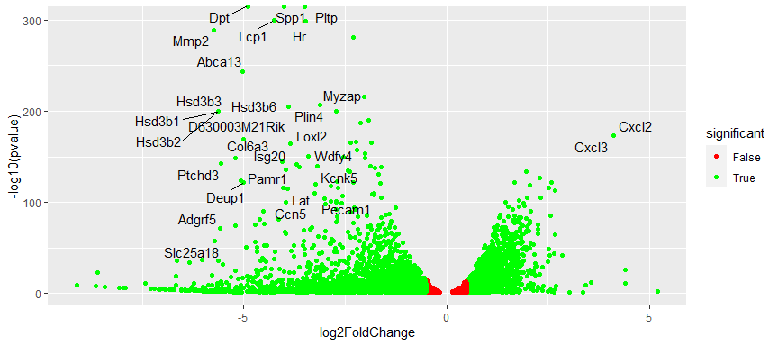<!-- -->

## Normalizando os dados e salvando os resultados em um arquivo excel

Com a tabela dos resultados do DESeq2 com as anotações é possível
continuar as análises downstream, como as análises de enriquecimento das
vias, sem a necessidade de executar o deseq e a anotações gênica
novamente.

### readCounts

``` r
## Salvando a tabela readCounts não normalizada
#write.csv(counts, 'counsts.csv')

# Normalizando as counts
# norm_counts <- counts(ddsDE, normalized=TRUE)

# Salvando counts normaliadas
#write.csv(as.data.frame(norm_counts), 'norm_Counts.csv')
#write.csv(as.data.frame(assay_rld), 'rld_norm_Counts.csv')
```

### Resultados DESeq2 shrink

``` r
# Salvando o resultado de deseq2 com p-value de 0,05
#write.csv(as.data.frame(res05), 'res05.csv')

# Criando uma cópia do df
df2 <- res_sig2

# Aplicando a função as.character as colunas GeneSymbol, GeneDescription e ENTREZID c(10:12)
alter_cols2 <- apply(df2[ , c(10:12)], 2, as.character)  # retorna um df com as colunas modificadas

# Substituindo as colunas
df2[ , colnames(df2) %in% colnames(alter_cols2)] <- alter_cols2  


# Salvando os resultados do DESeq2
# write.csv(as.data.frame(df2), 'results_DESeq2_annotation.csv')
# writexl::write_xlsx(as.data.frame(df2), 'results_DESeq2_annotation.xlsx')
# 
# # Sanvando os resultados DE para e up regulados down regulados 
# res05_sig_up <- filter(df2, significant == "True" & log2FoldChange > 0)
# writexl::write_xlsx(as.data.frame(res05_sig_up), 'results_DESeq2_genes_up.xlsx')
# 
# res05_sig_down <- filter(df2, significant == "True" & log2FoldChange < 0)
# writexl::write_xlsx(as.data.frame(res05_sig_down), 'results_DESeq2_genes_down.xlsx')
```

## Informações da sessão

``` r
sessionInfo()
```

    ## R version 4.1.1 (2021-08-10)
    ## Platform: x86_64-w64-mingw32/x64 (64-bit)
    ## Running under: Windows 10 x64 (build 22000)
    ## 
    ## Matrix products: default
    ## 
    ## locale:
    ## [1] LC_COLLATE=Portuguese_Brazil.1252  LC_CTYPE=Portuguese_Brazil.1252   
    ## [3] LC_MONETARY=Portuguese_Brazil.1252 LC_NUMERIC=C                      
    ## [5] LC_TIME=Portuguese_Brazil.1252    
    ## 
    ## attached base packages:
    ## [1] parallel  stats4    stats     graphics  grDevices utils     datasets 
    ## [8] methods   base     
    ## 
    ## other attached packages:
    ##  [1] ggrepel_0.9.1               RColorBrewer_1.1-2         
    ##  [3] pheatmap_1.0.12             ggplot2_3.3.5              
    ##  [5] writexl_1.4.0               dplyr_1.0.7                
    ##  [7] org.Mm.eg.db_3.13.0         AnnotationDbi_1.54.1       
    ##  [9] DESeq2_1.32.0               SummarizedExperiment_1.22.0
    ## [11] Biobase_2.52.0              MatrixGenerics_1.4.3       
    ## [13] matrixStats_0.61.0          GenomicRanges_1.44.0       
    ## [15] GenomeInfoDb_1.28.4         IRanges_2.26.0             
    ## [17] S4Vectors_0.30.0            BiocGenerics_0.38.0        
    ## 
    ## loaded via a namespace (and not attached):
    ##  [1] httr_1.4.2             bit64_4.0.5            splines_4.1.1         
    ##  [4] highr_0.9              blob_1.2.2             GenomeInfoDbData_1.2.6
    ##  [7] yaml_2.2.1             numDeriv_2016.8-1.1    pillar_1.6.4          
    ## [10] RSQLite_2.2.8          lattice_0.20-44        glue_1.4.2            
    ## [13] bbmle_1.0.24           digest_0.6.28          XVector_0.32.0        
    ## [16] colorspace_2.0-2       plyr_1.8.6             htmltools_0.5.2       
    ## [19] Matrix_1.3-4           XML_3.99-0.8           pkgconfig_2.0.3       
    ## [22] emdbook_1.3.12         genefilter_1.74.0      zlibbioc_1.38.0       
    ## [25] mvtnorm_1.1-3          purrr_0.3.4            xtable_1.8-4          
    ## [28] scales_1.1.1           apeglm_1.14.0          BiocParallel_1.26.2   
    ## [31] tibble_3.1.5           annotate_1.70.0        KEGGREST_1.32.0       
    ## [34] farver_2.1.0           generics_0.1.0         ellipsis_0.3.2        
    ## [37] withr_2.4.2            cachem_1.0.6           survival_3.2-11       
    ## [40] magrittr_2.0.1         crayon_1.4.1           memoise_2.0.0         
    ## [43] evaluate_0.14          fansi_0.5.0            MASS_7.3-54           
    ## [46] tools_4.1.1            lifecycle_1.0.1        stringr_1.4.0         
    ## [49] munsell_0.5.0          locfit_1.5-9.4         DelayedArray_0.18.0   
    ## [52] Biostrings_2.60.2      compiler_4.1.1         rlang_0.4.12          
    ## [55] grid_4.1.1             RCurl_1.98-1.5         labeling_0.4.2        
    ## [58] bitops_1.0-7           rmarkdown_2.11         gtable_0.3.0          
    ## [61] DBI_1.1.1              R6_2.5.1               bdsmatrix_1.3-4       
    ## [64] knitr_1.36             fastmap_1.1.0          bit_4.0.4             
    ## [67] utf8_1.2.2             stringi_1.7.5          Rcpp_1.0.7            
    ## [70] vctrs_0.3.8            geneplotter_1.70.0     png_0.1-7             
    ## [73] coda_0.19-4            tidyselect_1.1.1       xfun_0.27


## Referências

Love, M.I., Huber, W. & Anders, S. Moderated estimation of fold change
and dispersion for RNA-seq data with DESeq2. Genome Biol 15, 550 (2014).

[Paper
DESeq2](https://genomebiology.biomedcentral.com/articles/10.1186/s13059-014-0550-8)

[hbctraining
DGE\_Workshop\_lessons](https://hbctraining.github.io/DGE_workshop/lessons/05_DGE_DESeq2_analysis2.html)

[hbctraining
DGE\_Workshop\_salmon](https://hbctraining.github.io/DGE_workshop_salmon_online/lessons/05b_wald_test_results.html)

[Biocondoctoe vignettes -
lfcShrink](https://www.bioconductor.org/packages/devel/bioc/vignettes/DESeq2/inst/doc/DESeq2.html)

[Bioconductor vignettes
DESeq2](https://bioconductor.org/packages/devel/bioc/vignettes/DESeq2/inst/doc/DESeq2.html#principal-component-plot-of-the-samples)

[Bioconductor vignettes
rnaseq](https://www.bioconductor.org/packages/devel/workflows/vignettes/rnaseqGene/inst/doc/rnaseqGene.html)

[Bioconductor course
material](https://www.bioconductor.org/help/course-materials/2015/LearnBioconductorFeb2015/B02.1.1_RNASeqLab.html)

[STHDA rna-seq
workflow](http://www.sthda.com/english/wiki/rna-seq-differential-expression-work-flow-using-deseq2#diagnostic-plot)


# FIM