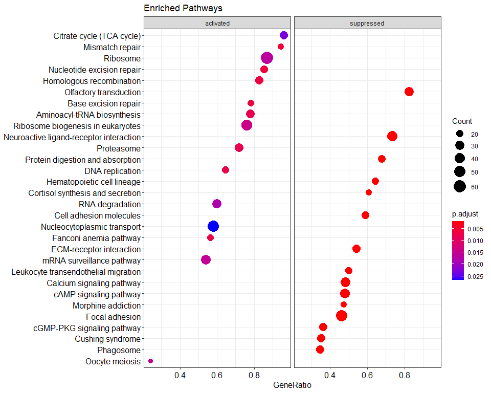

Gene Set Enrichment Analysis
================

A análise de enriquecimento de um conjunto de genes (GSEA), obtém dados
diferenciais de cada gene medido e procura por vias que exibem mudanças
significativamente coordenadas nesses valores, pontuando a tendência dos
membros do conjunto de genes de aparecer no topo ou no final da lista
classificada de todos os genes medidos.

Requer uma exportação de seu conjunto completo de genes expressos
diferenciais, junto com uma medição de expressão para cada gene
refletindo sua diferença entre duas condições (por exemplo, o log
fold-change entre duas condições, com a regulação para cima expressa
como um valor positivo e a regulação para baixo expressa como negativo).

Esta análise considera esses valores para todos os genes, mas testa as
tendências nos genes que compõem cada via, procurando um efeito
coordenado significativo em todas as proporções relevantes para testar
se a via está sendo regulada para cima ou para baixo de uma maneira que
é improvável que seja explicado por acaso. O teste de Wilcoxon é baseado
em classificação, usando a classificação das taxas de enriquecimento no
conjunto, em vez de seus valores absolutos.

Esse teste é uma abordagem mais livre de hipóteses, pois você não
pré-selecionou os genes de interesse e também a extensão relativa das
diferenças entre os grupos é levada em consideração para cada gene.
Porém, é uma análise mais complexa e pode demorar mais, pois todos os
genes estão sendo considerados.

# Instalando e carregando as bibliotecas necessárias

``` r
# Anotação gênica
library("AnnotationDbi")
library("org.Mm.eg.db")  # mouse database
library("msigdbr")       # Molecular Signatures Database
library("GO.db")         

# Pathway analysis of DE genes
library("GOstats")
library("clusterProfiler")
library('pathview')
library("enrichplot")
library("dplyr")
library("cowplot")
library("ggplot2")
```


# Carregando os resultadps do DESeq2

``` r
results <- as.data.frame(read.csv('results_DESeq2_shrink.csv'))
names(results)[1] <- "Gene.ID"
head(results)
```

    ##   Gene.ID     Gene.stable.ID  baseMean log2FoldChange     lfcSE        pvalue
    ## 1    6361 ENSCGRG00015014056 117.02347       4.328667 0.4119615  1.777749e-26
    ## 2   10027 ENSCGRG00015021957  49.39002       4.223146 0.6284647  3.502474e-12
    ## 3    4838 ENSCGRG00015010553 975.31791       4.113391 0.1466091 5.729765e-174
    ## 4    4839 ENSCGRG00015010553 975.31791       4.113391 0.1466091 5.729765e-174
    ## 5    1606 ENSCGRG00015003447  60.58478       3.432653 0.4902614  3.162151e-13
    ## 6    9026 ENSCGRG00015019703  46.00532       3.272854 0.5467203  2.615811e-10
    ##            padj significant Mouse.gene.stable.ID GeneSymbol
    ## 1  3.293992e-25        True   ENSMUSG00000109392     Gm5737
    ## 2  2.367394e-11        True   ENSMUSG00000024810       Il33
    ## 3 5.719738e-171        True   ENSMUSG00000058427      Cxcl2
    ## 4 5.719738e-171        True   ENSMUSG00000029379      Cxcl3
    ## 5  2.348019e-12        True   ENSMUSG00000056758      Hmga2
    ## 6  1.484182e-09        True   ENSMUSG00000039103       Nexn
    ##                    GeneDescription ENTREZID
    ## 1              predicted gene 5737   436008
    ## 2                   interleukin 33    77125
    ## 3 chemokine (C-X-C motif) ligand 2    20310
    ## 4 chemokine (C-X-C motif) ligand 3   330122
    ## 5    high mobility group AT-hook 2    15364
    ## 6                          nexilin    68810

## Removendo dados duplicados

``` r
# Removendo dados duplicados da Mouse.gene.stable.ID
results <- distinct(results, Gene.ID, .keep_all= TRUE)

head(results)
```

    ##   Gene.ID     Gene.stable.ID  baseMean log2FoldChange     lfcSE        pvalue
    ## 1    6361 ENSCGRG00015014056 117.02347       4.328667 0.4119615  1.777749e-26
    ## 2   10027 ENSCGRG00015021957  49.39002       4.223146 0.6284647  3.502474e-12
    ## 3    4838 ENSCGRG00015010553 975.31791       4.113391 0.1466091 5.729765e-174
    ## 4    4839 ENSCGRG00015010553 975.31791       4.113391 0.1466091 5.729765e-174
    ## 5    1606 ENSCGRG00015003447  60.58478       3.432653 0.4902614  3.162151e-13
    ## 6    9026 ENSCGRG00015019703  46.00532       3.272854 0.5467203  2.615811e-10
    ##            padj significant Mouse.gene.stable.ID GeneSymbol
    ## 1  3.293992e-25        True   ENSMUSG00000109392     Gm5737
    ## 2  2.367394e-11        True   ENSMUSG00000024810       Il33
    ## 3 5.719738e-171        True   ENSMUSG00000058427      Cxcl2
    ## 4 5.719738e-171        True   ENSMUSG00000029379      Cxcl3
    ## 5  2.348019e-12        True   ENSMUSG00000056758      Hmga2
    ## 6  1.484182e-09        True   ENSMUSG00000039103       Nexn
    ##                    GeneDescription ENTREZID
    ## 1              predicted gene 5737   436008
    ## 2                   interleukin 33    77125
    ## 3 chemokine (C-X-C motif) ligand 2    20310
    ## 4 chemokine (C-X-C motif) ligand 3   330122
    ## 5    high mobility group AT-hook 2    15364
    ## 6                          nexilin    68810

## Criando um subset dos genes com expressão significativa

``` r
res_sig = subset(results, padj < 0.5)
res_sig = res_sig[order(res_sig$log2FoldChange, decreasing=TRUE),]
head(res_sig)
```

    ##   Gene.ID     Gene.stable.ID  baseMean log2FoldChange     lfcSE        pvalue
    ## 1    6361 ENSCGRG00015014056 117.02347       4.328667 0.4119615  1.777749e-26
    ## 2   10027 ENSCGRG00015021957  49.39002       4.223146 0.6284647  3.502474e-12
    ## 3    4838 ENSCGRG00015010553 975.31791       4.113391 0.1466091 5.729765e-174
    ## 4    4839 ENSCGRG00015010553 975.31791       4.113391 0.1466091 5.729765e-174
    ## 5    1606 ENSCGRG00015003447  60.58478       3.432653 0.4902614  3.162151e-13
    ## 6    9026 ENSCGRG00015019703  46.00532       3.272854 0.5467203  2.615811e-10
    ##            padj significant Mouse.gene.stable.ID GeneSymbol
    ## 1  3.293992e-25        True   ENSMUSG00000109392     Gm5737
    ## 2  2.367394e-11        True   ENSMUSG00000024810       Il33
    ## 3 5.719738e-171        True   ENSMUSG00000058427      Cxcl2
    ## 4 5.719738e-171        True   ENSMUSG00000029379      Cxcl3
    ## 5  2.348019e-12        True   ENSMUSG00000056758      Hmga2
    ## 6  1.484182e-09        True   ENSMUSG00000039103       Nexn
    ##                    GeneDescription ENTREZID
    ## 1              predicted gene 5737   436008
    ## 2                   interleukin 33    77125
    ## 3 chemokine (C-X-C motif) ligand 2    20310
    ## 4 chemokine (C-X-C motif) ligand 3   330122
    ## 5    high mobility group AT-hook 2    15364
    ## 6                          nexilin    68810

## Criando uma lista de genes.

GSEA requer uma lista de genes ordenada por alguma estatística
(“log2FoldChange” calculadas pela análise de expressão diferencial de
genes, DESeq2) e um conjuntos de genes de entrada (podendo ser, coleção
Hallmark, GO Terms, Kegg). São chamadas de GSEA pré-classificadas,
quando se usa estatísticas calculadas anteriormente.

A função GSEA() leva um vetor de estatísticas nomeado e
pré-classificado, onde os nomes no vetor são identificadores de genes.

``` r
# Remover genes que não tenham entrezid identificadores e duplicados
res_sig_GeneSymbol <- subset(res_sig, is.na(ENTREZID) == FALSE)
res_sig_GeneSymbol <- distinct(res_sig_GeneSymbol, .keep_all = TRUE)

# Cria uma matriz de genes com log2 fold changes
geneList <- res_sig_GeneSymbol$log2FoldChange

# Add entrezID como nomes para cada entrada de logFC
names(geneList) <- res_sig_GeneSymbol$GeneSymbol

head(geneList, 10)
```

    ##   Gm5737     Il33    Cxcl2    Cxcl3    Hmga2     Nexn      Fst    Mybl2 
    ## 4.328667 4.223146 4.113391 4.113391 3.432653 3.272854 2.822795 2.674004 
    ##  Bcl2l12    Cdca8 
    ## 2.664413 2.626854


# Gene set Enrichment Analysis - GSEA MSigDb

# MSigDb analysis

Molecular Signatures Database é uma coleção de conjuntos gênicos
anotados, sendo as 8 principais coleções:

H: hallmark gene sets  
C1: positional gene sets  
C2: curated gene sets  
C3: motif gene sets  
C4: computational gene sets  
C5: GO gene sets  
C6: oncogenic signatures  
C7: immunologic signatures

### Lista de organismos no package msigdbr

Conferindo quais organismos o pacote msigdb suporta.

``` r
msigdbr_species()
```

    ## # A tibble: 20 x 2
    ##    species_name                    species_common_name                          
    ##    <chr>                           <chr>                                        
    ##  1 Anolis carolinensis             Carolina anole, green anole                  
    ##  2 Bos taurus                      bovine, cattle, cow, dairy cow, domestic cat~
    ##  3 Caenorhabditis elegans          roundworm                                    
    ##  4 Canis lupus familiaris          dog, dogs                                    
    ##  5 Danio rerio                     leopard danio, zebra danio, zebra fish, zebr~
    ##  6 Drosophila melanogaster         fruit fly                                    
    ##  7 Equus caballus                  domestic horse, equine, horse                
    ##  8 Felis catus                     cat, cats, domestic cat                      
    ##  9 Gallus gallus                   bantam, chicken, chickens, Gallus domesticus 
    ## 10 Homo sapiens                    human                                        
    ## 11 Macaca mulatta                  rhesus macaque, rhesus macaques, Rhesus monk~
    ## 12 Monodelphis domestica           gray short-tailed opossum                    
    ## 13 Mus musculus                    house mouse, mouse                           
    ## 14 Ornithorhynchus anatinus        duck-billed platypus, duckbill platypus, pla~
    ## 15 Pan troglodytes                 chimpanzee                                   
    ## 16 Rattus norvegicus               brown rat, Norway rat, rat, rats             
    ## 17 Saccharomyces cerevisiae        baker's yeast, brewer's yeast, S. cerevisiae 
    ## 18 Schizosaccharomyces pombe 972h- <NA>                                         
    ## 19 Sus scrofa                      pig, pigs, swine, wild boar                  
    ## 20 Xenopus tropicalis              tropical clawed frog, western clawed frog

### Hallmarks Gene Sets

Os dados de interesse são de amostras de camundongos, portanto, para
obter apenas os conjuntos de genes Hallmarks relevantes para M.
musculus, se especifica category = “H” e species = “Mus musculus”,
respectivamente para a função msigdbr(). Caso a espécie de interesse
seja diferente, apenas altere com o nome da espécie.

``` r
mm_hallmark_sets <- msigdbr(species = "Mus musculus",
                            category = "H"
                            )
head(mm_hallmark_sets)
```

    ## # A tibble: 6 x 18
    ##   gs_cat gs_subcat gs_name gene_symbol entrez_gene ensembl_gene human_gene_symb~
    ##   <chr>  <chr>     <chr>   <chr>             <int> <chr>        <chr>           
    ## 1 H      ""        HALLMA~ Abca1             11303 ENSMUSG0000~ ABCA1           
    ## 2 H      ""        HALLMA~ Abcb8             74610 ENSMUSG0000~ ABCB8           
    ## 3 H      ""        HALLMA~ Acaa2             52538 ENSMUSG0000~ ACAA2           
    ## 4 H      ""        HALLMA~ Acadl             11363 ENSMUSG0000~ ACADL           
    ## 5 H      ""        HALLMA~ Acadm             11364 ENSMUSG0000~ ACADM           
    ## 6 H      ""        HALLMA~ Acads             11409 ENSMUSG0000~ ACADS           
    ## # ... with 11 more variables: human_entrez_gene <int>,
    ## #   human_ensembl_gene <chr>, gs_id <chr>, gs_pmid <chr>, gs_geoid <chr>,
    ## #   gs_exact_source <chr>, gs_url <chr>, gs_description <chr>, taxon_id <int>,
    ## #   ortholog_sources <chr>, num_ortholog_sources <dbl>

### TERM2GENE

Criando dados de entrada “annotation of TERM TO GENE mapping”, um
data.frame com 2 colunas, term and gene.

``` r
#TERM = termo do mm_hallmark_sets nesse caso gs_name que se quer descobrir

#GENE = keyType dos Genes a serem enriquecidos, este deve ter o mesmo keyType entre a geneList e mm_hallmark_sets.
# podendo ser: gene_symbol, entrez_gene, ensembl_gene

TERM2GENE_list = dplyr::select(mm_hallmark_sets, gs_name, gene_symbol)
```

## Gene Set Enrichment Analysis (GSEA)

O objetivo do GSEA é detectar situações em que muitos genes em um
conjunto de genes mudam de forma coordenada, mesmo quando as mudanças
individuais são de pequena magnitude (Subramanian et al. 2005).

``` r
gsea_MSigDb <- GSEA(
  geneList = geneList, # Ordered ranked gene list
  minGSSize = 10, # Minimum gene set size
  maxGSSize = 1000, # Maximum gene set set
  pvalueCutoff = 0.05, # p-value cutoff
  pAdjustMethod = "BH", # Benjamini-Hochberg correction
  seed = TRUE, # Set seed to make results reproducible
  TERM2GENE = TERM2GENE_list
  )
```

    ## preparing geneSet collections...

    ## GSEA analysis...

    ## Warning in preparePathwaysAndStats(pathways, stats, minSize, maxSize, gseaParam, : There are ties in the preranked stats (5% of the list).
    ## The order of those tied genes will be arbitrary, which may produce unexpected results.

    ## Warning in preparePathwaysAndStats(pathways, stats, minSize, maxSize,
    ## gseaParam, : There are duplicate gene names, fgsea may produce unexpected
    ## results.

    ## Warning in fgseaMultilevel(...): There were 7 pathways for which P-values were
    ## not calculated properly due to unbalanced (positive and negative) gene-level
    ## statistic values. For such pathways pval, padj, NES, log2err are set to NA. You
    ## can try to increase the value of the argument nPermSimple (for example set it
    ## nPermSimple = 10000)

    ## Warning in fgseaMultilevel(...): For some pathways, in reality P-values are less
    ## than 1e-10. You can set the `eps` argument to zero for better estimation.

    ## leading edge analysis...

    ## done...

``` r
gsea_MSigDb_res <- as.data.frame(gsea_MSigDb)
head(gsea_MSigDb_res)
```

    ##                                                                                    ID
    ## HALLMARK_MYC_TARGETS_V2                                       HALLMARK_MYC_TARGETS_V2
    ## HALLMARK_INFLAMMATORY_RESPONSE                         HALLMARK_INFLAMMATORY_RESPONSE
    ## HALLMARK_EPITHELIAL_MESENCHYMAL_TRANSITION HALLMARK_EPITHELIAL_MESENCHYMAL_TRANSITION
    ## HALLMARK_COAGULATION                                             HALLMARK_COAGULATION
    ## HALLMARK_UNFOLDED_PROTEIN_RESPONSE                 HALLMARK_UNFOLDED_PROTEIN_RESPONSE
    ## HALLMARK_ALLOGRAFT_REJECTION                             HALLMARK_ALLOGRAFT_REJECTION
    ##                                                                           Description
    ## HALLMARK_MYC_TARGETS_V2                                       HALLMARK_MYC_TARGETS_V2
    ## HALLMARK_INFLAMMATORY_RESPONSE                         HALLMARK_INFLAMMATORY_RESPONSE
    ## HALLMARK_EPITHELIAL_MESENCHYMAL_TRANSITION HALLMARK_EPITHELIAL_MESENCHYMAL_TRANSITION
    ## HALLMARK_COAGULATION                                             HALLMARK_COAGULATION
    ## HALLMARK_UNFOLDED_PROTEIN_RESPONSE                 HALLMARK_UNFOLDED_PROTEIN_RESPONSE
    ## HALLMARK_ALLOGRAFT_REJECTION                             HALLMARK_ALLOGRAFT_REJECTION
    ##                                            setSize enrichmentScore       NES
    ## HALLMARK_MYC_TARGETS_V2                         52       0.6413459  3.643325
    ## HALLMARK_INFLAMMATORY_RESPONSE                  95      -0.6009798 -1.960831
    ## HALLMARK_EPITHELIAL_MESENCHYMAL_TRANSITION     125      -0.5577966 -1.850068
    ## HALLMARK_COAGULATION                            60      -0.6029110 -1.876723
    ## HALLMARK_UNFOLDED_PROTEIN_RESPONSE              74       0.3611501  2.160048
    ## HALLMARK_ALLOGRAFT_REJECTION                    88      -0.5412770 -1.754127
    ##                                                  pvalue     p.adjust
    ## HALLMARK_MYC_TARGETS_V2                    1.000000e-10 4.200000e-09
    ## HALLMARK_INFLAMMATORY_RESPONSE             1.921487e-08 4.035123e-07
    ## HALLMARK_EPITHELIAL_MESENCHYMAL_TRANSITION 7.310209e-08 1.023429e-06
    ## HALLMARK_COAGULATION                       5.380451e-06 5.649473e-05
    ## HALLMARK_UNFOLDED_PROTEIN_RESPONSE         2.188826e-05 1.838614e-04
    ## HALLMARK_ALLOGRAFT_REJECTION               3.649308e-05 2.554516e-04
    ##                                                 qvalues rank
    ## HALLMARK_MYC_TARGETS_V2                    2.315789e-09 1848
    ## HALLMARK_INFLAMMATORY_RESPONSE             2.224880e-07 1673
    ## HALLMARK_EPITHELIAL_MESENCHYMAL_TRANSITION 5.642968e-07 2090
    ## HALLMARK_COAGULATION                       3.114998e-05 1869
    ## HALLMARK_UNFOLDED_PROTEIN_RESPONSE         1.013772e-04 2220
    ## HALLMARK_ALLOGRAFT_REJECTION               1.408505e-04 1815
    ##                                                              leading_edge
    ## HALLMARK_MYC_TARGETS_V2                    tags=77%, list=24%, signal=59%
    ## HALLMARK_INFLAMMATORY_RESPONSE             tags=54%, list=22%, signal=42%
    ## HALLMARK_EPITHELIAL_MESENCHYMAL_TRANSITION tags=62%, list=27%, signal=45%
    ## HALLMARK_COAGULATION                       tags=58%, list=24%, signal=44%
    ## HALLMARK_UNFOLDED_PROTEIN_RESPONSE         tags=51%, list=29%, signal=37%
    ## HALLMARK_ALLOGRAFT_REJECTION               tags=43%, list=24%, signal=33%
    ##                                                                                                                                                                                                                                                                                                                                                                                                                                                                                                       core_enrichment
    ## HALLMARK_MYC_TARGETS_V2                                                                                                                                                                                                                                                              Mcm5/Plk1/Pa2g4/Ung/Mcm4/Plk4/Nop56/Map3k6/Mybbp1a/Nip7/Imp4/Tbrg4/Utp20/Tcof1/Mrto4/Rrp9/Nolc1/Hspd1/Bysl/Phb/Pus1/Wdr74/Noc4l/Nop2/Grwd1/Nop16/Farsa/Las1l/Hspe1/Cdk4/Wdr43/Prmt3/Rrp12/Slc29a2/Ppan/Sord/Ddx18/Pes1/Cbx3/Rcl1
    ## HALLMARK_INFLAMMATORY_RESPONSE                                                                                                                                                                         Il1r1/Chst2/Nlrp3/Adm/Irak2/Il4ra/Osmr/P2rx4/Ptpre/Tlr1/Csf1/Sell/Tnfrsf9/Ebi3/Npffr2/Il7r/Itga5/Met/Slc28a2/Slc28a2b/Hif1a/Pdpn/Il15/Serpine1/Pcdh7/Slc1a2/Cxcl5/Tnfaip6/Timp1/Ccl2/Ptgir/Tnfrsf1b/Mefv/Ptafr/Nod2/Btg2/Pik3r5/Rgs16/Il10/Sema4d/Osm/Fpr1/Gpc3/Ccr7/Olr1/Il18r1/Cd82/Lyn/Il18rap/Itgb3/Adgre1
    ## HALLMARK_EPITHELIAL_MESENCHYMAL_TRANSITION Basp1/Slc6a8/Pmp22/Magee1/Efemp2/Sparc/Tgfb1/Tagln/Plod2/Notch2/Gadd45b/Loxl1/Mmp14/Fstl3/Tnfaip3/Fbn1/Fap/P3h1/Gem/Cd59b/Htra1/Dst/Itga5/Itgav/Acta2/Plod1/Sgcg/Il15/Qsox1/Col16a1/Serpine1/Lrp1/Fn1/Col4a1/Vcam1/Rhob/Col6a2/Nt5e/Ptx3/Cxcl5/Timp1/Itgb5/Tgm2/Col5a1/Col4a2/Col5a3/Bgn/Lama3/Pdgfrb/Oxtr/Dpysl3/Col11a1/Fmod/Cxcl12/Igfbp2/Nid2/Ecm1/Dcn/Crlf1/Adam12/Tnc/Fbln5/Myl9/Abi3bp/Col8a2/Loxl2/Thbs2/Spp1/Postn/Scg2/Col1a1/Lrrc15/Cap2/Col6a3/Itgb3/Mmp2/Gpx7
    ## HALLMARK_COAGULATION                                                                                                                                                                                                                                                                                                       C8g/Lgmn/Mmp14/P2ry1/Vwf/F8/Fbn1/S100a1/Clu/Htra1/Ctsl/Serpine1/Lrp1/Fn1/Plau/Rapgef3/Mmp9/Timp1/F2rl2/Ctsb/C3/Plat/Gda/Gsn/Plek/Acox2/Pecam1/Tmprss6/Hmgcs2/Cpq/Dusp14/Olr1/C2/Itgb3/Mmp2
    ## HALLMARK_UNFOLDED_PROTEIN_RESPONSE                                                                                                                                                                                                                                          Cks1b/Exosc2/Eif4a1/Asns/Psat1/Dkc1/Nop56/Iars/Eif4ebp1/Xpot/Slc7a5/Hspa9/Rrp9/Nolc1/Eif4a3/Nfyb/Mthfd2/Tatdn2/Vegfa/Exosc1/Sdad1/Eef2/Chac1/Eif4g1/Nop14/Eif4e/Nhp2/Exosc10/Pop4/Mtrex/Dcp1a/Atf4/Exosc4/Ddx10/Herpud1/Rps14/Dnajb9/Tars
    ## HALLMARK_ALLOGRAFT_REJECTION                                                                                                                                                                                                                                                                  Tlr3/F2r/Eif4g3/Igsf6/Nlrp3/Il4ra/Cd1d1/Ifng/Tlr1/Csf1/Cd7/Ccnd2/Hif1a/Il15/Il12rb1/St8sia4/Mmp9/Stat4/H2-T23/Timp1/Itk/Ccl2/Egfr/Il10/Cfp/H2-Ob/Cd74/H2-DMb1/H2-DMb2/C2/Prkcb/H2-Aa/Ncf4/Lyn/Il18rap/Cxcl13/H2-Ea/Gzmb

#### Salvando os resultados de enriquecimento GSEA-MSigDB

``` r
#writexl::write_xlsx(gsea_MSigDb_res, 'results_gsea_MSigDb.xlsx')
```

## Plot GSEA

O plot GSEA mostra o “Enrichment Score” (ES, linha verde) para um
conjunto de genes. Conforme a análise percorre a lista de genes
classificados, incluindo a localização da pontuação de enriquecimento
máximo (linha vermelha).

As linhas pretas do “Running Enrichment Score” mostram onde os membros
do conjunto de genes aparecem na lista classificada.

A métrica da “ranked list” mostra o valor da métrica de classificação
(log2 fold changes). A métrica de classificação mede a correlação de um
gene com um fenótipo.

## Plot da via mais enriquecida

``` r
# Use o parâmetro geneSetID com o índice que representa o conjunto de genes quese deseja plotar, sendo:
# 1 para o primeiro conjunto de genes, 2 para segundo conjunto de genes etc.

gseaplot(gsea_MSigDb, by = "all", title = gsea_MSigDb$Description[1], geneSetID = 1, )
```

<!-- -->

# Usando o gseaplot2 para visualização dos resultados

## Vias com maior NES (enriquecidas)

Os escores de enriquecimento normalizado (NES) indicam a distribuição
das categorias de Gene Ontology em uma lista de genes classificados por
escore hipergeométrico (HGS).

``` r
gsea_MSigDb_res %>% dplyr::slice_max(NES, n = 3)
```

    ##                                                                    ID
    ## HALLMARK_MYC_TARGETS_V2                       HALLMARK_MYC_TARGETS_V2
    ## HALLMARK_UNFOLDED_PROTEIN_RESPONSE HALLMARK_UNFOLDED_PROTEIN_RESPONSE
    ## HALLMARK_HYPOXIA                                     HALLMARK_HYPOXIA
    ##                                                           Description setSize
    ## HALLMARK_MYC_TARGETS_V2                       HALLMARK_MYC_TARGETS_V2      52
    ## HALLMARK_UNFOLDED_PROTEIN_RESPONSE HALLMARK_UNFOLDED_PROTEIN_RESPONSE      74
    ## HALLMARK_HYPOXIA                                     HALLMARK_HYPOXIA     102
    ##                                    enrichmentScore       NES       pvalue
    ## HALLMARK_MYC_TARGETS_V2                  0.6413459  3.643325 1.000000e-10
    ## HALLMARK_UNFOLDED_PROTEIN_RESPONSE       0.3611501  2.160048 2.188826e-05
    ## HALLMARK_HYPOXIA                        -0.4401769 -1.439993 9.998917e-03
    ##                                        p.adjust      qvalues rank
    ## HALLMARK_MYC_TARGETS_V2            0.0000000042 2.315789e-09 1848
    ## HALLMARK_UNFOLDED_PROTEIN_RESPONSE 0.0001838614 1.013772e-04 2220
    ## HALLMARK_HYPOXIA                   0.0302230369 1.666433e-02 2404
    ##                                                      leading_edge
    ## HALLMARK_MYC_TARGETS_V2            tags=77%, list=24%, signal=59%
    ## HALLMARK_UNFOLDED_PROTEIN_RESPONSE tags=51%, list=29%, signal=37%
    ## HALLMARK_HYPOXIA                   tags=49%, list=31%, signal=34%
    ##                                                                                                                                                                                                                                                                                                                                    core_enrichment
    ## HALLMARK_MYC_TARGETS_V2                                                                                           Mcm5/Plk1/Pa2g4/Ung/Mcm4/Plk4/Nop56/Map3k6/Mybbp1a/Nip7/Imp4/Tbrg4/Utp20/Tcof1/Mrto4/Rrp9/Nolc1/Hspd1/Bysl/Phb/Pus1/Wdr74/Noc4l/Nop2/Grwd1/Nop16/Farsa/Las1l/Hspe1/Cdk4/Wdr43/Prmt3/Rrp12/Slc29a2/Ppan/Sord/Ddx18/Pes1/Cbx3/Rcl1
    ## HALLMARK_UNFOLDED_PROTEIN_RESPONSE                                                                       Cks1b/Exosc2/Eif4a1/Asns/Psat1/Dkc1/Nop56/Iars/Eif4ebp1/Xpot/Slc7a5/Hspa9/Rrp9/Nolc1/Eif4a3/Nfyb/Mthfd2/Tatdn2/Vegfa/Exosc1/Sdad1/Eef2/Chac1/Eif4g1/Nop14/Eif4e/Nhp2/Exosc10/Pop4/Mtrex/Dcp1a/Atf4/Exosc4/Ddx10/Herpud1/Rps14/Dnajb9/Tars
    ## HALLMARK_HYPOXIA                   Pgm1/Scarb1/Grhpr/Plac8/S100a4/Pdk3/P4ha1/Eno2/Ero1a/Efna1/Tgfb3/Slc2a1/Btg1/Myh9/Ccng2/Atp7a/Prkca/P4ha2/Vldlr/Pam/Tnfaip3/Ackr3/Chst2/Bnip3l/Adm/Hexa/Nedd4l/Dusp1/Cavin1/Akap12/Serpine1/Lxn/Cp/Tgm2/Col5a1/Bhlhe40/Egfr/Bgn/Dtna/Angptl4/Dcn/Ids/Gpc3/Sult2b1/Ccn5/Isg20/Ppargc1a/Tmem45a/Selenbp1/Selenbp2

### via com o maior NES

``` r
gseaplot2(gsea_MSigDb, 
          geneSetID = "HALLMARK_MYC_TARGETS_V2", 
          title = "MYC_TARGETS_V2")
```

<!-- -->

``` r
ggsave(file.path("gsea_MSigDb_enrich_positive.png"))
```

    ## Saving 8 x 4 in image

## Vias com o menor NES

``` r
gsea_MSigDb_res %>% dplyr::slice_min(NES, n = 3)
```

    ##                                                                                    ID
    ## HALLMARK_INFLAMMATORY_RESPONSE                         HALLMARK_INFLAMMATORY_RESPONSE
    ## HALLMARK_COAGULATION                                             HALLMARK_COAGULATION
    ## HALLMARK_EPITHELIAL_MESENCHYMAL_TRANSITION HALLMARK_EPITHELIAL_MESENCHYMAL_TRANSITION
    ##                                                                           Description
    ## HALLMARK_INFLAMMATORY_RESPONSE                         HALLMARK_INFLAMMATORY_RESPONSE
    ## HALLMARK_COAGULATION                                             HALLMARK_COAGULATION
    ## HALLMARK_EPITHELIAL_MESENCHYMAL_TRANSITION HALLMARK_EPITHELIAL_MESENCHYMAL_TRANSITION
    ##                                            setSize enrichmentScore       NES
    ## HALLMARK_INFLAMMATORY_RESPONSE                  95      -0.6009798 -1.960831
    ## HALLMARK_COAGULATION                            60      -0.6029110 -1.876723
    ## HALLMARK_EPITHELIAL_MESENCHYMAL_TRANSITION     125      -0.5577966 -1.850068
    ##                                                  pvalue     p.adjust
    ## HALLMARK_INFLAMMATORY_RESPONSE             1.921487e-08 4.035123e-07
    ## HALLMARK_COAGULATION                       5.380451e-06 5.649473e-05
    ## HALLMARK_EPITHELIAL_MESENCHYMAL_TRANSITION 7.310209e-08 1.023429e-06
    ##                                                 qvalues rank
    ## HALLMARK_INFLAMMATORY_RESPONSE             2.224880e-07 1673
    ## HALLMARK_COAGULATION                       3.114998e-05 1869
    ## HALLMARK_EPITHELIAL_MESENCHYMAL_TRANSITION 5.642968e-07 2090
    ##                                                              leading_edge
    ## HALLMARK_INFLAMMATORY_RESPONSE             tags=54%, list=22%, signal=42%
    ## HALLMARK_COAGULATION                       tags=58%, list=24%, signal=44%
    ## HALLMARK_EPITHELIAL_MESENCHYMAL_TRANSITION tags=62%, list=27%, signal=45%
    ##                                                                                                                                                                                                                                                                                                                                                                                                                                                                                                       core_enrichment
    ## HALLMARK_INFLAMMATORY_RESPONSE                                                                                                                                                                         Il1r1/Chst2/Nlrp3/Adm/Irak2/Il4ra/Osmr/P2rx4/Ptpre/Tlr1/Csf1/Sell/Tnfrsf9/Ebi3/Npffr2/Il7r/Itga5/Met/Slc28a2/Slc28a2b/Hif1a/Pdpn/Il15/Serpine1/Pcdh7/Slc1a2/Cxcl5/Tnfaip6/Timp1/Ccl2/Ptgir/Tnfrsf1b/Mefv/Ptafr/Nod2/Btg2/Pik3r5/Rgs16/Il10/Sema4d/Osm/Fpr1/Gpc3/Ccr7/Olr1/Il18r1/Cd82/Lyn/Il18rap/Itgb3/Adgre1
    ## HALLMARK_COAGULATION                                                                                                                                                                                                                                                                                                       C8g/Lgmn/Mmp14/P2ry1/Vwf/F8/Fbn1/S100a1/Clu/Htra1/Ctsl/Serpine1/Lrp1/Fn1/Plau/Rapgef3/Mmp9/Timp1/F2rl2/Ctsb/C3/Plat/Gda/Gsn/Plek/Acox2/Pecam1/Tmprss6/Hmgcs2/Cpq/Dusp14/Olr1/C2/Itgb3/Mmp2
    ## HALLMARK_EPITHELIAL_MESENCHYMAL_TRANSITION Basp1/Slc6a8/Pmp22/Magee1/Efemp2/Sparc/Tgfb1/Tagln/Plod2/Notch2/Gadd45b/Loxl1/Mmp14/Fstl3/Tnfaip3/Fbn1/Fap/P3h1/Gem/Cd59b/Htra1/Dst/Itga5/Itgav/Acta2/Plod1/Sgcg/Il15/Qsox1/Col16a1/Serpine1/Lrp1/Fn1/Col4a1/Vcam1/Rhob/Col6a2/Nt5e/Ptx3/Cxcl5/Timp1/Itgb5/Tgm2/Col5a1/Col4a2/Col5a3/Bgn/Lama3/Pdgfrb/Oxtr/Dpysl3/Col11a1/Fmod/Cxcl12/Igfbp2/Nid2/Ecm1/Dcn/Crlf1/Adam12/Tnc/Fbln5/Myl9/Abi3bp/Col8a2/Loxl2/Thbs2/Spp1/Postn/Scg2/Col1a1/Lrrc15/Cap2/Col6a3/Itgb3/Mmp2/Gpx7

### Via com o menor NES (via down regulada).

``` r
gseaplot2(gsea_MSigDb,
         geneSetID = "HALLMARK_INFLAMMATORY_RESPONSE",
         title = "INFLAMMATORY_RESPONSE"
         )
```

<!-- -->

``` r
ggsave(file.path("gsea_MSigDb_enrich_negative.png"))
```

    ## Saving 8 x 4 in image

Este conjunto de genes mostra o padrão oposto aos genes do pathway
enriquecido, que tendem a estar no lado direito do gráfico.

### Multiplas vias na mesma figura com gseaplot2:

``` r
gseaplot2(gsea_MSigDb, 
          geneSetID = 1:3,
          title = "",
          color = "green",
          pvalue_table = F,
          subplots = 1:3,
          rel_heights = c(1, 0.2, 0.5, 1),
          base_size = 10,
          ES_geom = "line"
          ) + coord_cartesian(clip = "off")
```

    ## Coordinate system already present. Adding new coordinate system, which will replace the existing one.

<!-- -->

``` r
ggsave(file.path("gsea_MSigDb_enrich_multiples_pathways.png"))
```

    ## Saving 8 x 4 in image

## Dotplot

O DotPlot é similar ao barplot com a capacidade de codificar outros
parâmetros, como tamanho dos pontos.

``` r
dotplot(gsea_MSigDb, showCategory=10,title = "Hallmark pathways Enrichment Score from GSEA", 
        split=".sign") + facet_grid(.~.sign)
```

<!-- -->

``` r
ggsave(file.path("dotplot_gsea.png"))
```

    ## Saving 10 x 6 in image

## Gene-Concept Network

Tanto barplot quanto o dotplots exibem apenas os termos enriquecidos
mais significativos ou selecionados.

A função cnetplot () fornece uma maneira de saber quais genes estão
envolvidos nesses termos significativos, extrair a associação das
complexidades potencialmente biológicas nas quais um gene pode pertencer
a várias categorias de anotação e fornecer informações de alterações
numéricas, se disponíveis.

cnetplot(gse, categorySize=“pvalue”, foldChange=gene\_list, showCategory
= 3) categorySize pode ser ‘pvalue’ or ‘geneNum’

``` r
#png(filename = "cnetplot_gsea.png", height = 1000, width = 1000, res = 120)

cnetplot(
  gsea_MSigDb,
  showCategory = 5,
  categorySize="pvalue",
  foldChange = geneList,
  layout = "kk",
  colorEdge = FALSE,
  circular = FALSE,
  node_label = "all",
  cex_category = 1,
  cex_gene = 0.5,
  cex_label_category = 1,
  cex_label_gene = 1,
  shadowtext = "all"
) + coord_cartesian(clip = "off")
```

<!-- -->

## heatplot

O heatplot é semelhante ao cnetplot, mas exibe as relações como um mapa
de calor. O “Gene-Concept Network” pode se tornar muito complicada se
apresentar um grande número de termos significativos. O heatplot pode
simplificar o resultado facilitando a identificação dos padrões de
expressão.

``` r
# heatplot(gsea_MSigDb, foldChange=geneList) +
#   coord_flip() +
#   theme(axis.text.x = element_text(angle = 90, vjust = 1, hjust=0.5),
#         axis.text.y = element_text(angle = 0, vjust = 1, hjust=1))
```

## Ridgeplot

São úteis para interpretar vias regulados para cima ou para baixo.

Os gráficos de densidade são gerados usando a frequência dos valores de
“fold change” por gene em cada conjunto.

``` r
#png(filename = "ridgeplot_gsea_MSigDb.png", height = 800, width = 1000, res = 120)

ridgeplot(gsea_MSigDb) + 
  labs(x = "Distribuição do enriquecimento") +
  coord_cartesian(clip = "off")
```

    ## Picking joint bandwidth of 0.49

<!-- -->


# Análise de Enriquecimento com GSEAKegg e GSEAGo

## Criando uma lista de genes com o entrezid como identificador

``` r
# Remover genes que não tenham entrezid identificadores e duplicados
res_sig_entrezID <- subset(res_sig, is.na(ENTREZID) == FALSE)
res_sig_entrezID <- distinct(res_sig_entrezID, .keep_all = TRUE)

# Cria uma matriz de genes com log2 fold changes
geneList2 <- res_sig_entrezID$log2FoldChange

# Add entrezID como nomes para cada entrada de logFC
names(geneList2) <- res_sig_entrezID$ENTREZID

head(geneList2, 10)
```

    ##   436008    77125    20310   330122    15364    68810    14313    17865 
    ## 4.328667 4.223146 4.113391 4.113391 3.432653 3.272854 2.822795 2.674004 
    ##    75736    52276 
    ## 2.664413 2.626854


# Enriquecimento com gseaGO


## Criando o abjeto gseGO

``` r
gsea_go <- gseGO(geneList = geneList2,
                 OrgDb = org.Mm.eg.db,
                 ont = "ALL",
                 keyType = "ENTREZID",
                 minGSSize = 3,
                 maxGSSize = 800,
                 nPerm = 10000,
                 pvalueCutoff = 0.05,
                 verbose = TRUE)
```

    ## preparing geneSet collections...

    ## GSEA analysis...

    ## Warning in .GSEA(geneList = geneList, exponent = exponent, minGSSize =
    ## minGSSize, : We do not recommend using nPerm parameter incurrent and future
    ## releases

    ## Warning in fgsea(pathways = geneSets, stats = geneList, nperm = nPerm, minSize
    ## = minGSSize, : You are trying to run fgseaSimple. It is recommended to use
    ## fgseaMultilevel. To run fgseaMultilevel, you need to remove the nperm argument
    ## in the fgsea function call.

    ## Warning in preparePathwaysAndStats(pathways, stats, minSize, maxSize, gseaParam, : There are ties in the preranked stats (5% of the list).
    ## The order of those tied genes will be arbitrary, which may produce unexpected results.

    ## Warning in preparePathwaysAndStats(pathways, stats, minSize, maxSize,
    ## gseaParam, : There are duplicate gene names, fgsea may produce unexpected
    ## results.

    ## Warning in fgseaSimple(...): There were 53 pathways for which P-values were not
    ## calculated properly due to unbalanced gene-level statistic values

    ## leading edge analysis...

    ## done...

``` r
# Set o gene_id para o formato human readble
gsea_go.H <- setReadable(gsea_go, OrgDb = org.Mm.eg.db, keyType= "ENTREZID")
gsea_go_res <- as.data.frame(gsea_go.H)
head(gsea_go_res)
```

    ##            ONTOLOGY         ID                         Description setSize
    ## GO:0000902       BP GO:0000902                  cell morphogenesis     493
    ## GO:0001775       BP GO:0001775                     cell activation     396
    ## GO:0001944       BP GO:0001944             vasculature development     347
    ## GO:0002682       BP GO:0002682 regulation of immune system process     528
    ## GO:0003008       BP GO:0003008                      system process     656
    ## GO:0005102       MF GO:0005102          signaling receptor binding     614
    ##            enrichmentScore       NES    pvalue    p.adjust     qvalues rank
    ## GO:0000902      -0.3932213 -1.352853 9.999e-05 0.004766059 0.003673615 2397
    ## GO:0001775      -0.4427962 -1.517827 9.999e-05 0.004766059 0.003673615 1572
    ## GO:0001944      -0.4413926 -1.509606 9.999e-05 0.004766059 0.003673615 2083
    ## GO:0002682      -0.4218278 -1.452749 9.999e-05 0.004766059 0.003673615 1579
    ## GO:0003008      -0.4955376 -1.711296 9.999e-05 0.004766059 0.003673615 2271
    ## GO:0005102      -0.4456233 -1.537863 9.999e-05 0.004766059 0.003673615 2234
    ##                              leading_edge
    ## GO:0000902 tags=43%, list=31%, signal=32%
    ## GO:0001775 tags=32%, list=21%, signal=27%
    ## GO:0001944 tags=42%, list=27%, signal=32%
    ## GO:0002682 tags=30%, list=21%, signal=25%
    ## GO:0003008 tags=51%, list=30%, signal=39%
    ## GO:0005102 tags=44%, list=29%, signal=34%
    ##                                                                                                                                                                                                                                                                                                                                                                                                                                                                                                                                                                                                                                                                                                                                                                                                                                                                                                                                                                                                                                                                                                                                                                                                                                                                                                                                                                                                                                                                                                                                                                                                                                                                                                                                                                                                                                                                                                                                                                                                                                                                                                                                                         core_enrichment
    ## GO:0000902                                                                                                                                                                                                                                                                                                                                                                                                                                                                                                                                                                                                                                                                                                                                                                                                                 Rb1/Bmpr1b/Lamb1/Dlg4/Unc5a/Ust/Ppp1r9a/Cdh9/Ppp3ca/Etv1/Zfpm1/Ntng1/Fzd4/Plxnc1/Spg11/Fgfr3/Lzts3/Ophn1/Ssh1/Atxn2/Dixdc1/Fmnl2/Arap1/Fat1/Kif13b/Hps1/Nbl1/Cntnap1/Nrcam/Clic5/Rtn4rl1/Dip2b/Ephb3/P2rx7/Pmp22/Efna1/Tanc2/Ulk1/Fndc3b/Dag1/Sparc/Apbb1/Tgfb1/Robo2/Itga1/Actn4/Myh9/Bmpr2/Ptprm/Mapt/Nfib/Ptch1/Rhoq/Dlc1/Macf1/Atp7a/Bcl9l/Nox4/Dclk1/Prkca/Trak1/Sh3kbp1/Adnp/Ntn4/Atrnl1/Whrn/Crb1/Plxna4/Vldlr/Rere/Cdkl3/Rab3a/Zfp385a/P2ry1/Apbb2/Antxr1/Strc/Nrp1/Caprin2/Myo10/Rnd1/Nyap1/Grip1/Atl1/Dcdc2a/Robo1/Fgfr2/Tmeff2/Clu/Hexb/Hexa/Dst/Lmx1a/Dpysl2/Bsg/Fry/Hecw2/Ptprs/Spint2/Nrp2/Plxna1/Chrnb2/Fbxo31/Il7r/Lrp2/Nedd4l/Spta1/Tmem108/Pak6/Palld/Met/Smurf1/Ptk2b/Fmn1/Lama5/Map1a/Afdn/Itgav/Micall2/Grhl2/Plxna2/Rnf157/Pdpn/Lrp1/Fn1/Prkn/Lipa/Atp8a2/Hgf/Cobl/Evl/Rhob/Rhof/Cdc42ep2/Cdh12/Ptprz1/Tfcp2l1/Nlgn3/Nr4a3/Nlgn1/Gli2/Plxnd1/Col24a1/Ccl2/Ptprf/Pcdh15/Notch1/Sox6/Dapk3/Plxnb3/Sema6c/Fstl4/Ddr1/St6gal1/Tet1/Kirrel3/Unc5c/Col15a1/Adam10/Chl1/Egfr/Ntn1/Myo7a/Cux2/Lama3/Notch3/Cabp4/Ngf/Shroom3/Mypn/Stau2/Cxcl12/Rac2/Olfm4/Camk2b/Gas7/Fmnl1/Pacsin1/Itga8/Shank2/Sema4d/Hck/Pecam1/Cyfip2/Tiam1/Cntn2/Sema3g/Vil1/Lifr/Aatk/Nckap1l/Myo3a/Phactr1/Cpne5/Slitrk5/Parvg/Ermn/Cacna1a/Sema6d/Myh14/Lamb3/Postn/Ccdc88c/Nes/Sema4f/Cap2/Epb41/Celsr3/Wnt7b/Ablim1/Cntn6/Itgb3/Srcin1/Arhgap44/Krt8
    ## GO:0001775                                                                                                                                                                                                                                                                                                                                                                                                                                                                                                                                                                                                                                                                                                                                                                                                                                                                                                                                                                                                                                                                                                                                                                                                                                                                                                                                                                   Il4ra/Cd1d1/Gba/Gpnmb/Cd59b/Clu/Ptpre/Ctsl/Ifng/Tlr1/Pparg/Pglyrp2/Lyst/Lgals3/Rara/Ebi3/Dnase1/Prkar1a/Chrnb2/Il7r/Prkce/Spta1/Tgfbr2/Tnfrsf21/Ptk2b/Itgav/Acta2/Ticam1/Pdpn/Il15/Clec4d/Lrp1/Il12rb1/Fn1/Vcam1/Plcg2/Evl/Nfatc1/Wnt4/Inpp5d/Cebpa/Il6ra/Cd276/Runx2/Ubd/Nr4a3/Btnl6/Plcl2/Grn/Cxcl5/H2-T23/Ulbp1/Timp1/Itk/Ccl2/Sucnr1/Ifi35/BC053393/Gm12169/Tnfrsf1b/Ly6d/Zmiz1/Pla2g5/Adam10/Ptpn22/Egfr/Ptafr/Dysf/Cd300a/Nod2/Dppa1/Ctla2a/Bpi/Pdgfrb/Skap2/Lax1/Il1rl2/F2rl1/Slfn1/Cd38/Cxcl12/Tigit/Gsn/Rac2/Camk2b/Zbtb32/Il10/Cdh17/Igfbp2/Plek/Csf2/Tec/Klre1/Tarm1/Cd74/Vav1/Pla2g2f/Nckap1l/Spn/Scnn1b/Itgad/Wdfy4/Clec4f/Nfatc2/Lat/Tcim/Ccr7/Rorc/Card11/Fcgr4/Lcp1/Tnfsf11/Prkcb/Lbp/Megf10/Gas6/H2-Aa/Il18r1/Lyn/Jag2/Igha/Il18rap/Slamf6/Itgb3/Adgrf5/Trbc2/Sftpd/Crhr1
    ## GO:0001944                                                                                                                                                                                                                                                                                                                                                                                                                                                                                                                                                                                                                                                                                                                                                                                                                                                                                                                                                                                                                                                                                                                                                                                                                                      Ephb3/Prcp/Efna1/Bcas3/Lrp5/Efemp2/Sparc/Adgrg1/Tgfb1/Prickle1/Robo2/Tdgf1/Btg1/Myh9/Hspb1/Bmpr2/Ptprm/Vegfb/Srpk2/Notch2/Atp7a/Prkca/Ptpn14/Ism1/Tlr3/Plpp3/Stat3/Antxr1/Nrp1/Nr4a1/Ackr3/Pik3r3/Pik3r3/Dhcr7/Fap/Adm/Robo1/Cd59a/S100a1/Fgfr2/Foxs1/Arhgap24/Creb3l1/B4galt1/Ifng/Thsd7a/Pparg/Gpld1/Flt1/Bsg/Lgals3/Xdh/Serpinf1/Hpse/Nrp2/Lrp2/Apoh/Mmp19/Itga5/Tgfbr2/Adgrf4/Tnfaip2/Ptk2b/Itgav/Hif1a/Pdpn/Serpine1/Lrp1/Fn1/Pdcd4/Col4a1/Plau/Hgf/Rapgef3/Rhob/Nfatc1/Wnt4/Srpx2/Il6ra/Socs3/Angptl6/Enpep/Smad6/Mmp9/Aqp1/Grn/Plcd1/Vegfd/Acvr1/Plxnd1/Col24a1/Ccl2/Atp2b4/Notch1/Nfe2/Wnt11/Col5a1/Col4a2/Optc/Zmiz1/Hspg2/Col15a1/Adam10/Hyal1/Dysf/Adgrb2/C3/Notch3/Pdgfrb/Cxcl12/Angptl4/Rxra/Il10/Pik3cg/Ecm1/Dcn/Egfl7/Pecam1/Abcc8/Adam12/Eya1/Fbln5/Zfpm2/Gpc3/Col8a2/Loxl2/Nfatc2/Thbs2/Folr1/Jup/Wt1/Ptk7/Aldh1a2/Angpt4/Prkcb/Apob/Akt3/Pde3b/Fgfbp1/Scg2/Col1a1/Wnt7b/Ednra/Itgb3/Adgrf5/Mmp2/Chil1
    ## GO:0002682                                                                                                                                                                                                                                                                                                                                                                                                                                                                                                                                                                                                                                                                                                                                                                                                                                                                                                                                                                                                                                                                                                                                                                Tmem176a/Il4ra/Cd1d1/Cd1d2/Gpnmb/Ythdf2/Cd59a/Cd59b/P2rx4/Ptpre/Htra1/Tmem176b/Ano6/Ifng/Pparg/Csf1/Gpld1/Pglyrp2/Sell/Lyst/Lgals3/Rara/Dnase1/Prkar1a/Trim38/Clec12a/Chrnb2/Il7r/Spta1/Dusp1/Tgfbr2/Tnfrsf21/Gsdme/Ptk2b/Nlrc5/Ticam1/Sec14l1/C1rl/Hif1a/Prxl2a/Il15/Serpine1/Clec4d/Il12rb1/Ddx60/Mitf/Twist2/Vcam1/Plcg2/Inpp5d/Cebpa/Cd276/Ikbke/Isg15/Nr4a3/Btnl4/Btnl6/Mmp9/Plcl2/Nepn/Spon2/Grn/Cxcl5/H2-T23/Ulbp1/H2-T22/H2-T10/Vegfd/Mmp28/Itk/Ccl2/Serpinb9/Gm36028/Ifi35/BC053393/Gm12169/Tnfrsf1b/Rab7b/Zmiz1/Pla2g5/Adam10/Ptpn22/Mtus1/Ptafr/Dysf/Cd300a/Nod2/Rarres2/Dppa1/C3/Ctla2a/Bpi/Lax1/Il1rl2/F2rl1/Slfn1/Cd38/Cxcl12/Tigit/Rac2/Olfm4/Mmp12/Il10/Igfbp2/Plvap/Ecm1/Cfp/Hpx/Rftn1/Hcar2/Tec/Pecam1/Klre1/H2-Ob/Tarm1/Cd74/Adora1/Vav1/Pla2g2f/Fpr1/Nckap1l/Spn/Treml4/Fcrl5/Fcrlb/Aoc3/Nfatc2/Lat/Tcim/Ccr7/Rorc/Card11/Fcgr4/C2/Tnfsf11/Prkcb/Lbp/Gpr68/Gas6/H2-Aa/Il18r1/Lyn/Igha/Ednra/Il18rap/Slamf6/Itgb3/Adgrf5/H2-T24/Prkch/Mmp2/Trbc2/Adipoq/Cxcl13/Sftpd/Crhr1
    ## GO:0003008 Piezo2/Olfr1331/Olfr1330/Olfr1338/Olfr1329/Olfr1333/Olfr1328/Olfr1337/Trim63/Sgcz/Bace1/Chmp2b/Ssh1/Inpp5k/Myo6/Usp53/Cyba/Tgfbr3/Atxn2/Pde1b/Cflar/C1qtnf1/Hps1/Tac2/Tpcn2/Retreg1/Nipbl/Atp8a1/Abcc2/Cntnap1/Rab11fip3/Nrcam/Clic5/P2rx7/Pmp22/Prcp/Rcan1/Slc6a4/Scn8a/Tnni1/Prnp/Lrp5/Dag1/Tff1/Apbb1/Selenon/Tgfb1/Slc2a1/Gnao1/Gabrb3/Crtc1/Oga/Fbxo32/Fzd2/Itga1/Ulk4/Bmpr2/Ptprm/Mapt/Gnat1/Inpp5f/Vegfb/Pnkd/Dlg2/Sulf2/Cln5/Mybpc1/Nox4/Man2b1/Wwtr1/Cdkn2d/Scnn1a/Prkca/Lgmn/Olfr1270/Wfs1/Ptges/Adnp/Whrn/Crb1/Ehd3/F2r/St3gal4/Rab3a/Zfp385a/P2ry1/Olfr1272/Olfr32/Strc/Itpr3/Scn3a/Igsf9b/Rdh10/Tmc2/Odad4/Hmgcr/Cln8/Thra/Rpgrip1/Adm/Dcdc2a/Wnk4/Prx/Gba/Agtrap/S100a1/Ppara/Foxs1/P2rx4/Muc13/Hexb/Lima1/Hexa/Ifng/Anxa6/Pparg/Lmx1a/Grxcr1/Selenom/Lpin1/Gpd1l/Aff2/Dmxl2/Impg2/Oprm1/Aoc2/Synpo/Olfr533/Olfr530/Olfr536/Maged2/Pkp2/Myom1/Serpinf1/Unc13b/Tmem38a/Atxn1/Olfr142/Olfr1271/Irag1/Sorbs2/Chrnb2/Lrp2/Nedd4l/Tmem108/Itga5/Olfr9/Olfr763/Adgrv1/Cpeb3/Pak6/Met/Adgrf4/Tnfrsf21/Gsdme/Ptk2b/Dop1b/Lpo/Pde9a/Map1a/Afdn/Acta2/Olfr1290/Ccnd2/Sgcg/Sorcs3/Akap12/Hif1a/Lrp1/Olfr1408/Olfr1406/Prkn/Bscl2/Esr2/Fgf12/Slc12a5/Cacna1g/Atp8a2/Lxn/Tas1r1/Hgf/Olfr802/Olfr786/Gm2a/Nfatc1/Ncf2/Cnih2/Mylk3/Myom3/Hip1r/Ptprz1/Nlgn3/Jsrp1/Nr4a3/Adgrf1/Enpep/Smad6/Htr3a/Aqp1/Nlgn1/Myl1/Tmc1/Atp1a2/Kcnh1/Scn1a/Cacng4/Col11a2/Ccl2/Atp2b4/Pcdh15/Notch1/Gpr37l1/Sucnr1/Grik5/Kng1/Ctnna3/Pde3a/Fgfr4/Cav3/Pde6h/Tnfrsf1b/Grid2/Chl1/Egfr/Ryr3/Myo7a/Cux2/Scn7a/Map2k6/Olfr994/Ptafr/Glp1r/Olfm2/Bbs2/Nod2/Rarres2/Btg2/Col14a1/Cabp4/Ncald/Casq1/F2rl1/Oxtr/Ngf/Otogl/Cd38/Col11a1/Cxcl12/Gsn/Rps6ka2/Ttn/Slc9a3r2/Camk2b/Gabrp/Rdh12/Olfr1178/Scn4a/Actn2/Il10/Gabrr1/Mylk2/Cacna1i/Coro2b/Itga8/Shank2/Hcar2/Dgki/Nppb/Pkd2l1/Gjb4/Tiam1/Cntn2/Mcoln3/Tectb/Abcc8/Adora1/Abca4/Kcnab1/Dnah11/Vil1/Otof/Mogat2/Tbxas1/Ocln/Loxhd1/Scnn1b/Myl4/Myo3a/Thrb/Pde4d/Aoc3/Ephx2/Cyp11b1/Opn1mw/Ecrg4/Cacna1a/Myrf/Chrna1/Myh14/Gucy2f/Gabrr3/Qrfp/Ncf1/Adam2/Jup/Postn/Pde6a/Olfr19/Fcgr4/Tas1r2/Trpm1/Ryr2/Lrrn4/Homer2/Olfr76/Col1a1/Gas6/Cyp11b2/Epb41/Jag2/Ednra/Uts2b/Otog/Gabra1/Adgrf5/Gabrg3/Mmp2/Kcnma1/Npsr1/Adipoq/Lctl/Crhr1
    ## GO:0005102                                                                                                                                                                                                                                                                                                                                                                                                                                                                                S100a4/Enpp1/Ophn1/Tgfbr3/Leprot/Ncoa7/Pdgfra/Atxn2/Creb3/Emilin1/Epb41l1/Arap1/Tulp3/Cflar/Ccl17/Il34/Tac2/Bicd1/Gabarapl1/Nbl1/Plscr4/Itgb4/Adam17/Clec2h/Clec2e/Elmo2/Cd81/Gmfg/Rtn4rl1/Icam4/Efna1/Mfsd6/Prnp/Bcas3/Tgfb3/Tff1/Tgfb1/Gnao1/Tdgf1/Itga1/Actn4/Myh9/Itga6/Gnat1/Vegfb/Tmbim1/Sstr3/Ptch1/Trim25/Asah1/H60b/H60c/Prkca/Lgals9/Ptpn14/Trak1/Anxa5/Plpp3/Gdf11/Gla/F2r/Pacrg/Stat3/Mmp14/Lrpap1/P2ry1/Pik3ap1/Vwf/Hfe/Nr4a1/Il1r1/Caprin2/Sqstm1/Sh2d3c/Rnd1/Fbn1/Fap/Cdnf/Grip1/Adm/Osmr/Cd1d1/Nradd/Sorbs1/Gba/Gpnmb/Sytl2/P2rx4/Clu/Pdgfc/Cib2/Tns2/Ifng/Tlr1/Pparg/Csf1/Lpin1/Lpl/Tnk2/Tln2/Lgals3/Rara/Ebi3/Traf1/Npffr2/Traf5/Prkce/Lrp2/Itga5/Arrb1/Tgfbr2/Ptk2b/Osgin1/Lama5/Map1a/Itgav/Sec14l1/Irs3/Hif1a/Pdpn/Il15/Metrnl/Col16a1/Serpine1/Clec4d/Il12rb1/Fn1/Asxl3/Prkn/Esr2/Fgf12/Vcam1/Abca12/Hgf/Prlr/Sh3bp1/Cdc42ep2/Wnt4/Srpx2/Il6ra/Cd276/Ptprz1/Nlgn3/Isg15/Nr4a3/Btnl4/Btnl6/Angptl6/Wnt5b/Smad6/Plcl2/Mtss1/Arnt2/Spon2/Aqp1/Grn/Cxcl5/H2-T23/Nlgn1/Ncor2/Il19/Tg/Ulbp1/H2-T22/H2-T10/Wnt9a/Timp1/Vegfd/C1qtnf4/Ets2/Cacng4/Itgb5/Ccl2/Ptprf/Notch1/Gm36028/Kng1/Kng2/Wnt11/Sema6c/Timp2/Pla2g5/Egfr/Grp/Dkk3/Lama3/Bmp2/Rarres2/C3/Itprid1/Plat/a/Pdgfrb/Necab2/Tcam1/Reep1/Ngf/Vgf/Gfra1/Bmp8b/Cxcl12/Tigit/Slc9a3r2/Angptl4/Rxra/Il10/Cdh17/Sytl3/Gdf10/Pik3cg/Ecm1/Abcb9/Shank2/Csf2/Sema4d/Dkk2/Nppb/Hck/Egfl7/Crlf1/Tarm1/Tiam1/Osm/S100a8/Cd74/Sema3g/Adora1/Fpr1/Lifr/Fbln5/Icam5/Rarb/Lingo1/Hr/Ecrg4/Gphb5/Sema6d/Adh7/Ccn5/Qrfp/Spp1/Jup/Tcim/Ppargc1a/Gna14/Ccdc88c/Lcp1/Nes/Sema4f/Angpt4/Tnfsf11/Prkcb/Apob/Lbp/Homer2/Megf10/Esp8/Scg2/Gas6/Wnt7b/Lyn/Jag2/Igha/Cntn6/Uts2b/Itgb3/H2-T24/Clic6/Trbc2/Adipoq/Angptl8/Cxcl13

#### Salvando os resultados de enriquecimento gseaGO

``` r
#writexl::write_xlsx(gsea_go_res, 'results_gsea_go.xlsx')
```

# Visualização do enriquecimento das vias por gseaGO

## GSEAplot

O tradicional plot de enriquecimento de vias por gsea

``` r
#png(filename = "gseaplot_GO.png", height = 800, width = 1000, res = 120)
gseaplot(gsea_go, by = "all", title = gsea_go$Description[1], geneSetID = 1)
```

<!-- -->

## gseaplot2

``` r
#png(filename = "gseaplot2_GO.png", height = 800, width = 1000, res = 120)

gseaplot2(gsea_go, title = gsea_go$Description[1], geneSetID = 1)
```

<!-- -->

## Dotplot

O DotPlot é similar ao barplot com a capacidade de codificar outros
parâmetros, como tamanho dos pontos.

``` r
#png(filename = "dotplot_gseaGO.png", height = 800, width = 1000, res = 120)

dotplot(gsea_go, showCategory=20,
        title = "Enriquecimento gseaGO",
        label_format = 30, 
        split=".sign") + 
  facet_grid(.~.sign)
```

<!-- -->

## Gene-Concept Network

Tanto barplot quanto o dotplots exibem apenas os termos enriquecidos
mais significativos ou selecionados.

A função cnetplot () fornece uma maneira de saber quais genes estão
envolvidos nesses termos significativos, extrair a associação das
complexidades potencialmente biológicas nas quais um gene pode pertencer
a várias categorias de anotação e fornecer informações de alterações
numéricas, se disponíveis.

``` r
#png(filename = "cnetplot_gseaGO.png", height = 800, width = 1200, res = 120)

cnetplot(gsea_go.H,
         showCategory = 2,
         foldChange = geneList2,
         layout = "kk",
         categorySize="pvalue",
         colorEdge = T,
         node_label = "gene",
         ) + coord_cartesian(clip = "off")
```

    ## Warning: ggrepel: 26 unlabeled data points (too many overlaps). Consider
    ## increasing max.overlaps

<!-- -->

## Enrichment Map

O mapa de enriquecimento organiza os termos enriquecidos em uma rede com
bordas conectando o conjuntos de genes sobrepostos. Desta forma, o
conjuntos de genes que se sobrepõem mutuamente tendem a se agrupar,
tornando mais fácil identificar o módulo funcional.

A função emapplot suporta resultados obtidos de teste hipergeométrico e
análise de enriquecimento de conjunto de genes.

``` r
#png(filename = "emapplot_gseaGO.png", height = 800, width = 1000, res = 120)

Enrich_Map_go <- pairwise_termsim(gsea_go)
emapplot(Enrich_Map_go,
         showCategory = 8,
         group_category = T,
         group_legend = T,
         color = "p.adjust",
         cex_category = 1,
         cex_line = 1, 
         layout="kk"
         )
```

<!-- -->

## Ridgeplot

São úteis para interpretar vias regulados para cima ou para baixo.

Os gráficos de densidade são gerados usando a frequência dos valores de
“fold change” por gene em cada conjunto.

``` r
ridgeplot(gsea_go) + 
  labs(x = "Distribção do enriquecimento das vias") +
  coord_cartesian(clip = "off")
```

    ## Picking joint bandwidth of 0.357

<!-- -->

## Heatmap-like functional classification

O heatplot é semelhante ao cnetplot, mas exibe as relações como um mapa
de calor. O “Gene-Concept Network” pode se tornar muito complicada se
apresentar um grande número de termos significativos. O heatplot pode
simplificar o resultado facilitando a identificação dos padrões de
expressão.

``` r
#png(filename = "heatmap_gseaGo.png", 1200, 600, res = 120)

#heatplot(gsea_go, foldChange=geneList2)
```

## Tree plot

A função treeplot() executa agrupamento hierárquico de termos
enriquecidos. Ele se baseia nas semelhanças entre pares dos termos
enriquecidos calculados pela função pairwise\_termsim(), que por padrão,
usa o índice de similaridade de Jaccard(JC).

``` r
#png(filename = "treeplot_gseaGO.png", height = 800, width = 1800, res = 120)

tree_plot_data <- pairwise_termsim(gsea_go)
treeplot(tree_plot_data,
         showCategory = 30,
         label_format = 20,
         offset = 9
         ) +
  coord_cartesian(clip = "off")
```

    ## Warning: The "label" has(have) been found in tree data. You might need to rename the
    ## variable(s) in the data of "geom_cladelab" to avoid this warning!

    ## Coordinate system already present. Adding new coordinate system, which will replace the existing one.

    ## Warning: It is deprecated to specify `guide = FALSE` to remove a guide. Please
    ## use `guide = "none"` instead.

    ## Warning: It is deprecated to specify `guide = FALSE` to remove a guide. Please
    ## use `guide = "none"` instead.

<!-- -->


# Enriquecimento com gseaKegg

## Create gseKEGG object

Obs: Quanto maior o número de permutações (nPerm) definidos, mais
preciso será o resultado, porém levará mais tempo para analisar.

``` r
gsea_kegg <- gseKEGG(geneList = geneList2,
               organism     = 'mmu',
               minGSSize    = 3,
               maxGSSize    = 800,
               nPerm        = 10000,
               pvalueCutoff = 0.05,
               verbose      = T)
```

    ## Reading KEGG annotation online:
    ## 
    ## Reading KEGG annotation online:

    ## preparing geneSet collections...

    ## GSEA analysis...

    ## Warning in .GSEA(geneList = geneList, exponent = exponent, minGSSize =
    ## minGSSize, : We do not recommend using nPerm parameter incurrent and future
    ## releases

    ## Warning in fgsea(pathways = geneSets, stats = geneList, nperm = nPerm, minSize
    ## = minGSSize, : You are trying to run fgseaSimple. It is recommended to use
    ## fgseaMultilevel. To run fgseaMultilevel, you need to remove the nperm argument
    ## in the fgsea function call.

    ## Warning in preparePathwaysAndStats(pathways, stats, minSize, maxSize, gseaParam, : There are ties in the preranked stats (5% of the list).
    ## The order of those tied genes will be arbitrary, which may produce unexpected results.

    ## Warning in preparePathwaysAndStats(pathways, stats, minSize, maxSize,
    ## gseaParam, : There are duplicate gene names, fgsea may produce unexpected
    ## results.

    ## leading edge analysis...

    ## done...

``` r
# Set o gene_id para o formato human readble
gsea_kegg.H <- setReadable(gsea_kegg, OrgDb = org.Mm.eg.db, keyType= "ENTREZID")

gsea_kegg_res <- as.data.frame(gsea_kegg.H)
head(gsea_kegg_res)
```

    ##                ID                Description setSize enrichmentScore       NES
    ## mmu04510 mmu04510             Focal adhesion     106      -0.5930652 -1.953009
    ## mmu04020 mmu04020  Calcium signaling pathway      77      -0.5787210 -1.865933
    ## mmu04024 mmu04024     cAMP signaling pathway      75      -0.6079745 -1.956491
    ## mmu04145 mmu04145                  Phagosome      72      -0.5898857 -1.890186
    ## mmu04934 mmu04934           Cushing syndrome      71      -0.5417939 -1.733172
    ## mmu04022 mmu04022 cGMP-PKG signaling pathway      66      -0.5842225 -1.853404
    ##                pvalue    p.adjust     qvalues rank
    ## mmu04510 0.0001009082 0.001788476 0.001096774 1642
    ## mmu04020 0.0001020929 0.001788476 0.001096774 1538
    ## mmu04024 0.0001022704 0.001788476 0.001096774 1777
    ## mmu04145 0.0001025326 0.001788476 0.001096774 1328
    ## mmu04934 0.0001026483 0.001788476 0.001096774 1374
    ## mmu04022 0.0001031353 0.001788476 0.001096774 1346
    ##                            leading_edge
    ## mmu04510 tags=46%, list=21%, signal=36%
    ## mmu04020 tags=48%, list=20%, signal=39%
    ## mmu04024 tags=47%, list=23%, signal=37%
    ## mmu04145 tags=35%, list=17%, signal=29%
    ## mmu04934 tags=35%, list=18%, signal=29%
    ## mmu04022 tags=36%, list=18%, signal=30%
    ##                                                                                                                                                                                                                                                                                            core_enrichment
    ## mmu04510 Pik3r3/Pik3r3/Col4a5/Pdgfc/Itga10/Flt1/Tln2/Rap1b/Itga5/Pak6/Met/Lama5/Itgav/Ccnd2/Tnxb/Fn1/Col4a1/Hgf/Mylk3/Col6a2/Vegfd/Itgb5/Col9a3/Cav3/Col4a2/Egfr/Lama3/Pdgfrb/Rac2/Col6a1/Mylk2/Itga8/Vav1/Tnc/Col9a1/Myl9/Parvg/Lamb3/Thbs2/Spp1/Itga9/Col6a4/Prkcb/Akt3/Myl10/Col1a1/Col6a3/Itgb3/Col6a5
    ## mmu04020                                                                     Fgfr2/P2rx4/Pdgfc/Flt1/Met/Ptk2b/Cacna1g/Plcg2/Hgf/Plce1/Mylk3/Plcd1/Vegfd/Atp2b4/Fgfr4/Pde1a/Egfr/Ryr3/Ptafr/Pdgfrb/Casq1/Oxtr/Ngf/Cd38/Camk2b/Mylk2/Mcoln2/Cacna1i/Mcoln3/Atp2b3/Cacna1a/Trhr2/Gna14/Adcy2/Prkcb/Ryr2/Ednra
    ## mmu04024                                                                        F2r/Gli1/Tshr/Pik3r3/Pik3r3/Ppara/Creb3l1/Rap1b/Afdn/Pld1/Rapgef3/Nfatc1/Plce1/Creb3l3/Atp1a2/Atp2b4/Sucnr1/Pde3a/Gria4/Glp1r/Oxtr/Rac2/Camk2b/Hcar2/Tiam1/Adora1/Vav1/Myl9/Pde4d/Atp2b3/Adcy2/Ryr2/Akt3/Pde3b/Ednra/Crhr1
    ## mmu04145                                                                                                                                        Rab5b/Itga5/Itgav/Ncf2/H2-T23/H2-T22/H2-T10/Itgb5/Rab7b/C3/H2-Ob/Atp6v0d2/H2-DMb1/H2-DMb2/Thbs2/Ncf1/Fcgr4/Olr1/H2-Aa/Ncf4/Itgb3/Cd209f/H2-T24/H2-Ea/Sftpd
    ## mmu04934                                                                                                                               Tcf7l1/Nceh1/Rap1b/Cacna1g/Kcnk2/Wnt4/Creb3l3/Wnt5b/Wnt9a/Cdkn2b/Wnt11/Egfr/Star/Pde8a/Camk2b/Cacna1i/Cyp11b1/Adcy2/Cyp11b2/Wnt7b/Hsd3b2/Hsd3b3/Hsd3b6/Hsd3b1/Crhr1
    ## mmu04022                                                                                                                                              Irag1/Prkce/Irs3/Nfatc1/Mylk3/Creb3l3/Atp1a2/Atp2b4/Kng1/Kng2/Pde3a/Pik3r5/Mylk2/Pik3cg/Nppb/Adora1/Myl9/Atp2b3/Nfatc2/Adcy2/Akt3/Pde3b/Ednra/Kcnma1

#### salvando os resultados do enquiquecimento por gseaKegg

``` r
#writexl::write_xlsx(gsea_kegg_res, 'results_gsea_kegg.xlsx')
```

# Visualização do enriquecimento das vias por gseaKegg

## GSEA Plot

``` r
#png(filename = "gseaplot_gseakegg.png", height = 800, width = 1000, res = 120)
gseaplot(gsea_kegg, by = "all", title = gsea_kegg$Description[1], geneSetID = 1)
```

<!-- -->

## gseaplot2

``` r
#png(filename = "gseaplot_gseakegg.png", height = 800, width = 1000, res = 120)
gseaplot2(gsea_kegg, title = gsea_go$Description[1], geneSetID = 1)
```

<!-- -->

## Dotplot

``` r
#png(filename = "dotplotplot_gseakegg.png", height = 800, width = 1000, res = 120)
dotplot(gsea_kegg, showCategory = 15, title = "Enriched Pathways" , split=".sign") + facet_grid(.~.sign)
```

<!-- -->

## Encrichment map:

``` r
#png(filename = "emapplot_gseakegg.png", height = 800, width = 1000, res = 120)

Enrichment_Map_kegg <- pairwise_termsim(gsea_kegg)

emapplot(Enrichment_Map_kegg,
         showCategory = 10,
         group_category = T,
         group_legend = T,
         color = "p.adjust",
         cex_category = 1,
         cex_line = 1, 
         layout="kk",
         repel= T
         ) #+ coord_cartesian(clip = "off")
```

<!-- -->

## Category Netplot:

``` r
#png(filename = "cnetplot_gseakegg.png", height = 800, width = 1000, res = 120)

cnetplot(gsea_kegg.H, categorySize="pvalue",
         foldChange=geneList2,
         colorEdge = T) + coord_cartesian(clip = "off")
```

<!-- -->

## Ridgeplot

``` r
#png(filename = "ridgeplot_gseakegg.png", height = 800, width = 1000, res = 120)

ridgeplot(gsea_kegg) + 
  labs(x = "enrichment distribution") +
  coord_cartesian(clip = "off")
```

    ## Picking joint bandwidth of 0.775

<!-- -->

## Heatmap-like functional classification

``` r
#png(filename = "heatmap_gseaKegg.png", 1200, 600, res = 120)

#heatplot(gsea_kegg.H, foldChange=geneList2)
```

## Tree plot

``` r
#png(filename = "treeplot_gseakegg.png", height = 800, width = 1800, res = 120)

tree_plot_kegg <- pairwise_termsim(gsea_kegg)

treeplot(tree_plot_kegg,
         showCategory = 30,
         label_format = 20,
         offset = 6) +
coord_cartesian(clip = "off")
```

    ## Warning: The "label" has(have) been found in tree data. You might need to rename the
    ## variable(s) in the data of "geom_cladelab" to avoid this warning!

    ## Coordinate system already present. Adding new coordinate system, which will replace the existing one.

    ## Warning: It is deprecated to specify `guide = FALSE` to remove a guide. Please
    ## use `guide = "none"` instead.

    ## Warning: It is deprecated to specify `guide = FALSE` to remove a guide. Please
    ## use `guide = "none"` instead.

<!-- -->

# Visualizando as vias mais significantes

``` r
# for (i in head(gsea_kegg_res, 15)[,1]){
#   pathview(gene.data = geneList2,
#          pathway.id = i,
#          species = "mmu",
#          map.symbol = T,
#          keeg.native = T)
# }
```

# Especificando vias do KEGG Pathways para o plot

``` r
# # pathway.id = KEGG pathway identifier
# pathview(gene.data = geneList2,
#          pathway.id = "mmu03050",
#          species = "mmu",
#          out.suffix = "Proteosome",
#          map.symbol = T,
#          keeg.native = T)
# 
# pathview(gene.data = geneList2,
#          pathway.id = "04110",
#          species = "mmu",
#          out.suffix = "Cell Cicle",
#          keeg.native = T)
```

## Referências:

[Paper clusterProfile](https://www.sciencedirect.com/science/article/pii/S2666675821000667)  
[clusterProfile book](https://yulab-smu.top/biomedical-knowledge-mining-book/index.html)  
[rdocumentation-enrichgo](https://www.rdocumentation.org/packages/clusterProfiler/versions/3.0.4/topics/enrichGO)  
[rdocumentation-enrichkegg](https://www.rdocumentation.org/packages/clusterProfiler/versions/3.0.4/topics/enrichKEGG)  
[rdocumentation-enrichomics](https://www.bioconductor.org/help/course-materials/2017/BioC2017/Day1/Workshops/OmicsData/doc/enrichOmics.html)  
[gsea enrichment](https://alexslemonade.github.io/refinebio-examples/03-rnaseq/pathway-analysis_rnaseq_02_gsea.html)  


### Informações da sessão

``` r
sessionInfo()
```

    ## R version 4.1.1 (2021-08-10)
    ## Platform: x86_64-w64-mingw32/x64 (64-bit)
    ## Running under: Windows 10 x64 (build 22000)
    ## 
    ## Matrix products: default
    ## 
    ## locale:
    ## [1] LC_COLLATE=Portuguese_Brazil.1252  LC_CTYPE=Portuguese_Brazil.1252   
    ## [3] LC_MONETARY=Portuguese_Brazil.1252 LC_NUMERIC=C                      
    ## [5] LC_TIME=Portuguese_Brazil.1252    
    ## 
    ## attached base packages:
    ## [1] parallel  stats4    stats     graphics  grDevices utils     datasets 
    ## [8] methods   base     
    ## 
    ## other attached packages:
    ##  [1] ggplot2_3.3.5         cowplot_1.1.1         dplyr_1.0.7          
    ##  [4] enrichplot_1.12.2     pathview_1.32.0       clusterProfiler_4.0.5
    ##  [7] GOstats_2.58.0        graph_1.70.0          Category_2.58.0      
    ## [10] Matrix_1.3-4          GO.db_3.13.0          msigdbr_7.4.1        
    ## [13] org.Mm.eg.db_3.13.0   AnnotationDbi_1.54.1  IRanges_2.26.0       
    ## [16] S4Vectors_0.30.0      Biobase_2.52.0        BiocGenerics_0.38.0  
    ## 
    ## loaded via a namespace (and not attached):
    ##   [1] ggnewscale_0.4.5       fgsea_1.18.0           colorspace_2.0-2      
    ##   [4] ggtree_3.0.4           ggridges_0.5.3         ellipsis_0.3.2        
    ##   [7] qvalue_2.24.0          XVector_0.32.0         aplot_0.1.1           
    ##  [10] rstudioapi_0.13        farver_2.1.0           graphlayouts_0.7.1    
    ##  [13] ggrepel_0.9.1          bit64_4.0.5            scatterpie_0.1.7      
    ##  [16] fansi_0.5.0            splines_4.1.1          cachem_1.0.6          
    ##  [19] GOSemSim_2.18.1        knitr_1.36             polyclip_1.10-0       
    ##  [22] jsonlite_1.7.2         annotate_1.70.0        png_0.1-7             
    ##  [25] ggforce_0.3.3          compiler_4.1.1         httr_1.4.2            
    ##  [28] lazyeval_0.2.2         fastmap_1.1.0          cli_3.0.1             
    ##  [31] tweenr_1.0.2           htmltools_0.5.2        tools_4.1.1           
    ##  [34] igraph_1.2.7           gtable_0.3.0           glue_1.4.2            
    ##  [37] GenomeInfoDbData_1.2.6 reshape2_1.4.4         DO.db_2.9             
    ##  [40] fastmatch_1.1-3        Rcpp_1.0.7             vctrs_0.3.8           
    ##  [43] Biostrings_2.60.2      babelgene_21.4         ape_5.5               
    ##  [46] nlme_3.1-152           ggraph_2.0.5           xfun_0.27             
    ##  [49] stringr_1.4.0          lifecycle_1.0.1        XML_3.99-0.8          
    ##  [52] DOSE_3.18.2            org.Hs.eg.db_3.13.0    zlibbioc_1.38.0       
    ##  [55] MASS_7.3-54            scales_1.1.1           tidygraph_1.2.0       
    ##  [58] KEGGgraph_1.52.0       RBGL_1.68.0            RColorBrewer_1.1-2    
    ##  [61] yaml_2.2.1             memoise_2.0.0          gridExtra_2.3         
    ##  [64] downloader_0.4         ggfun_0.0.4            yulab.utils_0.0.4     
    ##  [67] stringi_1.7.5          RSQLite_2.2.8          highr_0.9             
    ##  [70] genefilter_1.74.0      tidytree_0.3.5         BiocParallel_1.26.2   
    ##  [73] GenomeInfoDb_1.28.4    rlang_0.4.12           pkgconfig_2.0.3       
    ##  [76] bitops_1.0-7           evaluate_0.14          lattice_0.20-44       
    ##  [79] purrr_0.3.4            labeling_0.4.2         treeio_1.16.2         
    ##  [82] patchwork_1.1.1        shadowtext_0.0.9       bit_4.0.4             
    ##  [85] tidyselect_1.1.1       GSEABase_1.54.0        AnnotationForge_1.34.0
    ##  [88] plyr_1.8.6             magrittr_2.0.1         R6_2.5.1              
    ##  [91] snow_0.4-3             generics_0.1.0         DBI_1.1.1             
    ##  [94] withr_2.4.2            pillar_1.6.4           survival_3.2-11       
    ##  [97] KEGGREST_1.32.0        RCurl_1.98-1.5         tibble_3.1.5          
    ## [100] crayon_1.4.1           utf8_1.2.2             rmarkdown_2.11        
    ## [103] viridis_0.6.2          grid_4.1.1             data.table_1.14.2     
    ## [106] blob_1.2.2             Rgraphviz_2.36.0       digest_0.6.28         
    ## [109] xtable_1.8-4           tidyr_1.1.4            gridGraphics_0.5-1    
    ## [112] munsell_0.5.0          viridisLite_0.4.0      ggplotify_0.1.0
