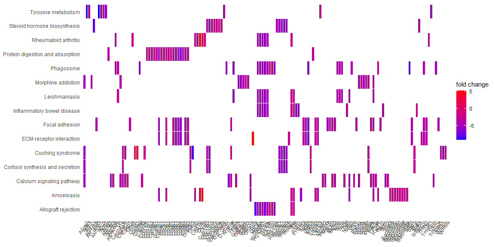

A análise de enriquecimento funcional
================

A análise de enriquecimento funcional é uma técnica utilizada para
interpretar e investigar listas de genes derivados de estudos de
high-throughput sequence.

A biblioteca clusterProfiler foi projetada para realizar
“over-representation analysis” (ORA), usando GO e KEGG para vários
organismos modelo e comparar perfis funcionais de várias condições em um
nível (por exemplo, diferentes grupos de tratamento).

Uma das principais limitações da ORA é que ela restringe a análise aos
genes DE, excluindo genes que não satisfazem o limite de significância
escolhido (normalmente a grande maioria).

[Mais informações sobre
clusterProfiler](https://www.sciencedirect.com/science/article/pii/S2666675821000667)

O enriquecimento de vias com os termos GO e a enciclopédia KEGG são os
mais usados para a análise funcional, devido à sua curadoria de longa
data e a disponibilidade para uma ampla gama de espécies.

# Instalando e carregando as bibliotecas necessárias

``` r
# Anotação gênica
library("AnnotationDbi")
library("org.Mm.eg.db")  #db de camundongo
library("GO.db")         #

# Pathway analysis of DE genes
library("clusterProfiler")
library('pathview')
library("GOstats")
library("dplyr")
library("ggplot2")
library("enrichplot")
library("cowplot")
```

# - - - - - - - - - - - - - - - - - - - - - - - - - - - - - - - - - - - - - - - - - - - - -

# Carregando os resultadps do DESeq2

# - - - - - - - - - - - - - - - - - - - - - - - - - - - - - - - - - - - - - - - - - - - - -

``` r
results <- as.data.frame(read.csv('results_DESeq2_annotation.csv'))
names(results)[1] <- "Gene.ID"
head(results)
```

    ##   Gene.ID     Gene.stable.ID   baseMean log2FoldChange     lfcSE      stat
    ## 1   10631 ENSCGRG00015023276   3.770296       5.197611 1.9787167  2.626758
    ## 2    6361 ENSCGRG00015014056 117.023468       4.401428 0.4133496 10.648197
    ## 3   10027 ENSCGRG00015021957  49.390020       4.395877 0.6319612  6.955929
    ## 4    4838 ENSCGRG00015010553 975.317910       4.122989 0.1466262 28.119055
    ## 5    4839 ENSCGRG00015010553 975.317910       4.122989 0.1466262 28.119055
    ## 6    1606 ENSCGRG00015003447  60.584781       3.557383 0.4881616  7.287306
    ##          pvalue          padj significant Mouse.gene.stable.ID GeneSymbol
    ## 1  8.620252e-03  1.834057e-02        True   ENSMUSG00000047953        Gp5
    ## 2  1.777749e-26  3.293992e-25        True   ENSMUSG00000109392     Gm5737
    ## 3  3.502474e-12  2.367394e-11        True   ENSMUSG00000024810       Il33
    ## 4 5.729765e-174 5.719738e-171        True   ENSMUSG00000058427      Cxcl2
    ## 5 5.729765e-174 5.719738e-171        True   ENSMUSG00000029379      Cxcl3
    ## 6  3.162151e-13  2.348019e-12        True   ENSMUSG00000056758      Hmga2
    ##                    GeneDescription ENTREZID
    ## 1        glycoprotein 5 (platelet)    14729
    ## 2              predicted gene 5737   436008
    ## 3                   interleukin 33    77125
    ## 4 chemokine (C-X-C motif) ligand 2    20310
    ## 5 chemokine (C-X-C motif) ligand 3   330122
    ## 6    high mobility group AT-hook 2    15364

## Removendo dados duplicados

``` r
# Removendo dados duplicados da Mouse.gene.stable.ID
results <- distinct(results, Gene.ID, .keep_all= TRUE)

head(results)
```

    ##   Gene.ID     Gene.stable.ID   baseMean log2FoldChange     lfcSE      stat
    ## 1   10631 ENSCGRG00015023276   3.770296       5.197611 1.9787167  2.626758
    ## 2    6361 ENSCGRG00015014056 117.023468       4.401428 0.4133496 10.648197
    ## 3   10027 ENSCGRG00015021957  49.390020       4.395877 0.6319612  6.955929
    ## 4    4838 ENSCGRG00015010553 975.317910       4.122989 0.1466262 28.119055
    ## 5    4839 ENSCGRG00015010553 975.317910       4.122989 0.1466262 28.119055
    ## 6    1606 ENSCGRG00015003447  60.584781       3.557383 0.4881616  7.287306
    ##          pvalue          padj significant Mouse.gene.stable.ID GeneSymbol
    ## 1  8.620252e-03  1.834057e-02        True   ENSMUSG00000047953        Gp5
    ## 2  1.777749e-26  3.293992e-25        True   ENSMUSG00000109392     Gm5737
    ## 3  3.502474e-12  2.367394e-11        True   ENSMUSG00000024810       Il33
    ## 4 5.729765e-174 5.719738e-171        True   ENSMUSG00000058427      Cxcl2
    ## 5 5.729765e-174 5.719738e-171        True   ENSMUSG00000029379      Cxcl3
    ## 6  3.162151e-13  2.348019e-12        True   ENSMUSG00000056758      Hmga2
    ##                    GeneDescription ENTREZID
    ## 1        glycoprotein 5 (platelet)    14729
    ## 2              predicted gene 5737   436008
    ## 3                   interleukin 33    77125
    ## 4 chemokine (C-X-C motif) ligand 2    20310
    ## 5 chemokine (C-X-C motif) ligand 3   330122
    ## 6    high mobility group AT-hook 2    15364

## Criando um subset dos genes com expressão significativa

``` r
res_sig = subset(results, padj < 0.5)
res_sig = res_sig[order(res_sig$log2FoldChange, decreasing=TRUE),]
head(res_sig)
```

    ##   Gene.ID     Gene.stable.ID   baseMean log2FoldChange     lfcSE      stat
    ## 1   10631 ENSCGRG00015023276   3.770296       5.197611 1.9787167  2.626758
    ## 2    6361 ENSCGRG00015014056 117.023468       4.401428 0.4133496 10.648197
    ## 3   10027 ENSCGRG00015021957  49.390020       4.395877 0.6319612  6.955929
    ## 4    4838 ENSCGRG00015010553 975.317910       4.122989 0.1466262 28.119055
    ## 5    4839 ENSCGRG00015010553 975.317910       4.122989 0.1466262 28.119055
    ## 6    1606 ENSCGRG00015003447  60.584781       3.557383 0.4881616  7.287306
    ##          pvalue          padj significant Mouse.gene.stable.ID GeneSymbol
    ## 1  8.620252e-03  1.834057e-02        True   ENSMUSG00000047953        Gp5
    ## 2  1.777749e-26  3.293992e-25        True   ENSMUSG00000109392     Gm5737
    ## 3  3.502474e-12  2.367394e-11        True   ENSMUSG00000024810       Il33
    ## 4 5.729765e-174 5.719738e-171        True   ENSMUSG00000058427      Cxcl2
    ## 5 5.729765e-174 5.719738e-171        True   ENSMUSG00000029379      Cxcl3
    ## 6  3.162151e-13  2.348019e-12        True   ENSMUSG00000056758      Hmga2
    ##                    GeneDescription ENTREZID
    ## 1        glycoprotein 5 (platelet)    14729
    ## 2              predicted gene 5737   436008
    ## 3                   interleukin 33    77125
    ## 4 chemokine (C-X-C motif) ligand 2    20310
    ## 5 chemokine (C-X-C motif) ligand 3   330122
    ## 6    high mobility group AT-hook 2    15364

## Criando uma lista dos genes diferencialmente expressos.

Criando um subset para o paramêtro gene da função enrich…() (gene = a
vector de entrez gene\_id)

``` r
# Remover genes que não tenham entrezid identificadores
res_sig_ENTREZID <- subset(res_sig, is.na(ENTREZID) == FALSE)

# Cria uma matriz de genes com log2 fold changes
gene_matrix <- res_sig_ENTREZID$log2FoldChange

# Add entrezID como nomes para cada entrada de logFC
names(gene_matrix) <- res_sig_ENTREZID$ENTREZID

# Criando um vetor de uma lista de genes que tenham um lfg > 2.
geneList <- gene_matrix[abs(gene_matrix) > 2] 

head(geneList, 10)
```

    ##    14729   436008    77125    20310   330122    15364    68810   723926 
    ## 5.197611 4.401428 4.395877 4.122989 4.122989 3.557383 3.432986 3.371903 
    ##    12993    14313 
    ## 3.028177 2.849432

# - - - - - - - - - - - - - - - - - - - - - - - - - - - - - - - - - - - - - - - - - - - - -

# Enriquecimento com GO Terms

# - - - - - - - - - - - - - - - - - - - - - - - - - - - - - - - - - - - - - - - - - - - - -

# Gene Ontology (GO)

Gene Ontology define conceitos / classes usados para descrever a função
do gene e as relações entre esses conceitos. Ele classifica as funções
em três aspectos:

-   MF: Função Molecular, atividades moleculares de produtos gênicos

-   CC: Componente Celular, onde produtos genéticos são ativos

-   BP: Processo Biológico, vias e processos maiores constituídos pelas
    atividades de vários produtos gênicos

Os termos GO são organizados em um gráfico acíclico direcionado, onde a
borda entre os termos representa a relação parental.

Como resultado da análise de enriquecimente, é gerado um a table com os
sequintes valores:

geneRatio = Razão dos genes de entrada (geneList) que estão anotados no
termo. BgRatio = Razão de todos os genes que estão anotados neste termo.

## Análise de enriquecimento das funções moleculares (MF)

``` r
go_enrich_MF <- enrichGO(
  gene= names(geneList),
  OrgDb= 'org.Mm.eg.db',
  keyType = "ENTREZID",
  ont = "MF",
  pvalueCutoff = 0.04,
  pAdjustMethod = "BH",
  qvalueCutoff = 0.05,
  readable = TRUE,
  pool = FALSE
)

summary_go_MF <- as.data.frame(go_enrich_MF)
head(summary_go_MF)
```

    ##                    ID
    ## GO:0005201 GO:0005201
    ## GO:0030020 GO:0030020
    ## GO:0005216 GO:0005216
    ## GO:0051959 GO:0051959
    ## GO:0008569 GO:0008569
    ## GO:0003777 GO:0003777
    ##                                                                        Description
    ## GO:0005201                             extracellular matrix structural constituent
    ## GO:0030020 extracellular matrix structural constituent conferring tensile strength
    ## GO:0005216                                                    ion channel activity
    ## GO:0051959                                 dynein light intermediate chain binding
    ## GO:0008569            ATP-dependent microtubule motor activity, minus-end-directed
    ## GO:0003777                                              microtubule motor activity
    ##            GeneRatio   BgRatio       pvalue     p.adjust       qvalue
    ## GO:0005201   41/1089 150/22682 3.178271e-20 2.879514e-17 2.358612e-17
    ## GO:0030020   15/1089  38/22682 8.252140e-11 3.738219e-08 3.061978e-08
    ## GO:0005216   47/1089 418/22682 5.859518e-08 1.769574e-05 1.449460e-05
    ## GO:0051959   11/1089  31/22682 1.036573e-07 2.313254e-05 1.894788e-05
    ## GO:0008569    9/1089  20/22682 1.363796e-07 2.313254e-05 1.894788e-05
    ## GO:0003777   16/1089  70/22682 1.531957e-07 2.313254e-05 1.894788e-05
    ##                                                                                                                                                                                                                                                                                                                   geneID
    ## GO:0005201                                     Matn4/Impg2/Tinagl1/Col11a2/Col5a1/Col9a3/Hspg2/Ntn1/Col5a3/Col15a1/Bgn/Col4a2/Lama3/Igfbp6/Col14a1/Col24a1/Col27a1/Col6a1/Hmcn1/Ecm1/Emilin2/Nid2/Col11a1/Dcn/Tnc/Col19a1/Fbln5/Tectb/Abi3bp/Col9a1/Col8a2/Lamb3/Postn/Col6a4/Papln/Dpt/Col1a1/Col6a3/Sspo/Col6a5/Adipoq
    ## GO:0030020                                                                                                                                                                                                Col11a2/Col5a1/Col9a3/Col5a3/Col15a1/Col4a2/Col14a1/Col24a1/Col27a1/Col6a1/Col11a1/Col6a4/Col1a1/Col6a3/Col6a5
    ## GO:0005216 Grik5/Pkd1l2/Cacng4/Grid2/Ryr3/Scn7a/Ano4/Kcnk2/Catsper3/Kcnh1/Gria4/Asic4/Tmc1/Scn4a/Gabrr1/Pkd1l1/Mcoln2/Gabrp/Ano2/Cacna1i/Kcnh5/Kcnab3/Kcnk5/Clcn4/Clcn5/Pkd2l1/Trpm6/Scnn1b/Mcoln3/Clcnkb/Gabrr3/Grid1/Kcnab1/Cacna1a/Hvcn1/Chrna1/Trpm1/Abcc8/Slc24a3/Trpv3/Ryr2/Kcnf1/Kcns2/Gabra1/Gabrg3/Clic6/Kcnma1
    ## GO:0051959                                                                                                                                                                                                                                      Hook1/Dnah2/Dnah9/Dnah6/Dnah11/Ccdc88c/Dnah1/Dnah7b/Dnah7a/Dnah7c/Dnah17
    ## GO:0008569                                                                                                                                                                                                                                                    Dnah2/Dnah9/Dnah6/Dnah11/Dnah1/Dnah7b/Dnah7a/Dnah7c/Dnah17
    ## GO:0003777                                                                                                                                                                                                       Kif22/Kif15/Kif21b/Kif6/Kif17/Kif26b/Dnah2/Dnah9/Dnah6/Dnah11/Dnah1/Dnah7b/Dnah7a/Dnah7c/Dync1i1/Dnah17
    ##            Count
    ## GO:0005201    41
    ## GO:0030020    15
    ## GO:0005216    47
    ## GO:0051959    11
    ## GO:0008569     9
    ## GO:0003777    16

``` r
# Salvando os resultados:
#writexl::write_xlsx(summary_go_MF, 'summary_go_MF.xlsx')
```

### Plot das funções moleculares

``` r
barplot(go_enrich_MF, 
        drop = TRUE, 
        showCategory = 50, 
        title = "GO Molecular Function",
        font.size = 8)
```

<!-- -->

``` r
ggsave(file.path("barplot_GO_MF.png"))
```

    ## Saving 10 x 10 in image

## Análise de enriquecimento dos Processos Biológicos (BP)

``` r
go_enrich_BP <- enrichGO(
  gene=names(geneList),
  OrgDb= 'org.Mm.eg.db',
  keyType = "ENTREZID",
  ont = "BP",
  pvalueCutoff = 0.04,
  pAdjustMethod = "BH",
  qvalueCutoff = 0.05,
  readable = TRUE,
  pool = FALSE
)

summary_go_BP <- as.data.frame(go_enrich_BP)
head(summary_go_BP)
```

    ##                    ID                                   Description GeneRatio
    ## GO:0030198 GO:0030198             extracellular matrix organization   52/1074
    ## GO:0043062 GO:0043062          extracellular structure organization   52/1074
    ## GO:0045229 GO:0045229 external encapsulating structure organization   52/1074
    ## GO:0050900 GO:0050900                           leukocyte migration   48/1074
    ## GO:0060326 GO:0060326                               cell chemotaxis   43/1074
    ## GO:0002685 GO:0002685             regulation of leukocyte migration   33/1074
    ##              BgRatio       pvalue     p.adjust       qvalue
    ## GO:0030198 306/23355 2.649441e-16 5.226557e-13 4.273461e-13
    ## GO:0043062 307/23355 3.051707e-16 5.226557e-13 4.273461e-13
    ## GO:0045229 307/23355 3.051707e-16 5.226557e-13 4.273461e-13
    ## GO:0050900 364/23355 5.330292e-11 5.780390e-08 4.726299e-08
    ## GO:0060326 304/23355 5.625137e-11 5.780390e-08 4.726299e-08
    ## GO:0002685 217/23355 1.492365e-09 1.123762e-06 9.188364e-07
    ##                                                                                                                                                                                                                                                                                                                                                                    geneID
    ## GO:0030198 Gas2/Foxc1/Nepn/Mmp28/Col11a2/Notch1/Col5a1/Col9a3/Tnfrsf1b/Adamts4/Ddr1/Hspg2/Fgfr4/Col5a3/Col15a1/Spint2/Col4a2/Adamts3/Optc/Ptx3/Ltbp3/Olfml2b/Col14a1/Col24a1/Col27a1/Mmp12/Bmp2/Col11a1/Itga8/Crispld2/Col19a1/Fbln5/Thsd4/Loxl2/Abi3bp/Col9a1/Adamtsl2/Col8a2/Lamb3/Postn/Lcp1/Col6a4/Wt1/Papln/Dpt/Col1a1/Hpse2/Adamts14/Csgalnact1/Mmp2/Adamts15/Itgb3
    ## GO:0043062 Gas2/Foxc1/Nepn/Mmp28/Col11a2/Notch1/Col5a1/Col9a3/Tnfrsf1b/Adamts4/Ddr1/Hspg2/Fgfr4/Col5a3/Col15a1/Spint2/Col4a2/Adamts3/Optc/Ptx3/Ltbp3/Olfml2b/Col14a1/Col24a1/Col27a1/Mmp12/Bmp2/Col11a1/Itga8/Crispld2/Col19a1/Fbln5/Thsd4/Loxl2/Abi3bp/Col9a1/Adamtsl2/Col8a2/Lamb3/Postn/Lcp1/Col6a4/Wt1/Papln/Dpt/Col1a1/Hpse2/Adamts14/Csgalnact1/Mmp2/Adamts15/Itgb3
    ## GO:0045229 Gas2/Foxc1/Nepn/Mmp28/Col11a2/Notch1/Col5a1/Col9a3/Tnfrsf1b/Adamts4/Ddr1/Hspg2/Fgfr4/Col5a3/Col15a1/Spint2/Col4a2/Adamts3/Optc/Ptx3/Ltbp3/Olfml2b/Col14a1/Col24a1/Col27a1/Mmp12/Bmp2/Col11a1/Itga8/Crispld2/Col19a1/Fbln5/Thsd4/Loxl2/Abi3bp/Col9a1/Adamtsl2/Col8a2/Lamb3/Postn/Lcp1/Col6a4/Wt1/Papln/Dpt/Col1a1/Hpse2/Adamts14/Csgalnact1/Mmp2/Adamts15/Itgb3
    ## GO:0050900                                                                         Il33/Cxcl2/Cxcl3/Stap1/Ccl2/Cxcl5/Mmp28/Ifng/Adam10/Mtus1/Ptpn22/Nod2/Chst4/Rarres2/F2rl1/Cxcl12/Dysf/Trem1/Ptafr/Ecm1/Mcoln2/Rac2/Pecam1/Plvap/Spn/Pde4d/Nckap1l/Cd300a/Aoc3/Spp1/Adora1/Vav1/Ccr7/Tnfsf11/S100a8/Spns2/Ripk3/Scg2/F7/Itga9/Il34/Cd74/Lbp/Gas6/Lyn/Ednra/Itgb3/Cxcl13
    ## GO:0060326                                                                                                 Cxcl2/Cxcl3/Enpp2/Stap1/Hmgb2/Ccl2/Cxcl5/Mmp28/Notch1/Ifng/Adam10/Plxnb3/Mtus1/Nod2/Pdgfrb/Rarres2/F2rl1/Cxcl12/Dysf/Trem1/Bin2/Rac2/Tiam1/Pde4d/Nckap1l/Spp1/Vav1/Ccr7/Tnfsf11/S100a8/Efcab1/Ackr2/Scg2/F7/Itga9/Arhgef16/Il34/Cd74/Lbp/Gas6/Lyn/Ednra/Cxcl13
    ## GO:0002685                                                                                                                                                                   Il33/Stap1/Ccl2/Mmp28/Adam10/Mtus1/Ptpn22/Nod2/Rarres2/F2rl1/Cxcl12/Dysf/Ptafr/Ecm1/Rac2/Pecam1/Plvap/Spn/Nckap1l/Cd300a/Aoc3/Adora1/Ccr7/Ripk3/F7/Il34/Cd74/Lbp/Gas6/Lyn/Ednra/Itgb3/Cxcl13
    ##            Count
    ## GO:0030198    52
    ## GO:0043062    52
    ## GO:0045229    52
    ## GO:0050900    48
    ## GO:0060326    43
    ## GO:0002685    33

``` r
## Salvando os resultados:
#writexl::write_xlsx(summary_go_BP, 'summary_go_BP.xlsx')
```

### Plot das Processos biológicos

``` r
barplot(go_enrich_BP, 
        drop = TRUE, 
        showCategory = 50, 
        title = "GO Biological Process",
        font.size = 8)
```

<!-- -->

``` r
ggsave(file.path("barplot_GO_BP.png"))
```

    ## Saving 10 x 10 in image

## Análise de enriquecimento componentes celulares (CC)

``` r
go_enrich_CC <- enrichGO(
  gene=names(geneList),
  OrgDb= 'org.Mm.eg.db',
  keyType = "ENTREZID",
  ont = "CC",
  pvalueCutoff = 0.04,
  pAdjustMethod = "BH",
  qvalueCutoff = 0.05,
  readable = TRUE,
  pool = FALSE
)

summary_go_CC <- as.data.frame(go_enrich_CC)
head(summary_go_CC)
```

    ##                    ID                              Description GeneRatio
    ## GO:0062023 GO:0062023 collagen-containing extracellular matrix   65/1107
    ## GO:0005581 GO:0005581                          collagen trimer   23/1107
    ## GO:0043235 GO:0043235                         receptor complex   49/1107
    ## GO:0034702 GO:0034702                      ion channel complex   36/1107
    ## GO:0036156 GO:0036156                         inner dynein arm    7/1107
    ## GO:1902495 GO:1902495        transmembrane transporter complex   37/1107
    ##              BgRatio       pvalue     p.adjust       qvalue
    ## GO:0062023 386/23177 5.174204e-19 2.638844e-16 2.124147e-16
    ## GO:0005581  81/23177 2.232115e-12 5.691892e-10 4.581709e-10
    ## GO:0043235 414/23177 4.993107e-09 8.488282e-07 6.832673e-07
    ## GO:0034702 297/23177 2.994510e-07 3.283288e-05 2.642895e-05
    ## GO:0036156  12/23177 3.568520e-07 3.283288e-05 2.642895e-05
    ## GO:1902495 313/23177 3.862692e-07 3.283288e-05 2.642895e-05
    ##                                                                                                                                                                                                                                                                                                                                                                                                                                    geneID
    ## GO:0062023 Matn4/Nepn/Impg2/Tinagl1/Tgm2/Col11a2/Serpinb9/Col5a1/Col9a3/Adamts4/Angptl6/Timp2/Hspg2/Adam10/Ntn1/Ctsb/Col5a3/Col15a1/Bgn/Col4a2/Lama3/Igfbp6/Megf6/Ltbp3/Rarres2/Ssc5d/Kng1/Kng2/Col14a1/Col24a1/Angptl4/Col27a1/Col6a1/Hmcn1/Ecm1/Emilin2/Nid2/Col11a1/Dcn/Tnc/Spn/Fbln5/Fmod/Gpc3/Egfl7/Lad1/Sema6d/Loxl2/Abi3bp/Col9a1/Thbs2/Col8a2/Lamb3/Postn/Angpt4/Col6a4/Papln/Dpt/Col1a1/Col6a3/Lrrc15/Adamts15/Sspo/Col6a5/Sftpd
    ## GO:0005581                                                                                                                                                                                                                                                          Col11a2/Col5a1/Col9a3/Col5a3/Col15a1/Col4a2/Col14a1/Col24a1/Col27a1/Col6a1/Emilin2/C1qtnf6/Col11a1/Dcn/Col19a1/Col9a1/Col8a2/Col6a4/Col1a1/Col6a3/Col6a5/Adipoq/Sftpd
    ## GO:0043235                                                                                                                 Ptprq/Nepn/Gprc5a/Impg2/Notch1/Cubn/Grik5/Gpr37l1/Ddr1/Cacng4/Plxnb3/Grid2/Fgfr4/Egfr/Olfm2/Notch3/Pdgfrb/Gria4/Gfra1/Rxra/Gabrr1/Bmp2/Itga8/Gabrp/Crlf1/Il31ra/Pkd2l1/Lifr/Fcrl5/Shank2/Calcr/Itgad/Gabrr3/Chrna1/Olr1/Trpv3/Tas1r2/Lrrc7/Slitrk5/Itga9/Cr2/Cnih3/Cd74/Gabra1/Gabrg3/Il18r1/Lyn/Il18rap/Itgb3
    ## GO:0034702                                                                                                                                                                                      Grik5/Cacng4/Grid2/Ryr3/Scn7a/Olfm2/Kcnk2/Catsper3/Kcnh1/Gria4/Nos1ap/Scn4a/Gabrr1/Pkd1l1/Gabrp/Ano2/Cacna1i/Kcnab3/Pkd2l1/Scnn1b/Clcnkb/Pde4d/Shank2/Kcnab1/Cacna1a/Chrna1/Abcc8/Ryr2/Lrrc7/Kcnf1/Kcns2/Cnih3/Gabra1/Gabrg3/Clic6/Kcnma1
    ## GO:0036156                                                                                                                                                                                                                                                                                                                                                                                   Dnai3/Dnah2/Dnah6/Dnah1/Dnah7b/Dnah7a/Dnah7c
    ## GO:1902495                                                                                                                                                                               Grik5/Cacng4/Grid2/Ryr3/Scn7a/Olfm2/Kcnk2/Catsper3/Kcnh1/Gria4/Nos1ap/Scn4a/Gabrr1/Pkd1l1/Gabrp/Ano2/Cacna1i/Kcnab3/Pkd2l1/Scnn1b/Clcnkb/Pde4d/Shank2/Atp1a2/Kcnab1/Cacna1a/Chrna1/Abcc8/Ryr2/Lrrc7/Kcnf1/Kcns2/Cnih3/Gabra1/Gabrg3/Clic6/Kcnma1
    ##            Count
    ## GO:0062023    65
    ## GO:0005581    23
    ## GO:0043235    49
    ## GO:0034702    36
    ## GO:0036156     7
    ## GO:1902495    37

``` r
## Salvando os resultados:
#writexl::write_xlsx(summary_go_CC, 'summary_go_CC.xlsx')
```

### Plot dos Componentes Celulares

``` r
barplot(go_enrich_CC, 
        drop = TRUE, 
        showCategory = 50, 
        title = "GO Cellular Componemts",
        font.size = 8)
```

<!-- -->

``` r
ggsave(file.path("barplot_GO_CC.png"))
```

    ## Saving 10 x 10 in image

## Análise de enriquecimento GO ALL

``` r
go_enrich_ALL <- enrichGO(
  gene=names(geneList),
  OrgDb= 'org.Mm.eg.db',
  keyType = "ENTREZID",
  ont = "ALL",
  pvalueCutoff = 0.04,
  pAdjustMethod = "BH",
  qvalueCutoff = 0.05,
  readable = TRUE,
  pool = FALSE
)

summary_go_ALL <- as.data.frame(go_enrich_ALL)
head(summary_go_ALL)
```

    ##            ONTOLOGY         ID                                   Description
    ## GO:0030198       BP GO:0030198             extracellular matrix organization
    ## GO:0043062       BP GO:0043062          extracellular structure organization
    ## GO:0045229       BP GO:0045229 external encapsulating structure organization
    ## GO:0050900       BP GO:0050900                           leukocyte migration
    ## GO:0060326       BP GO:0060326                               cell chemotaxis
    ## GO:0002685       BP GO:0002685             regulation of leukocyte migration
    ##            GeneRatio   BgRatio       pvalue     p.adjust       qvalue
    ## GO:0030198   52/1074 306/23355 2.649441e-16 5.226557e-13 4.273461e-13
    ## GO:0043062   52/1074 307/23355 3.051707e-16 5.226557e-13 4.273461e-13
    ## GO:0045229   52/1074 307/23355 3.051707e-16 5.226557e-13 4.273461e-13
    ## GO:0050900   48/1074 364/23355 5.330292e-11 5.780390e-08 4.726299e-08
    ## GO:0060326   43/1074 304/23355 5.625137e-11 5.780390e-08 4.726299e-08
    ## GO:0002685   33/1074 217/23355 1.492365e-09 1.123762e-06 9.188364e-07
    ##                                                                                                                                                                                                                                                                                                                                                                    geneID
    ## GO:0030198 Gas2/Foxc1/Nepn/Mmp28/Col11a2/Notch1/Col5a1/Col9a3/Tnfrsf1b/Adamts4/Ddr1/Hspg2/Fgfr4/Col5a3/Col15a1/Spint2/Col4a2/Adamts3/Optc/Ptx3/Ltbp3/Olfml2b/Col14a1/Col24a1/Col27a1/Mmp12/Bmp2/Col11a1/Itga8/Crispld2/Col19a1/Fbln5/Thsd4/Loxl2/Abi3bp/Col9a1/Adamtsl2/Col8a2/Lamb3/Postn/Lcp1/Col6a4/Wt1/Papln/Dpt/Col1a1/Hpse2/Adamts14/Csgalnact1/Mmp2/Adamts15/Itgb3
    ## GO:0043062 Gas2/Foxc1/Nepn/Mmp28/Col11a2/Notch1/Col5a1/Col9a3/Tnfrsf1b/Adamts4/Ddr1/Hspg2/Fgfr4/Col5a3/Col15a1/Spint2/Col4a2/Adamts3/Optc/Ptx3/Ltbp3/Olfml2b/Col14a1/Col24a1/Col27a1/Mmp12/Bmp2/Col11a1/Itga8/Crispld2/Col19a1/Fbln5/Thsd4/Loxl2/Abi3bp/Col9a1/Adamtsl2/Col8a2/Lamb3/Postn/Lcp1/Col6a4/Wt1/Papln/Dpt/Col1a1/Hpse2/Adamts14/Csgalnact1/Mmp2/Adamts15/Itgb3
    ## GO:0045229 Gas2/Foxc1/Nepn/Mmp28/Col11a2/Notch1/Col5a1/Col9a3/Tnfrsf1b/Adamts4/Ddr1/Hspg2/Fgfr4/Col5a3/Col15a1/Spint2/Col4a2/Adamts3/Optc/Ptx3/Ltbp3/Olfml2b/Col14a1/Col24a1/Col27a1/Mmp12/Bmp2/Col11a1/Itga8/Crispld2/Col19a1/Fbln5/Thsd4/Loxl2/Abi3bp/Col9a1/Adamtsl2/Col8a2/Lamb3/Postn/Lcp1/Col6a4/Wt1/Papln/Dpt/Col1a1/Hpse2/Adamts14/Csgalnact1/Mmp2/Adamts15/Itgb3
    ## GO:0050900                                                                         Il33/Cxcl2/Cxcl3/Stap1/Ccl2/Cxcl5/Mmp28/Ifng/Adam10/Mtus1/Ptpn22/Nod2/Chst4/Rarres2/F2rl1/Cxcl12/Dysf/Trem1/Ptafr/Ecm1/Mcoln2/Rac2/Pecam1/Plvap/Spn/Pde4d/Nckap1l/Cd300a/Aoc3/Spp1/Adora1/Vav1/Ccr7/Tnfsf11/S100a8/Spns2/Ripk3/Scg2/F7/Itga9/Il34/Cd74/Lbp/Gas6/Lyn/Ednra/Itgb3/Cxcl13
    ## GO:0060326                                                                                                 Cxcl2/Cxcl3/Enpp2/Stap1/Hmgb2/Ccl2/Cxcl5/Mmp28/Notch1/Ifng/Adam10/Plxnb3/Mtus1/Nod2/Pdgfrb/Rarres2/F2rl1/Cxcl12/Dysf/Trem1/Bin2/Rac2/Tiam1/Pde4d/Nckap1l/Spp1/Vav1/Ccr7/Tnfsf11/S100a8/Efcab1/Ackr2/Scg2/F7/Itga9/Arhgef16/Il34/Cd74/Lbp/Gas6/Lyn/Ednra/Cxcl13
    ## GO:0002685                                                                                                                                                                   Il33/Stap1/Ccl2/Mmp28/Adam10/Mtus1/Ptpn22/Nod2/Rarres2/F2rl1/Cxcl12/Dysf/Ptafr/Ecm1/Rac2/Pecam1/Plvap/Spn/Nckap1l/Cd300a/Aoc3/Adora1/Ccr7/Ripk3/F7/Il34/Cd74/Lbp/Gas6/Lyn/Ednra/Itgb3/Cxcl13
    ##            Count
    ## GO:0030198    52
    ## GO:0043062    52
    ## GO:0045229    52
    ## GO:0050900    48
    ## GO:0060326    43
    ## GO:0002685    33

``` r
## Salvando os resultados de enriquecimento GO ALL
#writexl::write_xlsx(summary_go_ALL, 'summary_go_ALL.xlsx')
```

### Barplot das vias GO ALL

Barplot dos termos enriquecidos mais significativos.

``` r
barplot(go_enrich_ALL, 
        drop = TRUE, 
        showCategory = 50, 
        title = "GO ALL",
        font.size = 8)
```

<!-- -->

``` r
ggsave(file.path("barplot_GO_ALL.png"))
```

    ## Saving 10 x 10 in image

### Dotplot

O DotPlot é similar ao barplot com a capacidade de codificar outros
parâmetros como tamanho dos pontos.

``` r
dotplot(go_enrich_ALL, 
        showCategory=40,
        title = "Dot Plot",
        label_format = 30
        )
```

<!-- -->

``` r
ggsave(file.path("dotplot_GO_ALL.png"))
```

    ## Saving 10 x 10 in image

### Gene-Concept Network

Tanto barplot quanto o dotplots exibem apenas os termos enriquecidos
mais significativos ou selecionados.

A função cnetplot () fornece uma maneira de saber quais genes estão
envolvidos nesses termos significativos, extrair a associação das
complexidades potencialmente biológicas nas quais um gene pode pertencer
a várias categorias de anotação e fornecer informações de alterações
numéricas, se disponíveis.

``` r
#png(filename = "Gene-Concept_Networkplot.png", 1200, 800, res = 120)
cnetplot(
  go_enrich_ALL,
  showCategory = 5,
  foldChange = geneList,
  layout = "kk",
  colorEdge = FALSE,
  circular = FALSE,
  node_label = "all",
  cex_category = 1,
  cex_gene = 0.5,
  cex_label_category = 1,
  cex_label_gene = 1,
  shadowtext = "all"
) + coord_cartesian(clip = "off")
```

<!-- -->

``` r
#ggsave(file.path("cnetplot_GO_ALL.png"))
```

## Enrichment Map

O mapa de enriquecimento organiza os termos enriquecidos em uma rede com
bordas conectando o conjuntos de genes sobrepostos. Desta forma, o
conjuntos de genes que se sobrepõem mutuamente tendem a se agrupar,
tornando mais fácil identificar o módulo funcional.

A função emapplot suporta resultados obtidos de teste hipergeométrico e
análise de enriquecimento de conjunto de genes.

``` r
Enrichment_Map <- pairwise_termsim(go_enrich_ALL)

emapplot(Enrichment_Map,
         showCategory = 15,
         color = "p.adjust",
         cex_category = 1.5,
         cex_line = 0.5, 
         layout="kk"
         )
```

<!-- -->

``` r
ggsave(file.path("emapplot_GO_ALL.png"))
```

    ## Saving 10 x 8 in image

### Heatmap-like functional classification

O heatplot é semelhante ao cnetplot, mas exibe as relações como um mapa
de calor. O “Gene-Concept Network” pode se tornar muito complicada se
apresentar um grande número de termos significativos. O heatplot pode
simplificar o resultado facilitando a identificação dos padrões de
expressão.

``` r
#png(filename = "heatmap_like_func_plot.png", 1200, 600, res = 120)
heatplot(go_enrich_ALL, showCategory=15, foldChange=geneList)
```

<!-- -->

``` r
#ggsave(file.path("heatplot_GO_ALL.png"))
```

### Tree plot

A função treeplot() executa agrupamento hierárquico de termos
enriquecidos. Ele se baseia nas semelhanças entre pares dos termos
enriquecidos calculados pela função pairwise\_termsim(), que por padrão,
usa o índice de similaridade de Jaccard(JC).

``` r
tree_plot_data <- pairwise_termsim(go_enrich_ALL)

treeplot(tree_plot_data,
         showCategory = 30,
         label_format = 20,
         guide = "none",
         offset=9)
```

    ## Warning: The "label" has(have) been found in tree data. You might need to rename the
    ## variable(s) in the data of "geom_cladelab" to avoid this warning!

    ## Warning: It is deprecated to specify `guide = FALSE` to remove a guide. Please
    ## use `guide = "none"` instead.

    ## Warning: It is deprecated to specify `guide = FALSE` to remove a guide. Please
    ## use `guide = "none"` instead.

<!-- -->

``` r
ggsave(file.path("treeplot_GO_ALL.png"))
```

    ## Saving 12 x 10 in image

    ## Warning: It is deprecated to specify `guide = FALSE` to remove a guide. Please
    ## use `guide = "none"` instead.

    ## Warning: It is deprecated to specify `guide = FALSE` to remove a guide. Please
    ## use `guide = "none"` instead.

# - - - - - - - - - - - - - - - - - - - - - - - - - - - - - - - - - - - - - - - - - - - - -

# Enriquecimento com KEGG database

# - - - - - - - - - - - - - - - - - - - - - - - - - - - - - - - - - - - - - - - - - - - - -

## Enciclopédia de Genes e Genomas de Kyoto (KEGG)

KEGG é uma coleção de mapas de vias desenhados manualmente que
representam redes de interação e reação molecular. Essas vias cobrem uma
ampla gama de processos bioquímicos que podem ser divididos em 7 grandes
categorias:

-   Metabolismo
-   Processamento de informação genética
-   Processamento de informações ambientais
-   Processos celulares
-   Sistemas organizacionais
-   Doenças humanas
-   Desenvolvimento de drogas.

Para consulta da lista de organismos suportados pelo database, consulte
o link abaixo: [Lista de
organismo](https://www.genome.jp/kegg/catalog/org_list.html)

## Análise de enriquecimento com KEGG

``` r
kegg_enrich <- enrichKEGG(gene= names(geneList),
                          organism = "mmu",     
                          keyType = "kegg",
                          pvalueCutoff = 0.04,
                          pAdjustMethod = "BH",
                          qvalueCutoff = 0.05,
                          use_internal_data = FALSE
                          )
```

    ## Reading KEGG annotation online:
    ## 
    ## Reading KEGG annotation online:

``` r
# Set o gene_id para o formato human readble
kegg_enrich.H <- setReadable(kegg_enrich, OrgDb = org.Mm.eg.db, keyType= "ENTREZID")

# Sumário da tabela de resultados:
summary_kegg_enrich <- as.data.frame(kegg_enrich.H)

head(summary_kegg_enrich, 10)
```

    ##                ID                      Description GeneRatio  BgRatio
    ## mmu05146 mmu05146                       Amoebiasis    22/495 107/8932
    ## mmu04512 mmu04512         ECM-receptor interaction    19/495  88/8932
    ## mmu04974 mmu04974 Protein digestion and absorption    20/495 108/8932
    ## mmu04510 mmu04510                   Focal adhesion    28/495 201/8932
    ## mmu05140 mmu05140                    Leishmaniasis    14/495  70/8932
    ## mmu05321 mmu05321       Inflammatory bowel disease    12/495  62/8932
    ## mmu04934 mmu04934                 Cushing syndrome    21/495 162/8932
    ## mmu00350 mmu00350              Tyrosine metabolism     9/495  40/8932
    ## mmu05323 mmu05323             Rheumatoid arthritis    14/495  87/8932
    ## mmu05032 mmu05032               Morphine addiction    14/495  91/8932
    ##                pvalue     p.adjust       qvalue
    ## mmu05146 6.777438e-08 2.012899e-05 1.619451e-05
    ## mmu04512 2.387351e-07 3.545217e-05 2.852257e-05
    ## mmu04974 1.560335e-06 1.544732e-04 1.242793e-04
    ## mmu04510 5.461555e-06 4.055204e-04 3.262560e-04
    ## mmu05140 2.348098e-05 1.394770e-03 1.122144e-03
    ## mmu05321 1.249474e-04 6.184896e-03 4.975975e-03
    ## mmu04934 2.291828e-04 9.110874e-03 7.330031e-03
    ## mmu00350 2.678502e-04 9.110874e-03 7.330031e-03
    ## mmu05323 2.760871e-04 9.110874e-03 7.330031e-03
    ## mmu05032 4.448782e-04 1.202861e-02 9.677459e-03
    ##                                                                                                                                                                           geneID
    ## mmu05146        Cxcl2/Cxcl3/Serpinb9c/Serpinb9d/Serpinb9/Serpinb9b/Serpinb9f/Serpinb9h/Serpinb9e/Serpinb9g/Ifng/Rab7b/Col4a2/Lama3/Il10/Csf2/Lamb3/Prkcb/Gna14/Col1a1/Nos2/Il1r2
    ## mmu04512                                                     Gp5/Col9a3/Hspg2/Col4a2/Lama3/Sv2b/Col6a1/Itga8/Tnc/Col9a1/Thbs2/Spp1/Lamb3/Col6a4/Col1a1/Itga9/Col6a3/Itgb3/Col6a5
    ## mmu04974                       Col11a2/Col5a1/Col9a3/Col5a3/Col15a1/Col4a2/Col14a1/Col24a1/Col27a1/Col6a1/Col11a1/Kcnk5/Col19a1/Atp1a2/Col9a1/Col8a2/Col6a4/Col1a1/Col6a3/Col6a5
    ## mmu04510 Col9a3/Col4a2/Lama3/Egfr/Pdgfrb/Col6a1/Mylk2/Itga8/Rac2/Cav3/Tnc/Myl9/Mylk3/Parvg/Col9a1/Thbs2/Spp1/Vav1/Lamb3/Prkcb/Akt3/Col6a4/Col1a1/Itga9/Col6a3/Myl10/Itgb3/Col6a5
    ## mmu05140                                                                                          Ifng/C3/Il10/H2-Ob/Ncf2/H2-DMb1/H2-DMb2/Ncf1/Prkcb/Ncf4/Nos2/H2-Aa/Fcgr4/H2-Ea
    ## mmu05321                                                                                              Ifng/Stat4/Nod2/Il10/H2-Ob/H2-DMb1/H2-DMb2/Rorc/H2-Aa/Il18r1/Il18rap/H2-Ea
    ## mmu04934                               Ccne2/Ccne1/Cdkn2b/Wnt9a/Star/Egfr/Creb3l3/Kcnk2/Camk2b/Pde8a/Wnt11/Cacna1i/Cyp11b1/Cyp11b2/Adcy2/Wnt7b/Hsd3b2/Hsd3b3/Hsd3b6/Hsd3b1/Crhr1
    ## mmu00350                                                                                                                           Maob/Aox2/Ddc/Aoc3/Adh7/Tpo/Aox4/Adh1/Aldh3b1
    ## mmu05323                                                                              Cxcl2/Cxcl3/Ccl2/Cxcl5/Ifng/Cxcl12/Csf2/H2-Ob/Atp6v0d2/H2-DMb1/H2-DMb2/Tnfsf11/H2-Aa/H2-Ea
    ## mmu05032                                                                              Pde3a/Gabrr1/Gabrp/Pde8a/Pde4d/Gabrr3/Adora1/Cacna1a/Pde1a/Prkcb/Pde3b/Adcy2/Gabra1/Gabrg3
    ##          Count
    ## mmu05146    22
    ## mmu04512    19
    ## mmu04974    20
    ## mmu04510    28
    ## mmu05140    14
    ## mmu05321    12
    ## mmu04934    21
    ## mmu00350     9
    ## mmu05323    14
    ## mmu05032    14

``` r
## salvando os resultados:
#writexl::write_xlsx(summary_kegg_enrich, 'summary_kegg_enrich.xlsx')
```

## KEGG barplot

``` r
barplot(kegg_enrich, 
        drop = TRUE, 
        showCategory = 50, 
        title = "KEGG Enrichment Pathways",
        font.size = 8)
```

<!-- -->

``` r
ggsave(file.path("barplot_Kegg.png"))
```

    ## Saving 10 x 10 in image

## Kegg Dotplot

``` r
dotplot(kegg_enrich, 
        showCategory=40,
        title = "GO ALL Enrichment",
        label_format = 30)
```

<!-- -->

``` r
ggsave(file.path("dotplot_Kegg.png"))
```

    ## Saving 10 x 10 in image

## Gene-Concept Network

``` r
#png(filename = "cnetplot_kegg_enrich.png", height = 1000, width = 1200, res = 120)

cnetplot(
  kegg_enrich.H,
  showCategory = 5,
  foldChange = geneList,
  layout = "kk",
  colorEdge = FALSE,
  circular = FALSE,
  node_label = "all",
  cex_category = 1,
  cex_gene = 0.5,
  cex_label_category = 1,
  cex_label_gene = 1,
  shadowtext = "all"
) + coord_cartesian(clip = "off")
```

<!-- -->

``` r
ggsave(file.path("cnetplot_Kegg.png"))
```

    ## Saving 10 x 10 in image

## Enrichment Map

``` r
Enrichment_Map_kegg <- pairwise_termsim(kegg_enrich)

emapplot(Enrichment_Map_kegg,
         showCategory = 15,
         color = "p.adjust",
         cex_category = 1.5,
         cex_line = 0.5, 
         layout="fr"
         )
```

<!-- -->

``` r
ggsave(file.path("emapplot_Kegg.png"))
```

    ## Saving 10 x 10 in image

## Heatmap-like functional classification

``` r
#png(filename = "heatmap_kegg_enrich.png", height = 800, width = 1600, res = 120)

heatplot(kegg_enrich.H, showCategory=15, foldChange=geneList)
```

<!-- -->

``` r
#ggsave(file.path("heatplot_Kegg.png"))
```

## Tree plot

``` r
tree_plot_kegg <- pairwise_termsim(kegg_enrich)

treeplot(tree_plot_kegg,
         showCategory = 30,
         label_format = 20,
         offset = 9,
         guide = "none")
```

    ## Warning: The "label" has(have) been found in tree data. You might need to rename the
    ## variable(s) in the data of "geom_cladelab" to avoid this warning!

    ## Warning: It is deprecated to specify `guide = FALSE` to remove a guide. Please
    ## use `guide = "none"` instead.

    ## Warning: It is deprecated to specify `guide = FALSE` to remove a guide. Please
    ## use `guide = "none"` instead.

<!-- -->

``` r
ggsave(file.path("treeplot_Kegg.png"))
```

    ## Saving 12 x 10 in image

    ## Warning: It is deprecated to specify `guide = FALSE` to remove a guide. Please
    ## use `guide = "none"` instead.

    ## Warning: It is deprecated to specify `guide = FALSE` to remove a guide. Please
    ## use `guide = "none"` instead.

# Plot das vias mais significativas

``` r
# for (i in head(summary_kegg_enrich, 10)[,1]){
#   pathview(gene.data = geneList,
#          pathway.id = i,
#          species = "mmu",
#          map.symbol = T,
#          keeg.native = T)
# }
```

# Plot de vias específicas do KEGG Pathways

``` r
# # pathway.id = KEGG pathway identifier
# pathview(gene.data = geneList,
#          pathway.id = "mmu03050",
#          species = "mmu",
#          out.suffix = "Proteosome",
#          map.symbol = T,
#          keeg.native = T)
# 
# pathview(gene.data = geneList,
#          pathway.id = "04110",
#          species = "mmu",
#          out.suffix = "Cell Cicle",
#          keeg.native = T)
```

### Informações da sessão

``` r
sessionInfo()
```

    ## R version 4.1.1 (2021-08-10)
    ## Platform: x86_64-w64-mingw32/x64 (64-bit)
    ## Running under: Windows 10 x64 (build 22000)
    ## 
    ## Matrix products: default
    ## 
    ## locale:
    ## [1] LC_COLLATE=Portuguese_Brazil.1252  LC_CTYPE=Portuguese_Brazil.1252   
    ## [3] LC_MONETARY=Portuguese_Brazil.1252 LC_NUMERIC=C                      
    ## [5] LC_TIME=Portuguese_Brazil.1252    
    ## 
    ## attached base packages:
    ## [1] parallel  stats4    stats     graphics  grDevices utils     datasets 
    ## [8] methods   base     
    ## 
    ## other attached packages:
    ##  [1] cowplot_1.1.1         enrichplot_1.12.2     ggplot2_3.3.5        
    ##  [4] dplyr_1.0.7           GOstats_2.58.0        graph_1.70.0         
    ##  [7] Category_2.58.0       Matrix_1.3-4          pathview_1.32.0      
    ## [10] clusterProfiler_4.0.5 GO.db_3.13.0          org.Mm.eg.db_3.13.0  
    ## [13] AnnotationDbi_1.54.1  IRanges_2.26.0        S4Vectors_0.30.0     
    ## [16] Biobase_2.52.0        BiocGenerics_0.38.0  
    ## 
    ## loaded via a namespace (and not attached):
    ##   [1] ggnewscale_0.4.5       fgsea_1.18.0           colorspace_2.0-2      
    ##   [4] ggtree_3.0.4           ellipsis_0.3.2         qvalue_2.24.0         
    ##   [7] XVector_0.32.0         aplot_0.1.1            farver_2.1.0          
    ##  [10] graphlayouts_0.7.1     ggrepel_0.9.1          bit64_4.0.5           
    ##  [13] fansi_0.5.0            scatterpie_0.1.7       splines_4.1.1         
    ##  [16] cachem_1.0.6           GOSemSim_2.18.1        knitr_1.36            
    ##  [19] polyclip_1.10-0        jsonlite_1.7.2         annotate_1.70.0       
    ##  [22] png_0.1-7              ggforce_0.3.3          compiler_4.1.1        
    ##  [25] httr_1.4.2             fastmap_1.1.0          lazyeval_0.2.2        
    ##  [28] tweenr_1.0.2           htmltools_0.5.2        tools_4.1.1           
    ##  [31] igraph_1.2.7           gtable_0.3.0           glue_1.4.2            
    ##  [34] GenomeInfoDbData_1.2.6 reshape2_1.4.4         DO.db_2.9             
    ##  [37] fastmatch_1.1-3        Rcpp_1.0.7             vctrs_0.3.8           
    ##  [40] Biostrings_2.60.2      ape_5.5                nlme_3.1-152          
    ##  [43] ggraph_2.0.5           xfun_0.27              stringr_1.4.0         
    ##  [46] lifecycle_1.0.1        XML_3.99-0.8           DOSE_3.18.2           
    ##  [49] org.Hs.eg.db_3.13.0    zlibbioc_1.38.0        MASS_7.3-54           
    ##  [52] scales_1.1.1           tidygraph_1.2.0        RBGL_1.68.0           
    ##  [55] KEGGgraph_1.52.0       RColorBrewer_1.1-2     yaml_2.2.1            
    ##  [58] memoise_2.0.0          gridExtra_2.3          downloader_0.4        
    ##  [61] ggfun_0.0.4            yulab.utils_0.0.4      stringi_1.7.5         
    ##  [64] RSQLite_2.2.8          highr_0.9              genefilter_1.74.0     
    ##  [67] tidytree_0.3.5         BiocParallel_1.26.2    GenomeInfoDb_1.28.4   
    ##  [70] rlang_0.4.12           pkgconfig_2.0.3        bitops_1.0-7          
    ##  [73] evaluate_0.14          lattice_0.20-44        purrr_0.3.4           
    ##  [76] labeling_0.4.2         treeio_1.16.2          patchwork_1.1.1       
    ##  [79] shadowtext_0.0.9       bit_4.0.4              tidyselect_1.1.1      
    ##  [82] AnnotationForge_1.34.0 GSEABase_1.54.0        plyr_1.8.6            
    ##  [85] magrittr_2.0.1         R6_2.5.1               generics_0.1.0        
    ##  [88] DBI_1.1.1              withr_2.4.2            pillar_1.6.4          
    ##  [91] survival_3.2-11        KEGGREST_1.32.0        RCurl_1.98-1.5        
    ##  [94] tibble_3.1.5           crayon_1.4.1           utf8_1.2.2            
    ##  [97] rmarkdown_2.11         viridis_0.6.2          grid_4.1.1            
    ## [100] data.table_1.14.2      blob_1.2.2             Rgraphviz_2.36.0      
    ## [103] digest_0.6.28          xtable_1.8-4           tidyr_1.1.4           
    ## [106] gridGraphics_0.5-1     munsell_0.5.0          viridisLite_0.4.0     
    ## [109] ggplotify_0.1.0
