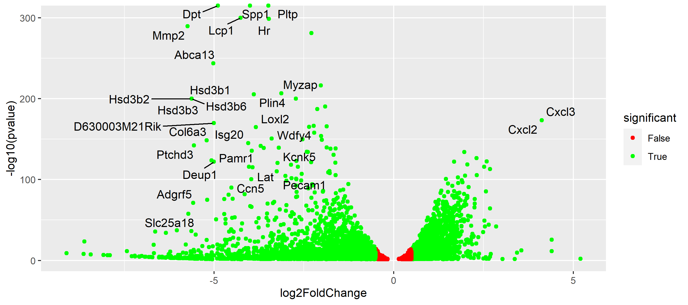

   

  

# Luiz Carlos Vieira
*Biólogo* Aspirante a analista de dados biológicos / Bioinformáta

Possui graduação em Ciências Biológicas e Mestrado em Ciências pelo Departamento de Biologia Celular e Molecular e Bioagentes Patogênicos.
Atuou como Técnico de Laboratório (Trainne) e Pesquisador (Mestrando) no Centro de Pesquisas em Virologia (USP).
Recentemente, atuou como Analista de Laboratório no controle de qualidade biológico, realizando testes de controle de qualidade de vacinas virais.

**Experiência em:** Biologia Celular e Molecular, Virologia, Análise de Dados, bioinformática, Python, R, bash.

**Links:**

* [LinkedIn](https://www.linkedin.com/in/luiz-carlos-vieira-4582797b/)

# RNA-Seq Pipeline para Notebook Padrão

Cada conjunto de dados apresenta suas peculiaridades, por isso deve ser tratado de acordo. Como função do analista, cabe a ele identificar, analisar e escolher a melhor abordagem à tal análise. No caso de uma análise de Rna-Seq não é diferente, cada conjunto de arquivos que você recebe, terá suas caracteristicas próprias, e será preciso
adequá-la a análise de acordo com o resultado esperado. Portanto, não existe uma pipeline universal para todas as análises, muito menos a melhor.   

Com isso, descrevi essa pipeline, não com o intuito de ser a melhor ou a única a ser usado em uma análise de Rna-seq, mas para ser vir como material de apoio para a contrução de uma pipeline especifica para uma análise especifica.

Neste projeto descrevo diferentes parâmetros e opções para execução de programas necessários à análise de Rna-Seq, além de incluir informações e opniões, que possam facilitar na hora de escolher a opção que melhor se adque à análise em questão.

Etapas da análise:  

* [Processamento dos arquivos fastq](https://github.com/ziul-bio/Rna-Seq_Workflow/blob/main/1-RNA-SEQ_pipeline.md)  
  * Fastqc e Multiqc  
  * HISAT2  
  * FeatureCounts  

* [Análise de expressão diferencial](https://github.com/ziul-bio/Rna-Seq_Workflow/blob/main/2-Analise-DESeq2_Annotation.md)  
  * DESeq2  

* Análise de enriquecimento funcional com ClusterProfiler:  
  * [Gene Set Enrichmente Analysis - GSEA](https://github.com/ziul-bio/Rna-Seq_Workflow/blob/main/3-Analysis-GSEA.md)  
  * [Over Representation Analysis - ORA](https://github.com/ziul-bio/Rna-Seq_Workflow/blob/main/4-Analysis-ORA.md)  

