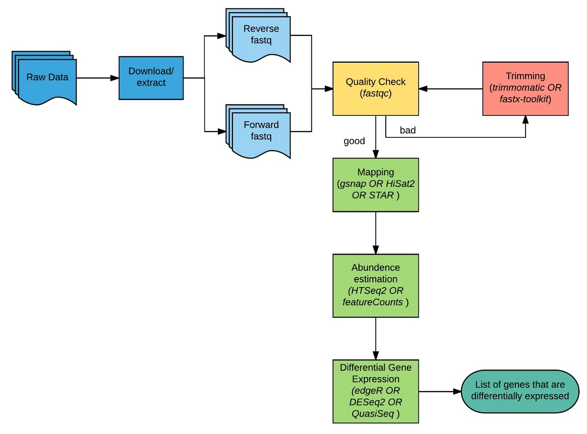
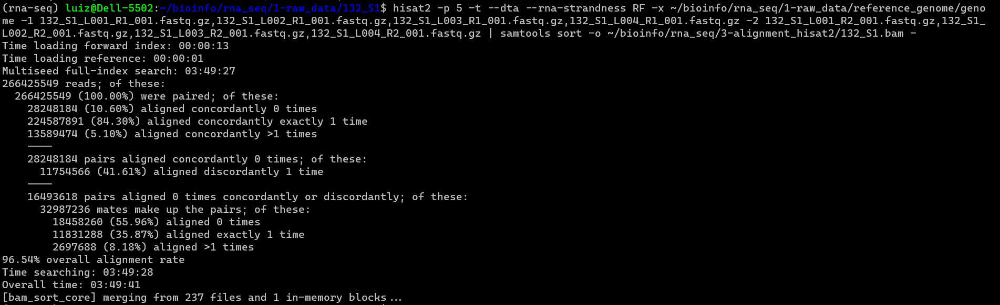
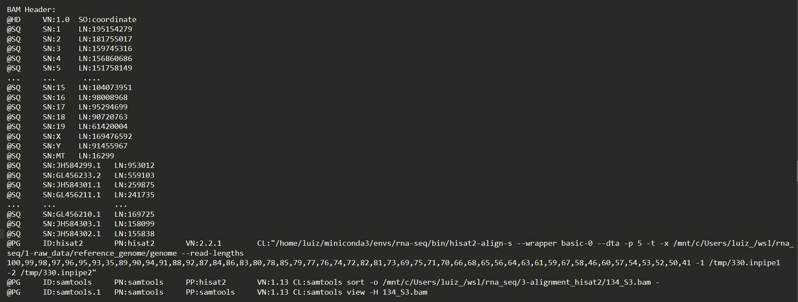
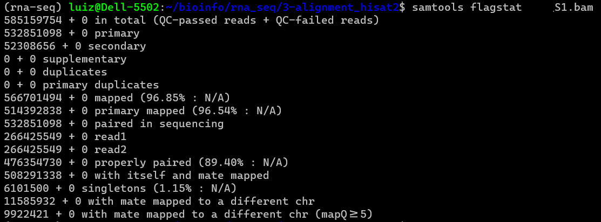
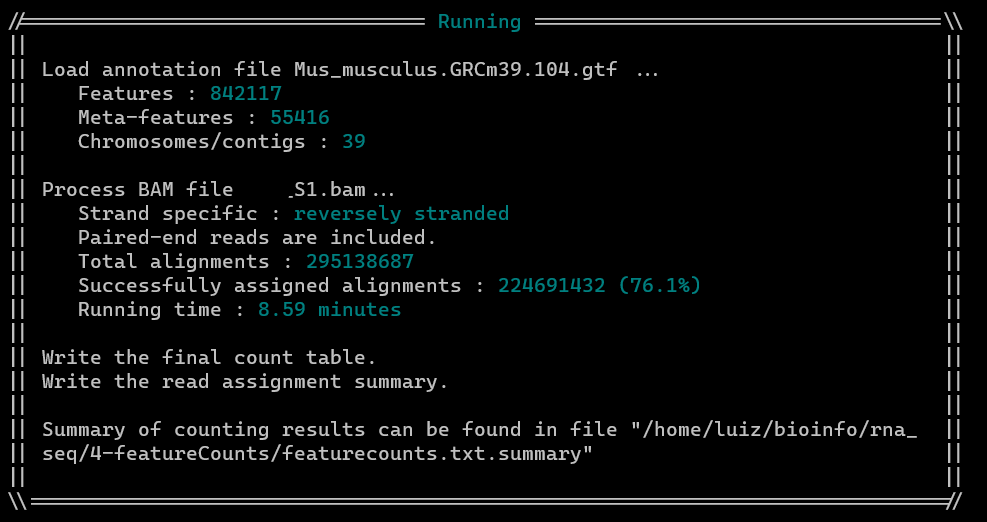
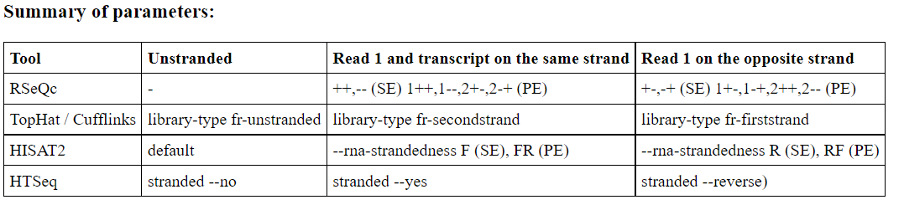

# RNA-Seq Pipeline para Notebook Padrão

Cada conjunto de dados apresenta suas peculiaridades, por isso deve ser tratado de acordo. Como função do analista, cabe a ele identificar, analisar e escolher a melhor abordagem à tal análise. No caso de uma análise de Rna-Seq não é diferente, cada conjunto de arquivos que você recebe, terá suas caracteristicas próprias, e será preciso
adequá-la a análise de acordo com o resultado esperado. Portanto, não existe uma pipeline universal para todas as análises, muito menos a melhor.   

Com isso, escrevi essa pipeline, não com o intuito de ser a melhor ou a única a ser usado em uma análise de Rna-seq, mas para ser vir como material de apoio para a contrução de uma pipeline especifica para uma análise especifica.

Neste projeto descrevo diferentes parâmetros e opções para execução de programas necessários à análise de Rna-Seq, além de incluir informações e opniões, que possam facilitar na hora de escolha a opção que melhor se adque à análise em questão. 

Esta pipeline foi desenvolvida em um ambiente conda, e os programas usados estão descritos na seção [Material complementar](#material-complementar)

Informações de hardware:  
OS: windowns10 home versão 21H1 / wsl-2 - Ubuntu
RAM: 16Gb  
SSD: 526Gb  
Processador: 11th Gen Intel(R) Core(TM) i7-1165G7  




# Raw Data e SRA toolkit

SRA Toolkit é uma coleção de ferramentas e bibliotecas para serem usadas em arquivos "Sequence Read Archives".  Os arquivos SRA armazenam dados de
alinhamento e sequências brutas provenientes das tecnologias de sequenciamento de nova geração, incluindo 454, IonTorrent, Illumina, SOLiD, Helicos e Complete Genomics. 
Com essa ferramenta é possível realizar o download de dataset de experimentos realizados por pesquisadores que foram disponibilizados neste banco de dados.
Coso, já tenha os dados em mãos, os arquivos fastqc, a sua análise se inicia com o [controle de qualidade](#controle-de-qualidade) destas.

[Link](https://trace.ncbi.nlm.nih.gov/Traces/sra/sra.cgi?view=toolkit_doc)

## Prefetch

O Prefetch permite o downloads via linha de comando de arquivos comprimidos no formato .sra  

O Prefetch pode ser usado para corrigir e finalizar downloads incompletos, ou seja, se ocorrer problemas de conexão, o download continua depois.  

Os arquivos do baixados ficarão disponível no diretório: home/ncbi/puplic/sra  

Uso do prefetch:
```bash
# Baixando um arquivo
prefetch SRR000001

# Baixando vários arquivos
prefetch --option-file SraAccList.txt

# Convertendo os arquivos sra em fastq
fasterq-dump --progress ~/ncbi/public/sra/SRR10493810.sra

```

## fasterq-dump

É a versão mais recente do fastq-dumper. É mais rápido e requer nemos código.  
Com ele é possível realizar ao mesmo tempo, o prefetch de arquivos e realizar a descompressão dos arquivos para o formato fastq.  

Opinião: "Achei o processo muito lento, quando usado para realizar as duas funções ao mesmo tempo, levou algumas horas.   
Por isso, prefiro usar o fasterq-dump apenas para a conversão do arquivo .sra para fastq. Tal processo levou uns 20 minutos."

```bash
# Para fazer o download e converter o arquivo direto para fastq:
fasterq-dump SRR000001
fasterq-dump --progress SRR10493810
fasterq-dump --progress --split-files SRR10493810
fasterq-dump --progress -S SRR10493818

# Obs: arquivos serão baixados no diretório de trabalho.
```


### Indicando um diretório para download
```bash
fasterq-dump --progress SRR000001 -O /mnt/d/hd_externo
fasterq-dump --progress SRR000001 --outdir ~/user/dir_de_escolha
```

### Informações sobre os arquivos

Segundo a documentação do NCBI:   

* SRR000001.fastq     – Fragment library data, or unpaired mates from a paired library.  
* SRR000001_1.fastq   – First mate sequence.  
* SRR000001_2.fastq   – Second mate sequence in the submitted orientation.  

Visualização dos arquivos:
```bash
head SRR000001

head -n10 SRR000001  # -n representa o número de linhas que se deseja visualizar
```


# Controle de qualidade

## Fastqc and multiqc

Opções do fastqc:  

* -o  #Diretório externo, que se deseja mover os reports.  
* -t  #Número de threads (núcleos de cpu)  
* -q  #"quiet" suprime todo o progresso, apenas reportando erros.  

Criando um novo diretório para enviar os reports:
```bash
mkdir ~/bioinfo/rna_seq/fastqc
```

Executando o fastqc e gerando os reports: 
```bash
fastqc -t 5 *.fastq # o símbolo * indica todos os arquivos que terminem em .fastq
```

Executando o fastqc e movendo os reports para o directório especificado
```bash
fastqc -t 5 *.fastq -o ~/bioinfo/rna_seq/2-CQ/fastqc
```

Movendo os reports após a execução do fastqc:
```bash
mv *fastqc* ~/bioinfo/rna_seq/2-QC/fastqc
```

## Multiqc

MultiQC é uma ferramenta de relatório que analisa estatísticas resumidas e arquivos de log gerados por outras ferramentas de bioinformática. 
O MultiQC foi projetado para ser colocado no final de pipelines de análises ou para ser executado manualmente ao termino da execução de algum programa.

Ao executar o MultiQC, ele pesquisa recursivamente em qualquer caminho de arquivo fornecido e ao encontra os arquivos que reconhece, analisa as informações relevantes
e gera um único arquivo de relatório HTML independente, além de criar um diretório "multiqc_data" onde armazena os dados analisados, para uso posterior.

Opções:  

 * . # O ponto serve para executar o multiqc no diretório de trabalho.  
 * -f # Sobrescreve reports anteriores, em a necessidade de --force.  
 * --force # Força e execução do programa.  
 * -x / --ignore # ignorar arquivos no diretório.  
 * -p / --export # Para salvar os plots em arquivos separados no report, no diretório /multiqc_plots como .png, .svg e .pdf.  
 * -o / --outdir # Gera todos os reports no directório externo especificado.  

Obs: O multiqc usa os reports do fastqc como arquivos de entrada, por isso precisa ser executado no diretório onde tais arquivos estão.
Além disso, o MultiQC foi projetado para ser executados em diretórios, ao invés de arquivos. Por isso, é mais fácil e recomendável informar 
apenas o/os diretório(s) a serem analisados pelo programa.  

### Executando o multiqc
```bash
# Executando multiqc no diretório de trabalho.
multiqc .

# Especificando um diretório.
multiqc ~/bioinfo/rna_seq/2-QC/fastqc

# Especificando multiplos diretórios
multiqc ~/bioinfo/rna_seq/2-QC/ # esta opção o multiqc procurará por arquivos em todas as pastas.
multiqc ~/bioinfo/rna_seq/2-QC/fastqc/ ~/bioinfo/rna_seq/2-QC/fastaqc_cuted/  

# Especificando diretório e arquivos a serem analisados
multiqc data/*fastqc.gz

# Para forçar o programa Executar novamente.
multiqc --force . 

# Para ignorar algum arquivo
multiqc --ignore 'RSS00000001' .

# Gerando um relatório final
multiqc ~/bioinfo/rna_seq/2-QC/* ~/bioinfo/rna_seq/3-hitsat/* ~/bioinfo/rna_seq/4-featureCounts/* 

```
 
### Visualizando os reports
```bash
# Listando o diretório multiqc_data/
ls multiqc_data/

# Estou usando wsl-2 - Ubuntu, por isso criei um alias do wslwiew = open para abrir os arquivos html.
open multiqc_report.html
```

# Mapeamento com HISAT2

HISAT é um programa de alinhamento rápido e sensível. Com ele foi desenvolvido um novo esquema de indexação baseado na transformação
de Burrows-Wheeler (BWT) e o índice FM, chamado de indexação hierárquica, que emprega dois tipos de índices, FM global, representando todo o genoma, e
índices FM locais, separados por pequenas regiões cobrindo coletivamente o genoma. 

O índice hierárquico para o genoma humano (cerca de 3 bilhões de pb) inclui ~ 48.000 índices FM locais, cada um representando uma região genômica de ~ 64.000 pb.
Como base para o alinhamento sem lacunas, o índice FM é extremamente rápido com um baixo uso de memória, conforme demonstrado por Bowtie. Além disso, o HISAT 
fornece várias estratégias de alinhamento projetadas especificamente para mapear diferentes tipos de leituras de RNA-seq. Juntos, o HISAT permite um alinhamento
extremamente rápido e sensível de leituras, em particular aquelas que abrangem dois exons ou mais. Como resultado, o HISAT é muito mais rápido e apresenta um boa
qualidade de alinhamento. 

Embora use um grande número de índices, o requisito de memória do HISAT ainda é modesto, aproximadamente 4,3 GB para o genoma humanos. 
HISAT usa a implementação Bowtie2 para lidar com a maioria das operações no índice FM. Além do alinhamento emendado, o HISAT lida com leituras envolvendo indels 
e suporta um modo de alinhamento de extremidades emparelhadas. Vários processadores podem ser usados simultaneamente para obter maior velocidade de alinhamento. 
O HISAT produz alinhamentos no formato SAM, permitindo a interoperação com um grande número de outras ferramentas que usam SAM. 
HISAT é distribuído sob a licença GPLv3 e é executado na linha de comando em Linux, Mac OS X e Windows.
[link](http://daehwankimlab.github.io/hisat2/)

#### Opções do HISAT2:
* -p # threads  
* -t # time  
* -f # arquivo fasta como arquivo de entrada  
* -x # reference genome  
* -x # reference genome  
* -1 # first mate  
* -2 # seconde mate  
* -S # sample output  
* --dta # Esta opção gera um relatório feito sob medida para os programas de reconstrução, incluindo StringTie.   
* --rna-strandness # Especifique as informações de orientação da fita: o padrão é unstranded.

A opção - downstream-transcriptome-assembly (--dta), é necessária caso se queira realizar "transcriptome assembly".
A opção requer comprimentos de âncora mais longos para a descoberta de novos transcritos, levando a menos alinhamentos com short-anchors, o que ajuda os 
"transcriptome assembly" a melhorar significativamente o uso de memória.

## Determinando a direcionalidade da biblioteca (- -rna-strandness)

Para que seja escolhido o parâmetro correto, é preciso descobrir qual foi método usado na preparar as bibliotecas. Para isso, é preciso testar a orientação/"strandness" das reads presentes nos arquivos fastq de RNA-Seq. 

Existem pelo menos dois métodos principais para a síntese de cDNA em bibliotecas "stranded":

* o método dUTP, que preserva a fita complementar

* o método Illumina, que liga diretamente ao RNA os ligantes, preserva a orientação original do RNA

É muito provável que o bioinformata não receba as informações da preparação da biblioteca de cDNA o que pode dificultar a escolha
dos parâmetros corretos. Por isso, realizar este teste agora, evita problemas futuros no decorrer da pipeline, como:

* A tag XS no arquivo BAM resultante do alinhamento, conterá informações incorretas da fita. A tag XS é usada por programas de montagem de transcrição, como Cufflinks e Stringtie, e também Cuffdiff a usa.

* Contagens incorretas de reads para alguns genes ou deixar de contar reads válidas para outros, na etapa de featureCounts.

[Mais informações sobre os tipos de bibliotecas](https://chipster.csc.fi/manual/library-type-summary.html)

***Obs: O pacote how_are_we_stranded_here.py em Python é usado para testar a orientação ou "strandness" das reads presentes nos arquivos fastq de RNA-Seq.
Porém, tive problemas na execução do script, mesmo usando a versão recomendado do kallisto, segue o link: [how_are_we_stranded_here](https://github.com/betsig/how_are_we_stranded_here)***

### Determinando --rna-strandness
Abaixo descrevo e executo os passos que o script how_are_we_stranded_here.py realizaria.

Requisitos:

* kallisto == 0,44.x

* RSeQC

* Arquivo de anotação de transcriptoma (arquivo .fasta - por exemplo, .cdna.fasta do ensembl)

* Arquivo de anotação no formato gtf, correspondente ao organismo em estudo.

* Arquivo gtf convertido em bed12. (Usei a ferramenta "gtf to bed12" do galaxy para fazer a converção. [link](https://usegalaxy.org/)) 

```bash
# criar um índice kallisto do transcriptoma do organismo em estudo.
kallisto index --index="Mus_musculus_index" reference_genome/Mus_musculus.GRCm39.cdna.all.fa

# mapear um subconjunto de leituras para o transcriptoma e usar o argumento --genomebam de kallisto, produzindo um arquivo pseudoa-lignment.bam ordenado.
kallisto quant --threads=4 --index=kallisto/Mus_musculus_index --bootstrap-samples=10 --output-dir kallisto/kallisto_results/ --genomebam --gtf reference_genome/Mus_musculus.GRCm39.104.gtf 132_S1/132_S1_L001_R1_001.fastq.gz 132_S1/132_S1_L001_R2_001.fastq.gz 

# Executar infer_experiment.py do RSeQC para verificar qual direção as reads estão alinhadas em relação à fita transcrita.
infer_experiment.py -r reference_genome/Mus_musculus.GRCm39.104.gtf.bed12 -i kallisto/kallisto_results/pseudoalignments.bam
```

Output:
>Reading reference gene model reference_genome/Mus_musculus.GRCm39.104.gtf.bed12 ... Done  
>Loading SAM/BAM file ...  Total 200000 usable reads were sampled  
>
>This is PairEnd Data  
>Fraction of reads failed to determine: 0.0095  
>Fraction of reads explained by "1++,1--,2+-,2-+": 0.0019  
>Fraction of reads explained by "1+-,1-+,2++,2--": 0.9886  

Interpretação:  
0.95% foram mapeadas em regiões do genoma que não foi possível determinar “standness of transcripts” (como regiões que tiveram ambas as fitas transcritas).  
Os outros 98.86% das reads, a grande maioria é explicada por, "1+-,1-+,2++,2--", sugerindo um dataset "strand-specific -reverse".

[Para mais informações sobre a interpretação na secção RSeQC](#rseqc-an-rnaseq-quality-control-package)


## Voltando para o HISAT2 - Contruindo um indíce genômico dos sitios de splicing e informações de exon

***Primeiro, usando os scripts python incluídos no pacote HISAT2, extraia o sitios de splicing e as informações do exon 
do arquivo de anotação de gene (GTF, mas caso queira, conseguirá fazer sem ele).***

```bash
extract_splice_sites.py genome.gtf > genome.ss
extract_exons.py genome.gtf > genome.exon
```

Opções:  

* --ss   path/para os arquivos .ss   
Obs: Esta opção deve ser usada com a opção --exon. Forneça a lista de splice sites (no formato HISAT2, 4 colunas)  

* --exon path/para os arquivos .exon  
Esta opção deve ser usada com a opção --ss acima. Forneça a lista de exons (no formato HISAT2, 3 colunas).  


### Criando um índice HISAT2 das regiões seleciondas:
Opinião: "Não consegui executar esta etapa, recebi a mensagem de erro: 'ran out of memory' "
```bash
### Opções:
--ss   path/para os arquivos .ss    # Esta opção deve ser usada com a opção --exon. Forneça a lista de splice sites (no formato HISAT2, 4 colunas)

--exon path/para os arquivos .exon  # Esta opção deve ser usada com a opção --ss acima. Forneça a lista de exons (no formato HISAT2, 3 colunas).  

hisat2-build --ss genome.ss --exon genome.exon genome.fasta genoma_index   
```

### Criando um índice do genoma de referência:

O genonas de referência para a espécie em estudo (usado para contruir o índice) pode ser encontrado no site ensembl [link](https://www.ensembl.org/index.html).
Ensembl é um navegador de genomas de vertebrados que oferece suporte à pesquisa em genômica comparativa, evolução, variação de sequência 
e regulação da transcrição. O Ensembl anota genes, calcula alinhamentos múltiplos, prediz a função regulatória e coleta dados de doenças.
As ferramentas de ensembl incluem BLAST, BLAT, BioMart e o Variant Effect Predictor (VEP) para todas as espécies com suporte.

```bash
hisat2-build -p 4 reference_genome.fa genome
```
O comando acima gera 8 arquivos .ht2, sendo eles usados no alinhamento das reads.


### Alinhamento com o genoma de referência

Os comando abaixo usam as informações que adquirimos anteriormente, como direcionalidade das bibliotecas e o índice genômico criado.
```bash
# Exemple 1, para paired-end reads, arquivo de saída sam:
hisat2 -p 5 -t --dta --rna-strandness RF -x .../reference_genome/genome -1 sample_R1.fq -2 sample_R2.fq -S sample.sam

# Exemple 2, para paired-end reads, direcionando o output para um arquivo bam ordenado:
hisat2 -p 5 -t --dta --rna-strandness RF -x .../reference_genome/genome  -1 .../1-Raw_data/fastq/SRR00000001_1.fastq -2 .../1-Raw_data/fastq/SRR00000001_2.fastq | samtools view -b -o S1_L001_sorted.bam - 

# Exemple 3 - Para criar um arquivo splice junction:
hisat2 --dta -p 5 -t -x ../reference/genome.fa -1 ../sample_R1_1.fq -2 ../sampl_R1_2.fq -S sample_R1.sam --phred33 --novel-splicesite-outfile sample_R1.junctions --rna-strandness RF 

hisat2 --dta -p 5 -t -x ../reference/genome.fa -1 ../sample_R2_1.fq -2 ../sample_R2_2.fq -S sample_R2.sam --phred33 --novel-splicesite-outfile sample_R2.junctions --rna-strandness RF

```

Output do mapeamento com hisat2: 


[Informações sobre a interpretação dos resultados](https://www.biostars.org/p/395017/)  
[Mais informações sobre hisat](http://daehwankimlab.github.io/hisat2/manual/)

### Alternativa de alinhamento em caso de fastq com multiplas lanes

##### Primeira opção:
Realiza o alinhamento de cada lane, e ao final se realiza o merge dos arquivos bam:
```bash
## Uso do pipe para direcionar o output do alinhamento para um arquivo BAM, sem a necessidade do intermediário SAM. Estes arquivos ocupam muito espaço.

# Nesta caso será necessário ordenar cada BAM após a conversão. 
hisat2 --dta -p 5 -t -x ~/bioinfo/rna_seq/1-raw_data/reference_genome/genome -1 S1_L001_R1.fastq -2 S1_L001_R2.fastq | samtools view -b -o S1_L001.bam -

# Direcionando o output do alinhamento direto para um arquivo bam ordenado. Usando a função samtools sort: "O hífen(-) ao final do comando representa 
# informa ao comando para usar como input presente no pipe, neste caso o output do alinhamento"
hisat2 --dta -p 5 -t -x ~/bioinfo/rna_seq/1-raw_data/reference_genome/genome -1 S1_L001_R1.fastq -2 S1_L001_R2.fastq | samtools sort -o S1_L001.bam -

# Direcionando o output para bam ordenado, mas mantendo o cabeçalho (header) bam.
hisat2 --dta -p 5 -t -x ~/bioinfo/rna_seq/1-raw_data/reference_genome/genome -1 S1_L001_R1.fastq -2 S1_L001_R2.fastq | samtools view -h -b - | samtools sort -o S1_L001.bam


## Unindo os arquivos bam, resultantes de cada alinhamento

# Merge, usado para arquivos sam, bam e cram, toma como entrada arquivos ordenados e gera um arquivo tbm ordenado. *** estou usando esta opção.***
samtools merge S1_merged.bam S1_L001.bam S1_L002.bam S1_L003.bam S1_L004.bam

# cat, usado para arquivos bam e cram, e o dicionário de sequência dos arquivos sendo concatenados precisa ser idêntico
samtools cat 

``` 
Média 40min por lane. Sendo o merge mais uns 30min.


##### Segunda opção:

Passar uma lista separada por vírgulas ao hisat2, com os arquivos fastqc(L001_R1.fastqc, L002_R1 ...) para o mate1 e uma outra lista, com os arquivos fastqc(L001_R2.fastqc, L002_R2 ...) para o mate2. Sendo o sort e merge realizado em pipe:
```bash
# Passar uma lista dos arquivo correspondente a cada lane separado por vírgula, e direcionar o output para um arquivo convertido à BAM ordenado, 
# OBS: O arquivo de output será muito grande, por isso já realizei a compactação. 
hisat2 -p 5 -t --dta --rna-strandness RF -x ~/bioinfo/rna_seq/1-raw_data/Reference_genome/genome -1 S1_L001_R1.fastq,S1_L002_R1.fastq,S1_L003_R1.fastq,S1_L004_R1.fastq -2 S1_L001_R2.fastq,S1_L002_R2.fastq,S1_L003_R2.fastq,S1_L004_R2.fastq | samtools sort -o /mnt/d/HD_exter/S1_L001.bam -

hisat2 -p 5 -t --dta --rna-strandness RF -x ~/bioinfo/rna_seq/1-raw_data/reference_genome/genome -1 133_S2_L001_R1_001.fastq.gz,133_S2_L002_R1_001.fastq.gz,133_S2_L003_R1_001.fastq.gz,133_S2_L004_R1_001.fastq.gz -2 133_S2_L001_R2_001.fastq.gz,133_S2_L002_R2_001.fastq.gz,133_S2_L003_R2_001.fastq.gz,133_S2_L004_R2_001.fastq.gz | samtools sort -o ~/bioinfo/rna_seq/3-alignment_hisat2/133_S2.bam -

# Estou usando está opção, pois o sort junto com convert´precisa de uma versão do samtools igual ou superior 1.2. Além disto, a opção -h garante a inserção do head.
hisat2 -p 5 -t --dta --rna-strandness RF -x /mnt/c/Users/luiz_/wsl/rna_seq/1-raw_data/reference_genome/genome -1 133_S2_L001_R1_001.fastq.gz,133_S2_L002_R1_001.fastq.gz,133_S2_L003_R1_001.fastq.gz,133_S2_L004_R1_001.fastq.gz -2 133_S2_L001_R2_001.fastq.gz,133_S2_L002_R2_001.fastq.gz,133_S2_L003_R2_001.fastq.gz,133_S2_L004_R2_001.fastq.gz | samtools view -h -b - | samtools sort -o /mnt/c/Users/luiz_/wsl/rna_seq/3-alignment_hisat2/133_S2.bam
```
Média de 3:30min por amostra.

[Informações sobre multiplas lanes](#material-complementar)


# Samtools

## Samtools para visualização e edição dos arquivos bam e sam:

Samtools é um conjunto de utilitários que manipula alinhamentos nos formatos SAM (Sequence Alignment / Map), BAM e CRAM. 
BAM é um arquivo no formato binário de SAM.
Ele converte entre os formatos, faz classificação, mesclagem e indexação e pode recuperar leituras em qualquer região rapidamente.

Samtools é projetado para funcionar em um fluxo. Ele considera um arquivo de entrada como a entrada padrão (stdin) e um arquivo de 
saída como a saída padrão (stdout). Vários comandos podem ser combinados com canais Unix. Samtools sempre envia mensagens de aviso e 
erro para a saída de erro padrão (stderr).

[link](http://samtools.sourceforge.net/samtools.shtml#5)

### Samtools view

Para converter SAM em BAM, usamos o comando samtools view. Devemos especificar que nossa entrada está no formato SAM (por padrão, espera BAM)
usando a opção -S. Devemos também dizer que queremos que a saída seja BAM (por padrão, ela produz BAM) com a opção -b. O Samtools segue a convenção
do UNIX de enviar sua saída para o STDOUT do UNIX, portanto, precisamos usar um operador de redirecionamento (“>”) para criar um arquivo BAM a partir da saída.

Visualização
```bash
samtools view -S -b sample.sam > sample.bam

# Agora, podemos usar o comando samtools view visualizar.
samtools view sample.bam | head

# Por padrão o samtools ignora o cabeçalho. Para visualização do header, use a opção -H
samtools view -H sample.bam | head
samtools view -H sample.bam | less
```

### Samtools sort

Quando os arquivos FASTQ são alinhados com uma sequência de referência, os alinhamentos produzidos estão em ordem aleatória com relação
à sua posição no genoma de referência. Em outras palavras, o arquivo BAM está na ordem em que as sequências ocorreram nos arquivos FASTQ de entrada.

Muitas análises down stream requerem que o arquivo BAM seja ordenado de forma que os alinhamentos ocorram na “ordem do genoma”. Ou seja, 
ordenados posicionalmente com base em suas coordenadas de alinhamento em cada cromossomo.

Ordenando o arquivo bam
```bash
samtools sort sample.bam -o sample.sorted.bam

# Visualizando o bam ordenado
samtools view sample.sorted.bam | head
```

Convertendo sam para um bam ordenado
```bash
samtools view -bS sample.sam | samtools sort -o sample.sorted.bam

# Reque versões mais recentes do samtools. 1.2 ou mais recente
samtools sort -o sample.bam sample.sam
```

## Controle de qualidade do arquivo de alinhamento binário BAM.

### quickcheck

Verifique rapidamente se os arquivos de entrada estão intactos. O comando verifica se o início do arquivo contém um cabeçalho válido (todos os formatos) 
contendo pelo menos uma sequência de destino e, em seguida, busca o final do arquivo e verifica se um final de arquivo (EOF) está presente e intacto (apenas BAM e CRAM )  
samtools quickcheck [options] in.sam|in.bam|in.cram [ ... ]

```bash
# Se o arquivo estiver ok, não haverá nenhum output
samtools quickcheck -v sample.bam
```

### Conferindo o resultado do sort:

```bash
# Visualizando o cabeçalho do alinhamento
samtools view -H sample.bam | less 
```

Se o arquivo estiver ordenado na sequencia genômica, um output similar ao descrito abaixo será mostrado.

SO: indica que o arquivo está ordenado por coordenadas(SO = Sort Order).

### samtools stats
Produzindo um resumo estatístico do alinhamento
```bash
samtools flagstat sample.sorted.bam

# Dentro do diretório com os arquivos BAM.
# O comando abaixo, realiza o flagstat que cada arquivo BAM e adiciona o resultado a um arquivo txt.
sample="sample1.bam sample2.bam sample3.bam"; for i in $sample; do samtools flagstat $i | tee -a flagstat.txt; done

# Segunda opção, se o diretório conter apenas os arquivos bam, dos quais se dejejar realizar o flagstat
for i in $(ls); do samtools flagstat $i | tee -a flagstat.txt; done
```



# FeatureCounts

FeatureCounts é um programa leve de contagem de reads, inteiramente na linguagem de programação C. Ele pode ser usado para contar reads 
de gDNA-seq e RNA-seq para características genômicas em arquivos SAM / BAM. FeatureCounts é parte do pacote Subread.

Formatos de entrada:  

* Os arquivos para alinhamentos devem ser fornecidos em Formato SAM ou Formato BAM  

* As anotações para as regiões do gene devem ser fornecidas no formato GFF / GTF:

Esta ferramenta usa os arquivos fornecidos como entrada e gera um arquivo com as "readCounts"  associadas a cada feature (característica) de interesse 
(genes, exons, transcritos, etc.). A estrutura desta matriz de readscounts, possui os genes nas linhas e as amostras representadas nas colunas

Essas são as contagens “brutas” e serão usadas em programas estatísticos para a expressão diferencial de genes.


### Organizando a área de trabalho
```bash
# Criando um novo diretório
mkdir ~/bioinfo/rna-seq/4-featureCounts

# mudando de diretório de trabalho 
cd ~/bioinfo/rna-seq/4-featureCounts

# Copiando os arquivos bam para esse novo diretório
cp ~/bioinfo/rna-seq/3-Alignment_HISAT2/*.bam ~/bioinfo/rna-seq/4-featureCounts


```

### featureCounts sintax:

featureCounts [options] -a annotation_file.gtf -o output_file.txt input_file1.bam input_file2.bam

Options:  

* -t 'exons' (defualt) _______ # specify which features consider from the gtf. (exon, gene,   transcripts)  
* -g 'gene_id' (default) _____ # specify the type of attribute to consider from gtf file.  
(gene_id, gene_name, p_id, transcript_id, tss_id)  
* -T _________________________ # specify number of threads  
* -p or --countReadPairs _____ # Count fragments instead of reads:  
* -a _________________________ # /path_to_reference_genome/file.gtf  
* -o _________________________ # /path_and_fileName/featurecounts.txt  
* -s _________________________ # Perform strand-specific read counting, 0 (unstranded, default), 1 (stranded), 2 (reversely stranded).  

#### Observação importante:

* Se o parâmetro de direcionalidade estiver incorreto na etapa de contagem de leituras, as leituras serão consideradas como provenientes da fita errada. 
Isso significa que, no caso em que não há gene na outra fita, não haverá nenhuma contagem e, se houver um gene no mesmo local na outra fita, as leituras
serão contadas para o gene errado.


### Executando featureCounts:

```bash
# Passando o caminho para que todos as arquivos no formato *.bam sejam contabilizados.
featureCounts -T 4 -p -a ~/bioinfo/rna-seq/1-Raw_data/ref_genome/genome_anotation.gtf -o ~/bioinfo/rna-seq/4-featureCounts/featurecounts.txt ~/bioinfo/rna-seq/3-Alignment_HISAT2/*.bam 

# Sem especificar um valor para -p, o programa executa como sendo reads unstranded. Prestar bastante atenção.
featureCounts -T 4 -p -a ~/bioinfo/rna-seq/1-Raw_data/ref_genome/genome_anotation.gtf -o ~/bioinfo/rna-seq/4-featureCounts/counts.txt SRR10493811.sam

# -p 2 diz para os featureCounts que as reads são reversely stranded
featureCounts -T 4 -p -s 2 -a ~/bioinfo/rna-seq/1-Raw_data/ref_genome/genome_anotation.gtf -o ~/bioinfo/rna-seq/4-featureCounts/counts.txt SRR10493819.bam

# Contalibizando todos os arquivos .bam no diretório de trabalho:
featureCounts -T 5 -p -s 2 -a ~/bioinfo/rna_seq/1-raw_data/reference_genome/Mus_musculus.GRCm39.104.gtf -o ~/bioinfo/rna_seq/4-featureCounts/featurecounts.txt *.bam
```

Output featureCouns:



## CUT, para Excluir colunas e organizar o featureCounts.txt

A saída de featureCounts é um arquivo separado por tabulações, com muitas informações como Geneid, Chr, Start, End, Strand, Length e as counts.
Desta tabela precisaremos apenas do Geneid e as colunas com as counts de cada amostra para análises downstream, sendo estas as colunas 1, 7-12.

Portanto, é possível recortar as colunas desejadas com a função cut do linux.

Options:  

* -f (--fields = LIST)______ # Selecione um conjunto de campos ou um intervalo de campos. Esta é a opção mais comumente usada.  
* --complement______________ # esta opção cut exibe todos os bytes, caracteres ou campos, exceto os selecionados.  
* -d (--delimiter)__________ # Especifique um delimitador que será usado em vez do delimitador “TAB” padrão.  
* -c (--characters = LIST)__ # Selecione especificando um caractere, um conjunto de caracteres ou um intervalo de caracteres.  

```bash
# O argumento LIST passado para as opções -f, -b e -c pode ser um número inteiro, vários números inteiros separados por vírgulas, 
# um intervalo de números inteiros ou ainda vários intervalos de números inteiros separados por vírgulas.
 cut -f 1,7-8 featurecounts.txt > counts.txt
```


# Relatório final

Ao passar o diretório rna_seq para o multiqc, ele buscará por aquivos que conheça, e gerará um relatório com todos os dados encontrado.
```bash
multiqc ~/bioinfo/rna_seq/
``` 


# Material complementar

## RSeQC An RnaSeq Quality Control Package
O pacote RSeQC fornece vários módulos úteis que podem avaliar de forma abrangente dados de sequência de alto rendimento, especialmente dados de RNA-seq. 
Alguns módulos básicos inspecionam rapidamente a qualidade da sequência, polarização de composição de nucleotídeos, polarização de PCR e polarização de GC, 
enquanto módulos específicos de RNA-seq avaliam a saturação de sequenciamento, distribuição de leituras mapeadas, uniformidade de cobertura, especificidade de fita, integridade de RNA de nível de transcrição etc.

### infer_experiment.py

Este programa é usado para “adivinhar” como o sequenciamento de RNA-seq foi configurado, particularmente como as leituras foram "stranded" para dados de
RNA-seq específicos de fita, por meio da comparação da “strandness of reads” com a “standness of transcripts”.

1 - A “strandness of reads” é determinada a partir do alinhamento e a “standness of transcripts” é determinada a partir da anotação.

2 - Para dados "non strand-specific RNA-seq", “strandness of reads” e “standness of transcripts” são independentes.

3 - Para dados "strand-specific RNA-seq", “strandness of reads” é amplamente determinada pela “standness of transcripts”. 


#### Parêmetros:
* -r >>> genoma de referencia gtf convertido para bed12
* -i >>> arquivo de entrada, arquivo bam do alinhamento.

```bash
infer_experiment.py -r refseq.bed12 -i ../hisat2/sample.bam
```

output:

This is PairEnd Data  
Fraction of reads failed to determine: 0.0156  
Fraction of reads explained by "1++,1--,2+-,2-+": 0.0025  
Fraction of reads explained by "1+-,1-+,2++,2--": 0.9819  

Interpretação: 0.15% foram mapeadas em regiões do genoma que não foi possível determinar “standness of transcripts” (como regiões que tiveram ambas as fitas transcritas)
Os outros 99.28%(1 - 0.0072 = 0.9928) das reads, a grande maioria é explicada por "1+-,1-+,2++,2--", sugerindo um dataset "strand-specific -reverse" 

Se compararmos a tabela a baixo, corresponde a FR(forward) ou stranded 



## Lista separada por vírgula em hisat2 para arquivos fastqc com multiplas lanes

Caso se tenha mais de dois arquivos FASTQ por amostra (por exemplo, Illumina NextSeq produz 8 arquivos FASTQ por amostra), será necessário fornecer uma lista
contendo os nomes dos arquivos para atribuir os arquivos FASTQ a cada direção., ou seja, umalista com os arquivo R1_.fastqc e outra lista R2_.fastqc.

Os instrumentos Illumina podem executam cada amostra em 4 lanes e geram 4 arquivos fastq para cada amostra, se:  

A mesma amostra (ou pool) foi executada em mais de uma pista, o programa de demultiplexação (bcl2fastq) irá gerar arquivos para cada amostra(s)
que são específicos da pista (por exemplo, L001 = Lane1, L002 = Lane2, L003 = Lane3 etc). Este comportamento pode ser suprimido usando a opção --no-lane-splitting para bcl2fastq. Isso irá gerar um único arquivo por amostra contendo todos os dados das lanes onde a amostra foi executada.

Nota 1: As células de fluxo HiSeq podem ter 8 lanes e produzirão tantos arquivos se a mesma amostra / pool for executado em todas as lanes.
Nota 2: Alguns sequenciadores Illumina têm lanes opticamente separadas, mas executam o mesmo pool em toda a célula de fluxo (NextSeq, NovaSeq sem kit XP).


## Configuração do ambiente conda

### Links para instalação dos pacotes necessário para a pipeline
[Sra toolkit](https://anaconda.org/bioconda/sra-tools)  
[fastqc](https://anaconda.org/bioconda/fastqc)  
[multiqc](https://anaconda.org/bioconda/multiqc)  
[hisat2](https://anaconda.org/bioconda/hisat2)  
[Kallisto](https://anaconda.org/bioconda/kallisto)  
[RSeQC](https://anaconda.org/bioconda/rseqc)  
[samtools](https://anaconda.org/bioconda/samtools)  
[subread-featureCounts](https://anaconda.org/bioconda/subread)  


# Referências:
https://www.ncbi.nlm.nih.gov/sra/docs/sradownload/  
https://trace.ncbi.nlm.nih.gov/Traces/sra/sra.cgi?view=toolkit_doc  
https://www.bioinformatics.babraham.ac.uk/projects/fastqc/  
https://hbctraining.github.io/Intro-to-rnaseq-hpc-salmon/lessons/qc_fastqc_assessment.html  
https://multiqc.info/docs/  
http://daehwankimlab.github.io/hisat2/manual/  
https://rnabio.org/module-02-alignment/0002/03/01/Alignment/  
http://www.htslib.org/doc/samtools.html  
https://davetang.org/wiki/tiki-index.php?page=SAMTools#Converting_a_SAM_file_to_a_BAM_file  
https://hbctraining.github.io/Intro-to-rnaseq-hpc-O2/lessons/04_alignment_quality.html  
https://hbctraining.github.io/Intro-to-rnaseq-hpc-O2/lessons/05_counting_reads.html  
http://subread.sourceforge.net/featureCounts.html  
http://rseqc.sourceforge.net/#infer-experiment-py  
https://chipster.csc.fi/manual/library-type-summary.html  
